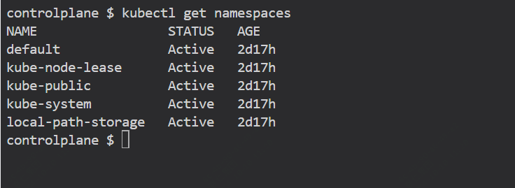
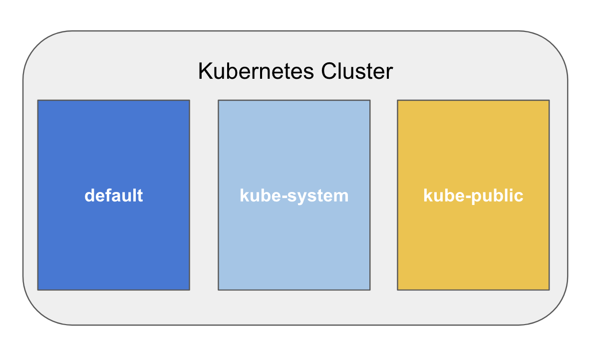
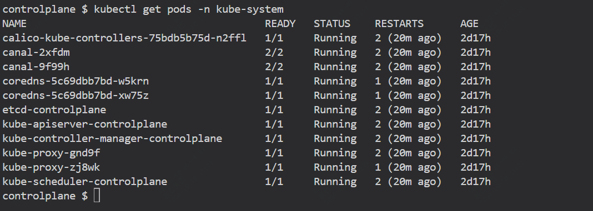
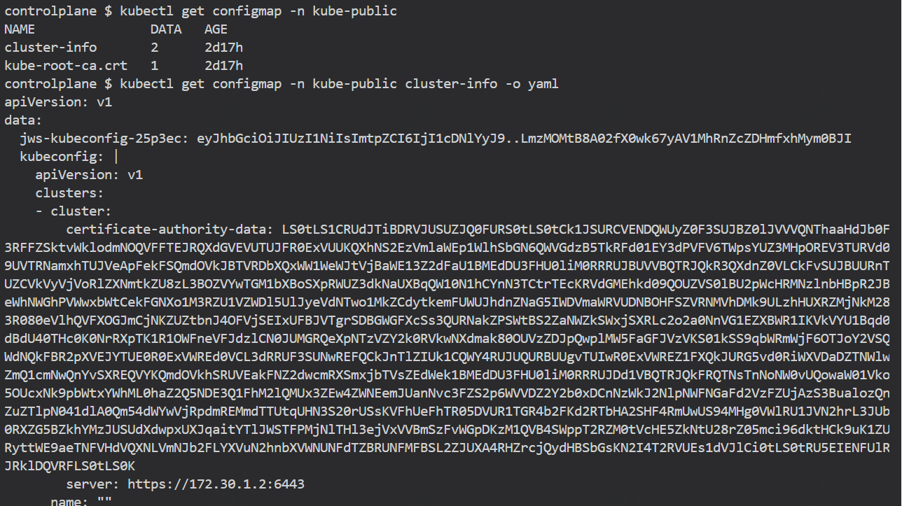
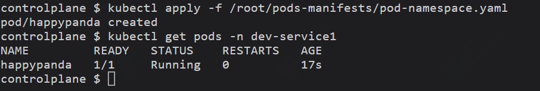
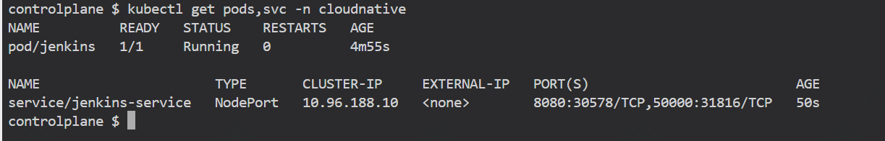
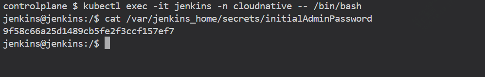
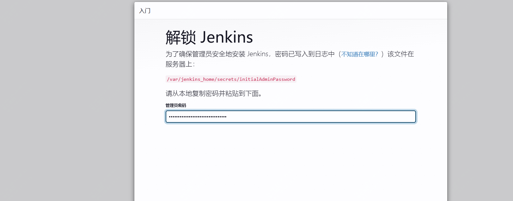

命名空间隔离 Pod，以将工作负载彼此分开，并让您能够设置资源约束。您可以将命名空间映射到您可能考虑的不同应用程序环境。

通过如下命令，可以查看命名空间

```
kubectl get namespaces
```



默认情况下，Kubernetes 带有一些预定义的命名空间。




### kube-system

该命名空间包含 Kubernetes 系统创建的对象：

```
kubect get pods -n kube-system
```



需要此命名空间内的 Pod 才能使 Kubernetes 正常工作，例如与 Kubernetes 原生集成的控制器和附加组件，我们将在稍后讨论。

### kube-public

该命名空间有一个ConfigMap ，其中包含 Kubernetes 集群的引导和证书配置：

```
kubectl get configmap -n kube-public cluster-info yaml
```



### default

所有未指定命名空间创建的对象都将自动在default命名空间中创建。

该命名空间最初是空的，不包含任何对象

关于default命名空间需要注意的一件事是，与 Kubernetes 集群中的其他命名空间不同，它无法删除。

### 创建一个新的命名空间

创建命名空间可以使用单个命令完成。让我们创建dev-service1命名空间：

```
kubectl create namespace dev-service1
```

也可以创建一个 YAML 文件并应用它，就像任何其他 Kubernetes 资源一样。

```
cat /root/pods-manifests/test-namespace.yaml 

kind: Namespace
apiVersion: v1
metadata:
  name: testcontrolplane
```

```
kubectl apply -f /root/pods-manifests/test-namespace.yaml
```
创建后，可以通过如下方式删除

```
kubectl delete -f /root/pods-manifests/test-namespace.yaml
```

或者

```
kubectl delete namespace test
```

## 创建一个pod

我们通过一个yaml文件来搞清楚我们如何部署和运行一个pod

每个 Kubernetes 对象都有一个 API 规范，并且该规范可以写在 YAML 文件中。

如下Pod 名称为happypanda ，它从 Docker Hub 的公共注册表部署nginx容器映像。
```
apiVersion: v1
kind: Pod
metadata:
  name: happypanda
spec:
  containers:
  - name: nginx
    image: nginx
```
执行如下命令创建我们的第一个pod
```
kubectl apply -f /root/pods-manifests/pod.yaml
```

下面这个yaml文件，我们配置新的pod部署到具体的namespace中

```
apiVersion: v1
kind: Pod
metadata:
  name: happypanda
  namespace: dev-service1
spec:
  containers:
  - name: nginx
    image: nginx
```

```
kubectl apply -f /root/pods-manifests/pod-namespace.yaml
```



我们作如下尝试

1.Pod 标签已添加到元数据部分
2.容器镜像已在容器部分更新。
3.Pod 端口已添加到容器部分


```
apiVersion: v1
kind: Pod
metadata:
  name: happypanda
  namespace: dev-service1
  labels: 
    app: redis
    segment: backend
    company: mycompany    
spec:
  containers:
  - name: redis
    image: redis:4.0.10
    ports:
    - name: redisport
      containerPort: 6379
      protocol: TCP
```

```
kubectl apply -f /root/pods-manifests/pod-update.yaml
```

会出现如下报错

```

The Pod "happypanda" is invalid: spec: Forbidden: pod updates may not change fields other than `spec.containers[*].image` <span class='kc-markdown-code-copy'></span>, `spec.initContainers[*].image` <span class='kc-markdown-code-copy'></span>, `spec.activeDeadlineSeconds` <span class='kc-markdown-code-copy'></span> or `spec.tolerations` <span class='kc-markdown-code-copy'></span> (only additions to existing tolerations)
```

在 Kubernetes 中，有一些字段是无法更新的。 Kubernetes API 参考有助于突出显示一些 API 限制和可用的对象规范。

为了更新那些被禁止的更新，我们应该删除 pod 并重新创建它。我们可以通过“部署”来绕过这些情况，我们将在其他章节中介绍这一点。


### 实践一把

- A.创建命名空间： cloudnative
- B. 创建一个具有以下约束的pod ：
  - Pod 名称： jenkins
  - 在cloudnative命名空间中部署 pod
  - 添加附加标签：
    ```
    app: jenkins
    company: sp
    ```
  - 使用此容器镜像： jenkins/jenkins:lts
- C. [可选] 使用服务公开 pod 并检查Jenkins是否运行成功
- D. [可选] 设置您的Jenkins实例。您可以检查 ssh 进入 pod 或检查日志中的管理员密码。


pod-jenkins.yaml

```
apiVersion: v1
kind: Pod
metadata:
  name: jenkins
  namespace: cloudnative
  labels: 
    app: jenkins
    company: sp  
spec:
  containers:
  - name: jenkins
    image: jenkins/jenkins:lts
    ports:
    - containerPort: 8080
    - containerPort: 50000
    resources:
      requests:
        memory: "512Mi"
        cpu: "500m"
      limits:
        memory: "1Gi"
        cpu: "1"
```

service-jenkins.yaml

```
apiVersion: v1
kind: Service
metadata:
  name: jenkins-service
  namespace: cloudnative
spec:
  selector:
    app: jenkins
  ports:
  - protocol: TCP
    port: 8080
    targetPort: 8080
    name: http
  - protocol: TCP
    port: 50000
    targetPort: 50000
    name: jnlp
  type: NodePort
```






