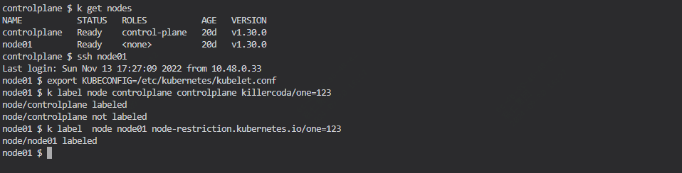
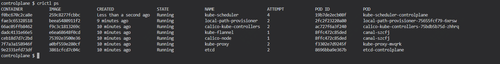
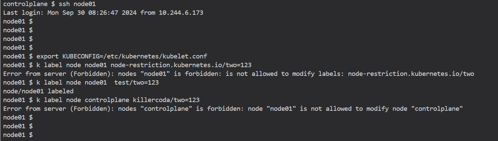

## 什么是NodeRestriction

在 Kubernetes 中，**NodeRestriction** 是一种准入控制器（Admission Controller），用于限制 kubelet 对 API 对象的修改权限。具体来说，它通过以下方式工作：

1. **限制标签和注释的修改**：NodeRestriction 插件防止 kubelet 修改或设置带有 `node-restriction.kubernetes.io/` 前缀的标签和注释。
2. **限制节点对象的修改**：它确保 kubelet 只能修改与其自身节点相关的对象，而不能修改其他节点的对象。
3. **增强安全性**：通过限制 kubelet 的权限，NodeRestriction 插件有助于防止潜在的安全漏洞和恶意行为。

## 如何开启NodeRestriction？

启用 NodeRestriction 插件的方法是通过在 kube-apiserver 的启动参数中添加 `--enable-admission-plugins=NodeRestriction`。

## 操作示例

现有一个集群，有两个节点一个是node01，一个是controlplane

目前没有开启NodeRestriction，在node01上操作

- 将标签 killercoda/one=123 添加到节点 controlplane
- 将标签 node-restriction.kubernetes.io/one=123 添加到节点 node01

```
ssh node01
    export KUBECONFIG=/etc/kubernetes/kubelet.conf
    k label node controlplane killercoda/one=123 # 应该被拒绝
    k label node node01 node-restriction.kubernetes.io/one=123 # 应该被拒绝
```



#### 开启NodeRestriction

修改/etc/kubernetes/manifests/kube-apiserver.yaml，新增如下配置

enable-admission-plugins=NodeRestriction

```
spec:
  containers:
  - command:
    - kube-apiserver
    - --advertise-address=172.30.1.2
    - --allow-privileged=true
    - --authorization-mode=Node,RBAC
    - --client-ca-file=/etc/kubernetes/pki/ca.crt
    - --enable-admission-plugins=NodeRestriction
    - --enable-bootstrap-token-auth=true
```



生效后再去测试,配置已经生效，相关设置已无法生效

```
ssh node01
    export KUBECONFIG=/etc/kubernetes/kubelet.conf
    k label node controlplane killercoda/two=123 # restricted
    k label node node01 node-restriction.kubernetes.io/two=123 # restricted
    k label node node01 test/two=123 # works
```

