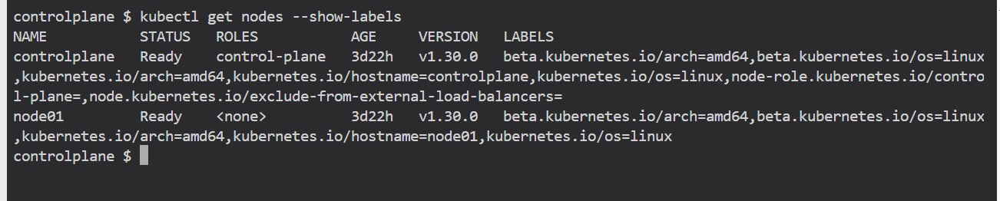
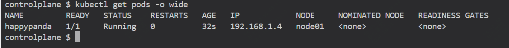

默认情况下，k8s会将pod自动分配到节点，如果你想要有计划的分配pod

其实有多种方法可以实现这一点，如使用：nodeSelector、Affinity 和 Anti-Affinity，它们都使用 Labels 和 Selectors。

这篇文章中，我们将介绍如何使用 nodeSelector 将 Pod 分配给节点

### Node Selector

nodeSelector 是一个选择器，允许您将 Pod 分配给特定节点。它与节点键/值对（也称为 Label）匹配，该节点告诉 Kubernetes 调度程序将 Pod 调度到哪个节点。


如果指定为 nodeSelector 的标签在任何节点上都不存在，则 Pod 调度失败。如果我们仍然想调度我们的 Pod（即使节点上不存在标签），我们需要使用 Node/Pod affinity 和 Anti-affinity。我们稍后将在此方案中介绍和讨论这一点。

>注意：默认情况下，Kubernetes 会向 kubernetes.io/hostname、beta.kubernetes.io/arch 等节点添加标签。有关更多信息，请阅读 Kubernetes 文档中的内置节点标签。

如何查看当前节点的标签信息

```
kubectl get nodes --show-labels
```



我们尝试将disk=ssd添加到node01节点，如下操作

```
kubectl label nodes node01 disk=ssd
```

然后我们新建一个pod，并且将该pod分配给node01，去匹配前面设置的标签，yaml 文件如下

cat /manifests/pod-nodeselector.yaml
```
apiVersion: v1
kind: Pod
metadata:
  name: happypanda
  labels: 
    app: redis
    segment: backend
    company: mycompany 
    disk: ssd  
spec:
  containers:
  - name: redis
    image: redis
    ports:
    - name: redisport
      containerPort: 6379
      protocol: TCP
  nodeSelector:
    disk: ssd
```

构建
```
kubectl apply -f /manifests/pod-nodeselector.yaml
```

验证



删除标签
```
kubectl label node node01 disk-
```

### Node Affinity and Anti-Affinity

软关联

```
spec.affinity.nodeAffinity.preferredDuringSchedulingIgnoredDuringExecution
```

如果节点标签存在，则 Pod 将在那里运行。否则，Pod 将被重新调度到集群中的其他位置。

硬关联

```
spec.affinity.nodeAffinity.requiredDuringSchedulingIgnoredDuringExecution
```

如果节点标签不存在，则根本不会调度 Pod。

yaml文件示例

```
cat /manifests/node-soft-affinity.yaml
apiVersion: v1
kind: Pod
metadata:
  name: happypanda
  labels: 
    app: redis
    segment: backend
    company: mycompany 
    disk: ssd  
spec:
  affinity:
    nodeAffinity:
      preferredDuringSchedulingIgnoredDuringExecution:
      - weight: 1
        preference:
          matchExpressions:
          - key: fruit
            operator: In
            values:
            - apple
  containers:
  - name: redis
    image: redis
    ports:
    - name: redisport
      containerPort: 6379
      protocol: TCP
```

```
cat /manifests/node-hard-affinity.yaml
apiVersion: v1
kind: Pod
metadata:
  name: happypanda
  labels: 
    app: redis
    segment: backend
    company: mycompany 
    disk: ssd  
spec:
  affinity:
    nodeAffinity:
      requiredDuringSchedulingIgnoredDuringExecution:
        nodeSelectorTerms:
        - matchExpressions:
          - key: fruit
            operator: In
            values:
            - apple
  containers:
  - name: redis
    image: redis
    ports:
    - name: redisport
      containerPort: 6379
      protocol: TCP
```

node anti-affinity可以通过使用 NotIn 运算符来实现。这将帮助我们在调度时忽略节点。

yaml参考

```
cat /manifests/node-hard-anti-affinity.yaml
apiVersion: v1
kind: Pod
metadata:
  name: happypanda
  labels: 
    app: redis
    segment: backend
    company: mycompany 
    disk: ssd  
spec:
  affinity:
    nodeAffinity:
      requiredDuringSchedulingIgnoredDuringExecution:
        nodeSelectorTerms:
        - matchExpressions:
          - key: fruit
            operator: NotIn
            values:
            - apple
  containers:
  - name: redis
    image: redis
    ports:
    - name: redisport
      containerPort: 6379
      protocol: TCP
```

### Pod Affinity and Anti-Affinity

Pod间关联性（Inter-Pod Affinity）：用于指定Pod应该与哪些其他Pod一起调度到同一个节点上。例如，如果两个Pod需要频繁通信，可以使用Pod间关联性将它们调度到同一个节点上，以减少网络延迟。

```
spec.affinity.podAffinity.preferredDuringSchedulingIgnoredDuringExecution

```

用于 Soft Pod 关联性。如果首选选项可用，则 Pod 将在那里运行。如果没有，Pod 仍然可以被调度到其他位置。

```
spec.affinity.podAffinity.requiredDuringSchedulingIgnoredDuringExecution
```

用于 Hard Pod 关联性。如果 required 选项不可用，则 Pod 无法运行。

如下示例中，这是一个硬 Pod 关联。如果没有任何节点使用 fruit=apple 标记，则不会调度 Pod。topologyKey 是节点的标签，例如 kubernetes.io/hostname

```
cat /manifests/pod-hard-affinity.yaml
apiVersion: v1
kind: Pod
metadata:
  name: happypanda
  labels: 
    app: redis
    segment: backend
    company: mycompany 
    disk: ssd  
spec:
  affinity:
    podAffinity:
      requiredDuringSchedulingIgnoredDuringExecution:
        - labelSelector:
            matchExpressions:
            - key: fruit
              operator: In
              values:
              - apple
          topologyKey: kubernetes.io/hostname
  containers:
  - name: redis
    image: redis
    ports:
    - name: redisport
      containerPort: 6379
      protocol: TCP
```

Pod反关联性则是用于指定Pod不应该与哪些其他Pod一起调度到同一个节点上。这在需要分散负载或避免资源竞争时非常有用。例如，如果你有多个计算密集型的Pod，可以使用反关联性将它们分散到不同的节点上。

同样有软、硬两种配置