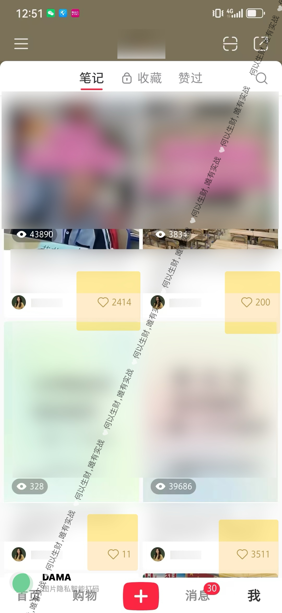
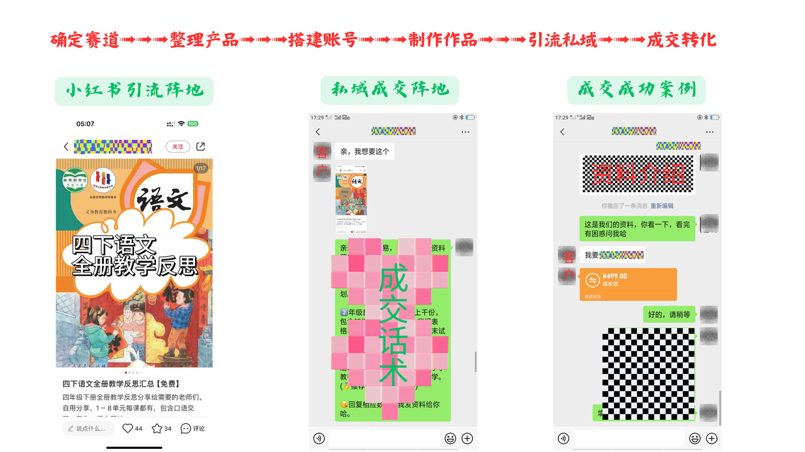

## 一、自我介绍

大家好，我是米杰，从大学期间开始折腾，做过实体、公众号、国学、知识付费等私域项目.....在虚拟电商赛道深耕了7~8年了，从最开始的3~5个账号到成立工作室上百个账号矩阵，所做的产品是某一些细分赛道的头部，一直被模仿但从未被超越。

我擅长免费流量获取，专注研究从公域平台“偷流量”到私域变现。
我的创作理念是：做号焦虑是常态，精进内容是唯一。
感谢生财和大家对我的认可和信任，作为航海教练，我将带领大家在小红书中乘风破浪。

## 二、项目情况

### 2.1 项目简介和赛道现状

利用拥有超高消费力人群的小红书平台，进行优质内容输出，吸引精准的教育粉丝进入私域，匹配高需求的教育资料产品从而获得销售变现的一个项目。

市场上对该项目有多种称谓，如：学科资料变现、小红书学科教辅、小红书虚拟资料、小红书虚拟电商等。尽管名称不同，但本质都是小红书教育资料引流项目。

教育一直是我国一个超高需求的行业，并且随着时间推移，热度只增不减。就拿高考之后的志愿填报举例，艾媒咨询的数据显示，2023 年中国高考志愿付费市场规模，达 9.5 亿元，是 2016 年的 7.3 倍。

有心的朋友会留意到，如今国家政策也在大力鼓励教育领域，教育领域在不断复苏前进，未来向好趋势明显。

分享 3 个真实的案例，你会更加理解该项目的潜在价值

- ①一份 ppt 模版 139，已售 9167 份，营业额 127w4213 元，成本大概也就是 5%的平台提现手续费，模版一旦开发出来边际成本就无限趋于 0 了，一个人就能赚 120w

- ②1 天搬运一篇外网文章，169 元一年会员，已售 2.1W+，收入 354w9000 元。手机摄影课程，199 元，已售 3w+单，合计营收 597w+。

- ③分享留学干货，家长前来下单咨询，和留学机构/个人工作室进行合作后端文书交付，30w 咨询费可以直接抽成 30%，9w 到手

### 2.2 项目的优势和门槛

对比传统电商，门槛更低，适合普通人玩赚，甚至在家里就能做。

总结起来我认为有五个优势点。
- ①适合绝大多数普通人玩。简单来说，门槛低。
- ②没有繁琐的售后服务。无需物流，仓储，客服等重服务体系投入。
- ③无需资质、无需流量基础，网一连就可以开干！
- ④成本低，见效快，可以说是几乎0成本。
- ⑤延伸性强，天花板高，适合个人也适合团队化运作。

小红书资料引流变现项目有什么门槛/风险，如何解决？

风险一：账号限流。小红书不再像前几年的“野蛮时代”，靠简单的搬运和洗稿就能轻松获利。如今，只有踏实做内容，才能在小红书赛道上长期赚到钱。

风险二：版权问题。市面上的教育资料鱼龙混杂，会出现不少出售盗版资料。建议：出售无版权产品，提升原创品力和获得授权正版产品进行出售。

经过我们这一次航海的训练，相信大家面对这些问题的时候都能够迎刃而解。

### 2.3 成功案例

这几年下来积累的数据的反馈特别多，我就挑选一些近期8~9月份新鲜出炉的案例，按照【小红书数据图】【小红书私信咨询图】【私域成交图】【收益图】四部分给大家做展示。

①一组满屏99+的小红书数据页面

③小红书咨询信息不断的页面截图

②团队的运营伙伴制作日常爆款笔记，一人也可以操盘10+账号

④新号小爆文展示

⑤日常私域成交聊天截图

⑥私域单账号月和年收益图

米杰在这里想跟大家强调一个观点，展示项目结果不是为了炫技，更多是想给大家传达项目的可行性，因为看见，所以相信，希望大家也能鼓信心，卯足劲钻研进来。

## 三、项目完整操作思路和重点

### 3.1 项目完整操作思路

我们先看一下小红书资料引流项目的流程。一共是分为六个步骤，分别是
确定赛道➟➟➟整理产品➟➟➟搭建账号➟➟➟制作作品➟➟➟引流私域➟➟➟成交转化

为了大家更加直观地了解整个项目的流程，在这里我放一个真实成交案例流程图。

整个航海21天分为3个阶段，这三个阶段将会覆盖6个关键步骤。

1.确定赛道：市场数据分析能力

做什么：通过分析我国教育领域大部分的细分赛道，并结合小红书平台用户需求。选择赛道之后做好账号的定位，以及相关的内容选题。

怎么做：在第一阶段教学中，将对我国大部分的教育细分领域做详细的解释说明，供大家选择。在这个阶段，教大家如何结合自身的优势去选择一个最适合自己的赛道。

2.整理产品：资料检索和整理能力

做什么：确定好赛道之后，那么我们就要匹配对应的产品了。

怎么做：同样在第一阶段会教大家如何去整理资料并搭建自己的产品库，从而为后面的变现做足充分的准备工作。

3.搭建账号：定位能力

做什么：根据我们所选的赛道，搭建适合的小红书账号 IP。

怎么做：所有的小红书搭建细节，我们会在第一阶段跟大家做详细的指引。

4.创作作品：内容制作能力

做什么：完成前三部分的确定赛道、整理产品、搭建账号、后就到了我们的制作作品环节了，这里非常考验我们的内容创作能力。

怎么做：在第二阶段会详细的教大家如何去做出爆款的作品的每一个具体步骤，希望大家动起手来，一起把手弄脏。

5.引流私域：平台运营能力

做什么：如果说你的作品爆了，有非常多的流量，但是这些流量没办法进入到我们的私域，那么这是一件多么遗憾的事情呀。

怎么做：为了避免这个遗憾的发生，我们同样在第二阶段会给大家分享小红书导流私域的一些小技巧。

6.成交转化：销售转化能力

做什么：整个项目来到了我们最后一个阶段：私域的成交转化了，那这里头涉及到成交话术、朋友圈打造以及私运营技巧和相关的注意事项。

怎么做：我们会在第三阶段跟大家进行私域板块的魔鬼式训练，这也是当下互联网人非常稀缺的一个能力——私域运营能力。

完成了最后一步，也就完成了整个项目的闭环，恭喜你！已经实现了从 0～1 的变现！

3.2 操作重点

这次项目的重难点有两个。

※内容制作：任何创作者平台，其本质是“内容为王”，好的内容是流量的本质，其余的都是锦上添花，因此在这种航海中最重要的技能之一是学会制作内容，制作笔记。

※私域成交转化：这是一个考验销售的能力，咱们国人性格普遍低调内敛，所以称得上是大部分人的短板，在互联网做生意，这却是最不可获取的能力。相信在这次私运营和销售的教学部分能够给大家带来启发，同时在教练直播也会给大家分享私域成交技巧和真实案例。

3.3 新手入门准备&避坑建议

关于账号、设备等基础问题，我再唠叨几句。

我的建议是能够由3台或以上的手机，因为机器越多，成功的概率就越高，并且去营业厅办理三张及以上的手机卡，月租选最便宜的，但需要有流量，流量最好是20G以上，用1张主卡绑定2张副卡的模式办理，你营业厅直接和工作人员说，她就会给你推荐卡了。如果当地办卡成本高，直接支付宝搜 “号卡中心”可直接办理。

另外，手册做的比较细，在执行中你大部分的问题都能在手册找得到答案，这是我多年实战的精华提炼，希望大家能耐心学习。如果经验较为丰富的同学，可以挑重点，选择性学习。

