腾讯云TDSQL-C Serverless 产品体验--结合AI进行电商数据分析

【AI驱动TDSQL-C Serverless数据库技术实战营】结合AI进行电商数据分析

在去年TDSQL-C serverless，其实已经有写过文章介绍过，并且做过相关压测及实验，今天这篇文章主要是结合目前大火的AI大模型相关，继续去对该产品实验。

在正式的实验开始之前，我们先按照惯例来介绍下文中涉及到的一些产品。

如果想要了解更多具体介绍可以移步官方文档。

## 产品介绍

TDSQL-C 是腾讯云自研的新一代云原生关系型数据库，主要基于 MySQL 架构，目前也提供了pg可选。

它融合了传统数据库、云计算与新硬件技术的优势，提供高弹性、高性能、海量存储和安全可靠的数据库服务

为用户提供极致弹性、高性能、高可用、高可靠、安全的数据库服务。实现超百万 QPS 的高吞吐、PB 级海量分布式智能存储、Serverless 秒级伸缩，助力企业加速完成数字化转型。

腾讯云数据库 TDSQL-C MySQL 版实现数据库计算和存储分离，存储构建在腾讯云分布式云存储服务之上，数据库引擎可与传统 MySQL 开源数据库完全兼容，还会定期实现对新版本的支持。这意味着您的业务无需改造即可平滑迁移，也将为您大大缩减数据迁移的成本和风险。

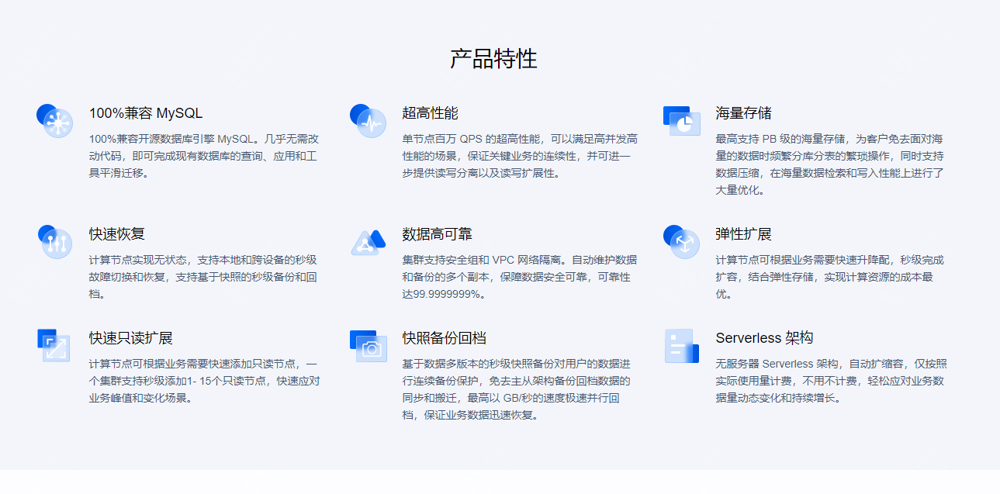

**Serverless** 是 TDSQL-C 的无服务器架构版本，具备以下特点

1. **按需启动和自动扩缩容**：根据业务负载自动启动和停止，无需手动干预，扩缩容过程对应用程序无影响。
2. **按使用计费**：按实际计算和存储资源使用量计费，不用不付费，按秒计量，按小时结算。
3. **适用场景**：适用于开发、测试环境、物联网、边缘计算、小程序云开发、中小企业建站等场景，尤其适合不确定性、波动性、间歇性的业务场景。

这些特性使得 TDSQL-C Serverless 版能够在降低成本的同时，提供高效、灵活的数据库服务

高性能应用服务（Hyper Application Inventor，HAI）是腾讯云推出的一款面向 AI 和科学计算的 GPU/NPU 应用服务产品。

它提供即插即用的强大算力和常见环境，帮助中小企业及开发者快速部署语言模型（LLM）、AI 绘图、数据科学等高性能应用

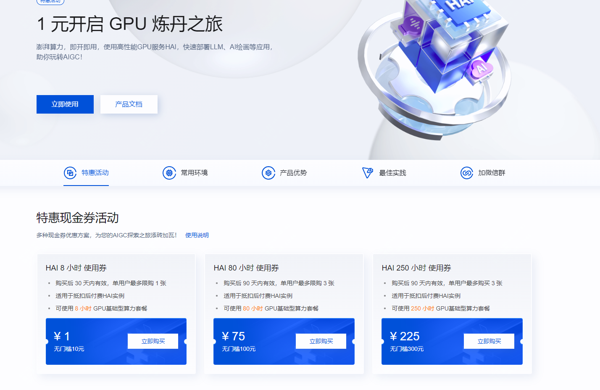

**主要特点**：
1. **即插即用**：无需复杂配置，快速部署高性能应用。
2. **灵活使用**：支持关机不计费，节省成本。
3. **一键部署**：分钟级自动构建应用环境，预装多种热门模型。
4. **可视化界面**：提供友好的图形界面，支持 JupyterLab、WebUI 等多种连接方式

**适用场景**：
- AI 绘图
- AI 对话/写作
- AI 开发/测试
- 数据科学
  
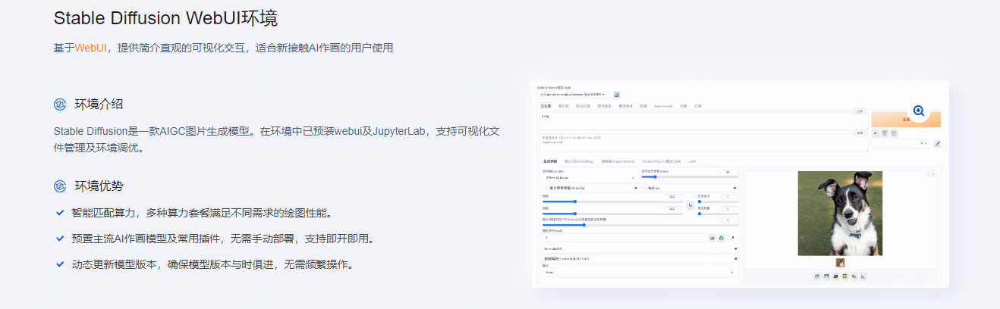


而在如今AI时代，TDSQL-C结合AI又会有怎样的火花，今天这篇文章将结合**TDSQL-C、serverless、HAI**（高性能应用服务）完成一个应用实验，给大家提供一个AI场景的新实验。


## 实验内容介绍
本次实验是基于python与Langchain，来完成对电商数据的分析
### 具体实验步骤

- 1.购买TDSQL-C Mysql Serverless
- 2.部署HAI llama 大模型
- 3.python环境及开发环境配置
- 4.验证结果
  
### 1.购买TDSQL-C Mysql Serverless

访问如下链接，进入数据库页面,点击立即选购
>https://cloud.tencent.com/product/tdsqlc 

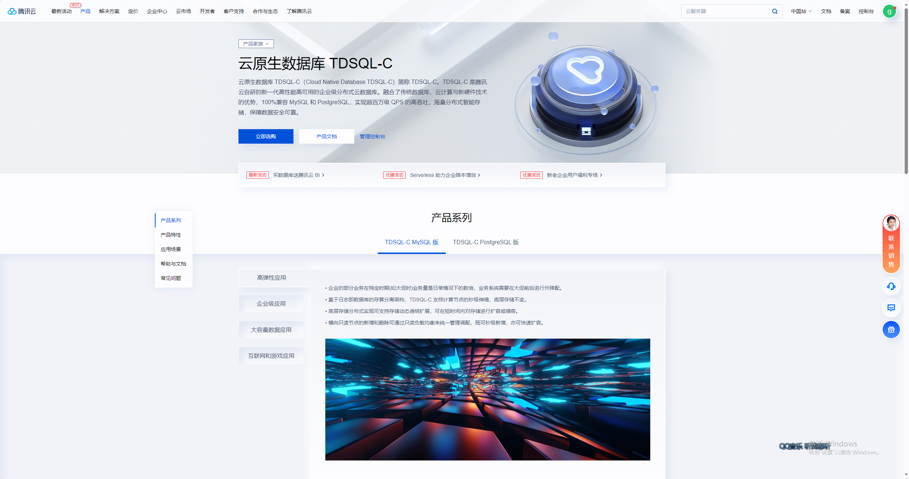 

根据图表选择选定服务器
选定的服务器为 serverless 的服务器，具体配置如下：

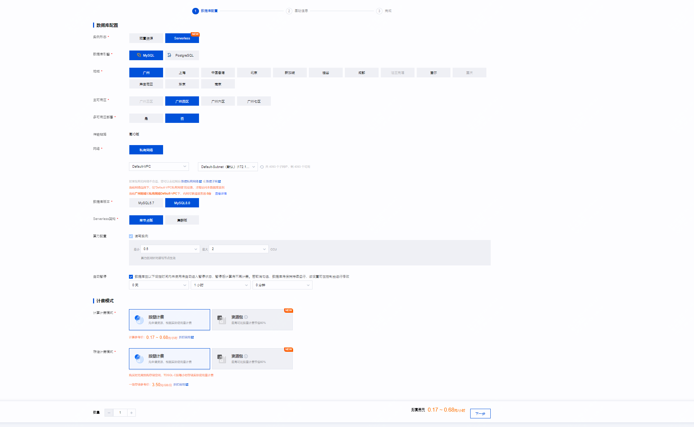

设置账户信息，配置密码，选择字符集等，如下图：

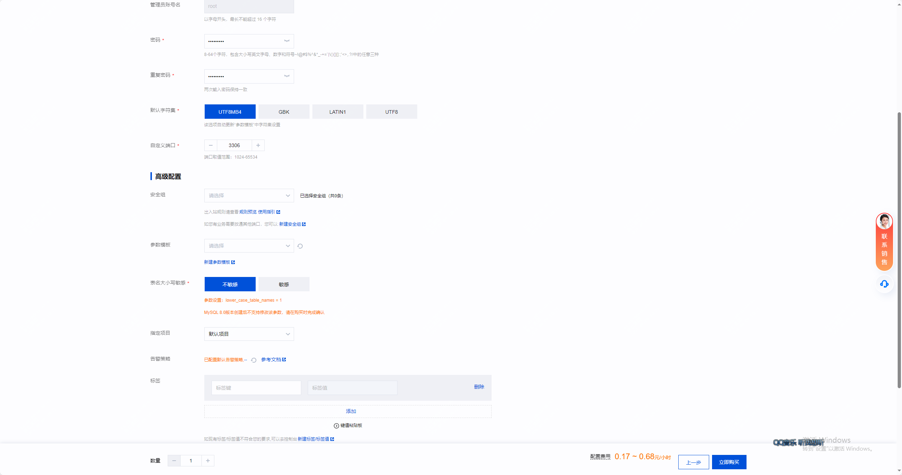

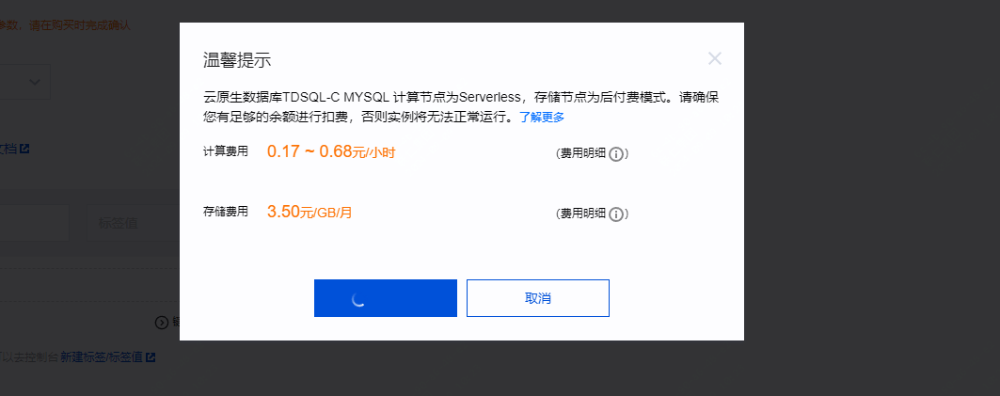

然后前往管理页面，配置开启公网访问，通过在线管理工具，创建数据库，并完成数据初始化

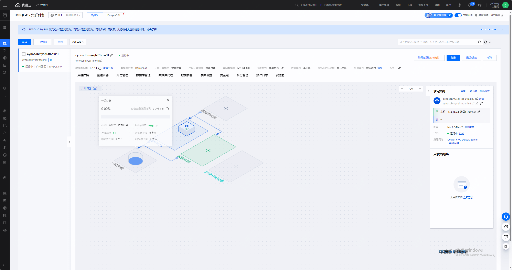

如下登录管理工具

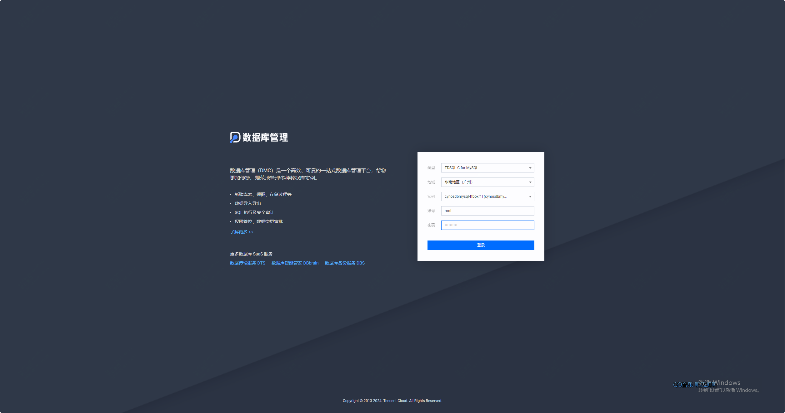

下面为新建库，并且初始化表

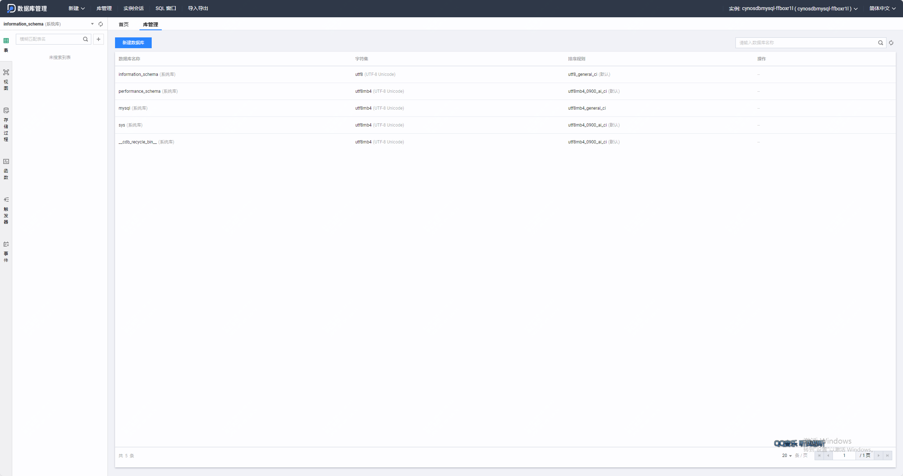

```
```

导入数据完成

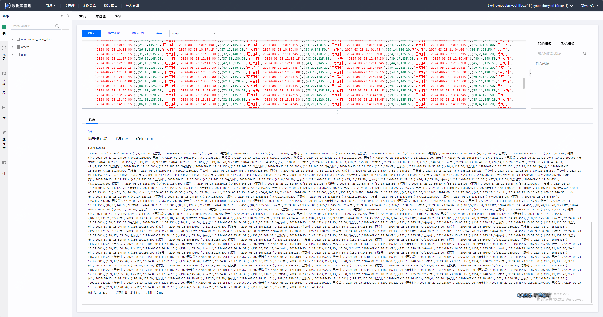

如上完成了数据库导入

### 2.部署HAI llama 大模

访问如下地址：

>官网地址：https://cloud.tencent.com/product/hai

页面如下：

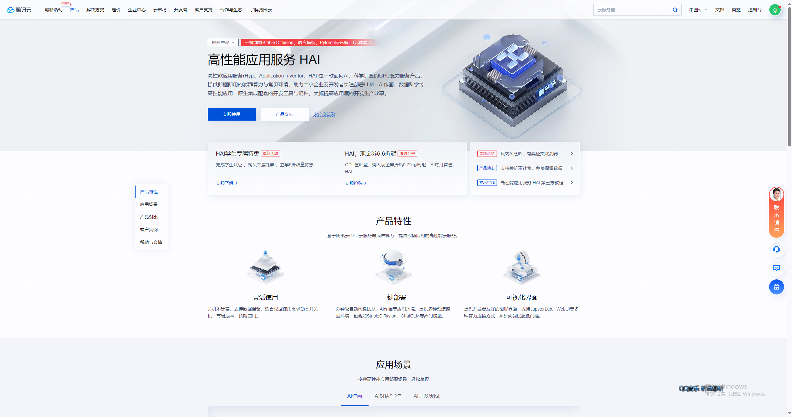

点击立即使用后，新建服务器
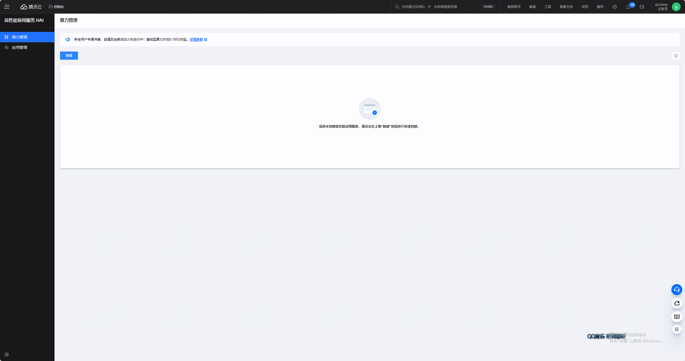

如下选择立即购买即可

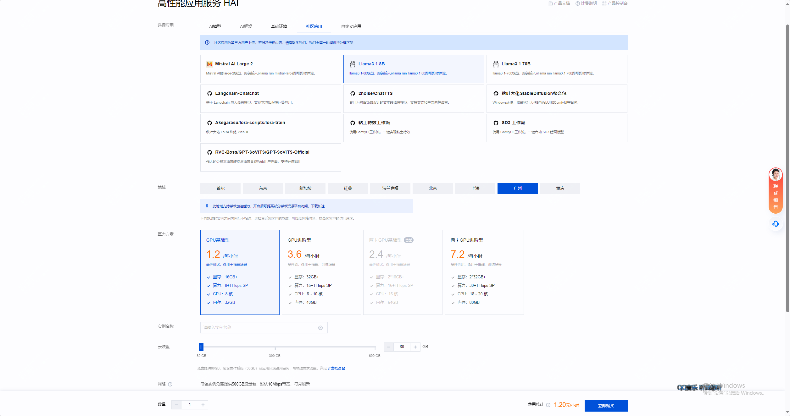

如下可以查看HAI算力服务器的llama对外端口

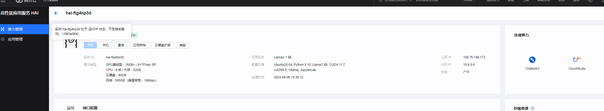

检查是否已经默认开放 6399端口，如下状态即是开放

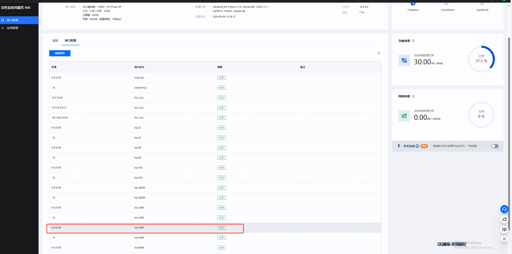

llama 大模型服务准备完毕！

### 3.python环境及开发环境配置

具体不在详细介绍，推荐版本3.10.11

python就绪后，需要安装对应模块，如下

```
pip install openai 
pip install langchain 
pip install langchain-core 
pip install langchain-community 
pip install mysql-connector-python 
pip install streamlit 
pip install plotly 
pip install numpy
pip install pandas
pip install watchdog
pip install matplotlib
pip install kaleido
```

### 4.应用搭建并验证


新建名为 shop 文件夹进行保存项目代码
在项目文件夹（shop）中新建配置文件 config.yaml
在项目文件夹（shop）中新建应用主文件 text2sql2plotly.py

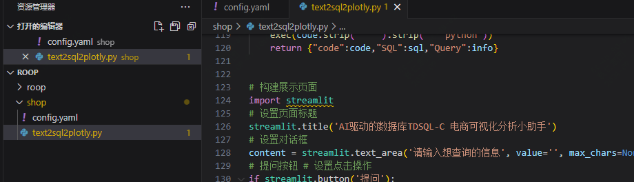

根据实际配置修改config.yaml的配置

这里主要分为 database 配置 和 hai 的配置

- database 的配置详解：
db_user: 数据库账号，默认为 root
db_password: 创建数据库时的密码
db_host: 数据库连接地址
db_port: 数据库公网端口
db_name 创建的数据库名称，如果按手册来默认是 shop
- hai 配置详解：
model 使用的大模型
base_url 模型暴露的 api 地址，是公网 ip 和端口的组合，默认 llama端口是6399
database 中填入 TDSQL-C 的相关配置，db_host、db_port可以在集群列表中找到

hai base_url将实例的ip进行替换，ip可以在HAI的控制台-> 算力管理中找到

配置完成后，copy如下代码

```

```

然后运行并测试效果，在终端执行如下代码

```
streamlit run text2sql2plotly.py
```

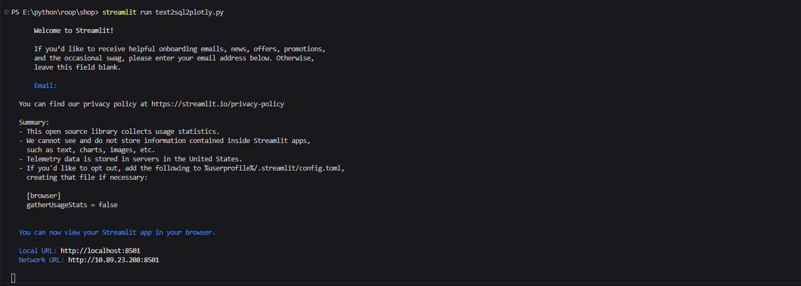

访问本地的8501端口，可以看到已经可以正常访问了

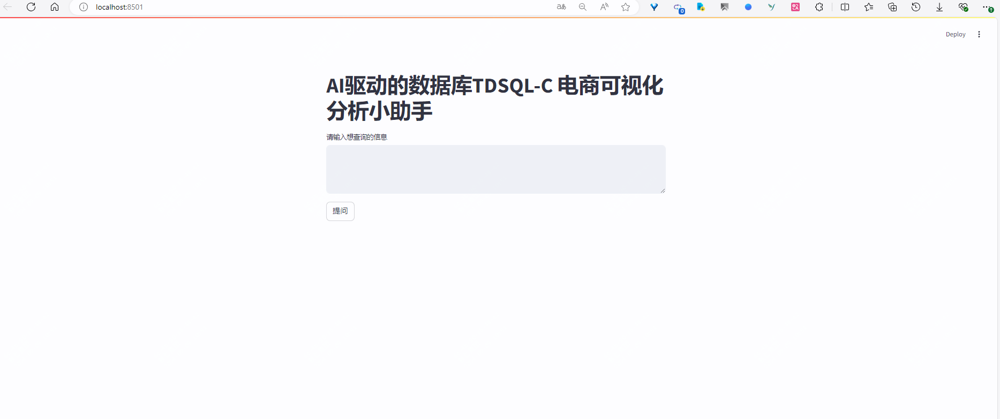

比如把你可以去**查询一下每类商品的名称和对应的销售总额**

### 相关资源释放

删除TDSQL-C Serverless
点击退还实例，退还后实例会在回收站中点击回收站即可看到已被退还的实例，为了数据安全，实例默认会在回收站中保留3天，如不需要可以进行立即释放


删除 HAI 算力

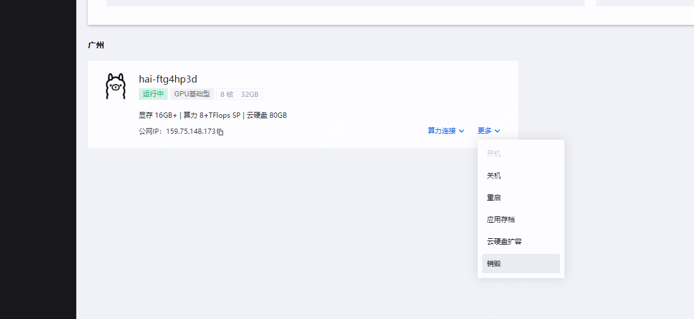

## 总结

本实验结合了 TDSQL-C Serverless 和 HAI 服务，展示了如何利用 AI 技术进行电商数据分析。

通过创建和配置 TDSQL-C Serverless 数据库实例，收集和清洗电商数据，并在 HAI 上训练和部署 AI 模型，能够实现高效的数据处理和分析。

在本次实验中，我们成功地利用了腾讯云的 TDSQL-C MySQL Serverless 和高性能应用服务 HAI，构建了一个高效、可扩展的 AI 电商数据分析系统。以下是实验的关键成果和学习点：

### 关键成果和学习点

1. **云原生数据库的优势**：
   - 通过使用 TDSQL-C MySQL Serverless，我们体验了云原生数据库在处理大规模数据时的弹性和高性能。这种弹性和高性能对于电商数据分析尤为重要，能够有效应对数据量的快速增长和变化。

2. **GPU 加速的 AI 模型**：
   - HAI 提供的 GPU 加速能力显著提升了 AI 模型的训练和推理速度，使得系统能够快速响应市场变化和用户需求。这种加速能力不仅提高了效率，还增强了系统的实时分析能力。

3. **实战演练的价值**：
   - 通过具体的案例研究，开发者不仅理解了理论知识，还通过实际操作加深了对系统功能的认识。这种实战演练帮助开发者更好地掌握了技术应用，并提升了他们解决实际问题的能力。

4. **持续学习与改进**：
   - 实验的总结也指出了系统可能存在的局限性和改进空间，鼓励开发者持续学习最新的技术和方法，以不断优化和升级系统。这种持续改进的理念对于保持系统的先进性和竞争力至关重要。

通过本次实验，我们不仅验证了技术方案的可行性，还为未来的优化和扩展提供了宝贵的经验和思路。希望开发者们能够继续探索和创新，推动 AI 电商数据分析系统的发展。

通过可视化工具展示分析结果，并生成数据分析报告，为业务决策提供有力支持。该实验不仅展示了云原生数据库和 AI 技术的结合应用，还为企业在电商领域的数据分析提供了实用的解决方案。
