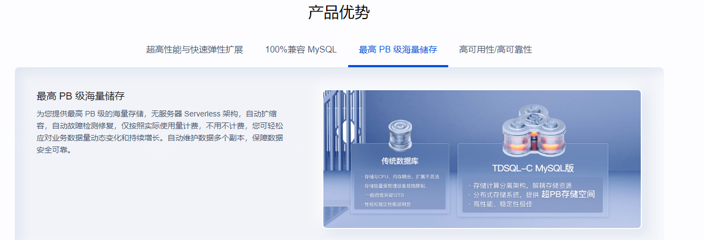
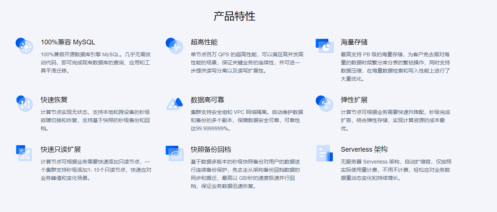
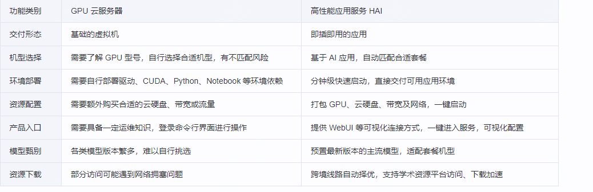

【AI驱动TDSQL-C Serverless数据库技术实战营】结合AI进行

在正式介绍本次项目之前，我们先来介绍几个名词，方便后面文章的理解。

文章中涉及到了腾讯云的TDSQL-C Mysql Serverless、HAI(Hyper Application Inventor)产品，前者之前已经有文章介绍过，今天这篇文章简单聊下，而后者是在如今大模型趋势下，推出的AI算力产品。

## 关于TDSQL-C Mysql

TDSQL-C MySQL 版（TDSQL-C for MySQL）是腾讯云自研的新一代云原生关系型数据库，你可以理解为云上的mysql，简单讲就是paas服务，你不需要关注背后的技术，只需要当成常规的mysql使用即可。

但实际上它不仅融合了传统数据库，而且有云计算与新硬件技术的优势，如果你正在用到mysql，那么它100%兼容 MySQL，而最关键的是它可以为用户提供极致弹性、高性能、高可用、高可靠、安全的数据库服务。

根据官方的测试及数据显示，它可以实现超百万 QPS 的高吞吐、PB 级海量分布式智能存储、Serverless 秒级伸缩，助力企业加速完成数字化转型。

关于产品更多的一些特点，可以到官方文档去查看

## 关于serverless

关于serverless，简单介绍下

Serverless是一种云计算执行模型，允许开发者编写和部署功能而无需关注底层的服务器管理。

它通过按需计费和自动扩展资源，使得应用能够更有效地利用云计算资源，提升开发效率和成本效益。

TDSQL-C MySQL的Serverless版本带来了几个显著的优势：

1. **弹性伸缩**: Serverless架构允许根据实际需求自动扩展和收缩数据库资源。这意味着在负载较低时，数据库可以自动缩减成本，而在负载增加时，可以自动扩展以满足性能需求，这样可以节省成本并确保数据库的稳定性和响应性能。

2. **按需计费**: 用户只需根据实际使用的资源量支付费用，而不需要预付费或维护固定容量。这种按需计费的模式特别适合对数据库使用情况有较大波动的场景，如开发和测试环境，或具有不规律工作负载的应用程序。

3. **管理简化**: Serverless模式下，数据库管理层面的操作（如备份、补丁更新、容灾恢复）通常由云服务提供商自动处理，减少了运维工作量，使开发团队可以更专注于应用程序开发和业务逻辑。

4. **高可用性**: TDSQL-C MySQL的Serverless版本通常会内置高可用性特性，如自动备份和灾难恢复机制，以确保数据安全和业务持续性。

5. **灵活性**: 开发团队可以根据需要快速部署新的数据库实例，而不受物理资源或固定容量的限制，这种灵活性可以帮助应对快速扩展或新项目的需求。

## 关于HAI介绍

高性能应用服务（Hyper Application Inventor，HAI）是一款面向 AI 、科学计算 的 GPU 应用服务产品，提供即插即用的澎湃算力与常见环境。

在目前的大趋势下，很多企业都希望有自己的AI工具或产品，但是如果纯靠公司自己搞算力，很困难，该工具可以助力中小企业及开发者快速部署 LLM。

相比于常规的GPU云服务器，HAI的优势也更加明显

## 上述三者结合下完成一个项目测试

## 总结

本文通过对TDSQL-C MySQL serveless与HAI的结合使用，完成了AI项目的实践，希望对大家的实践有所启发。