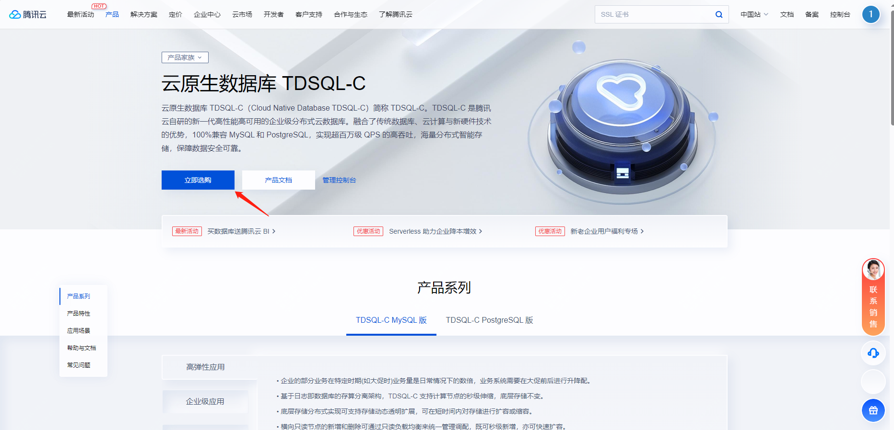
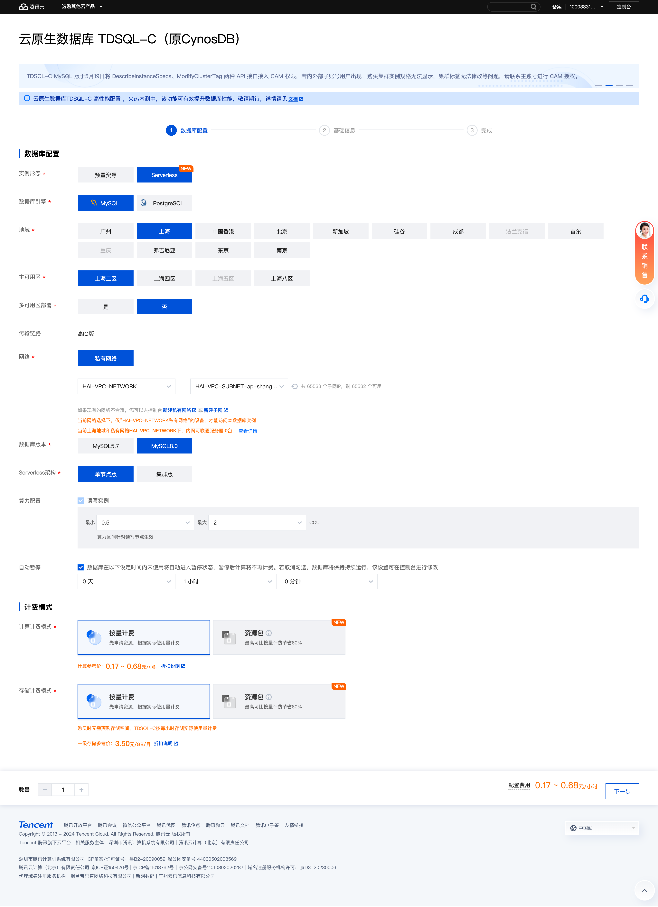
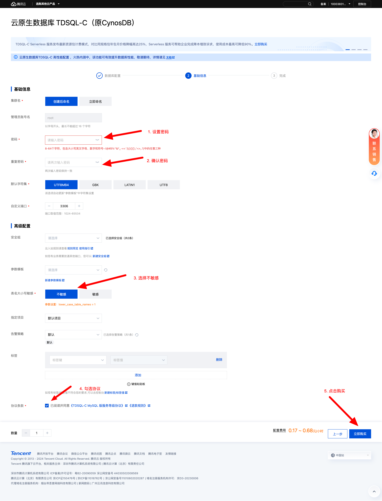
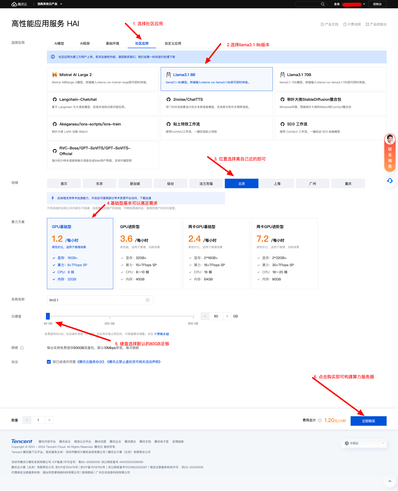
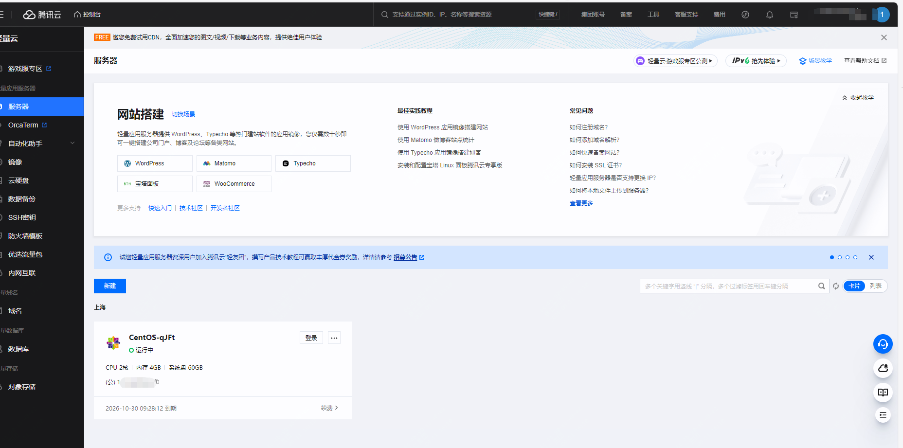
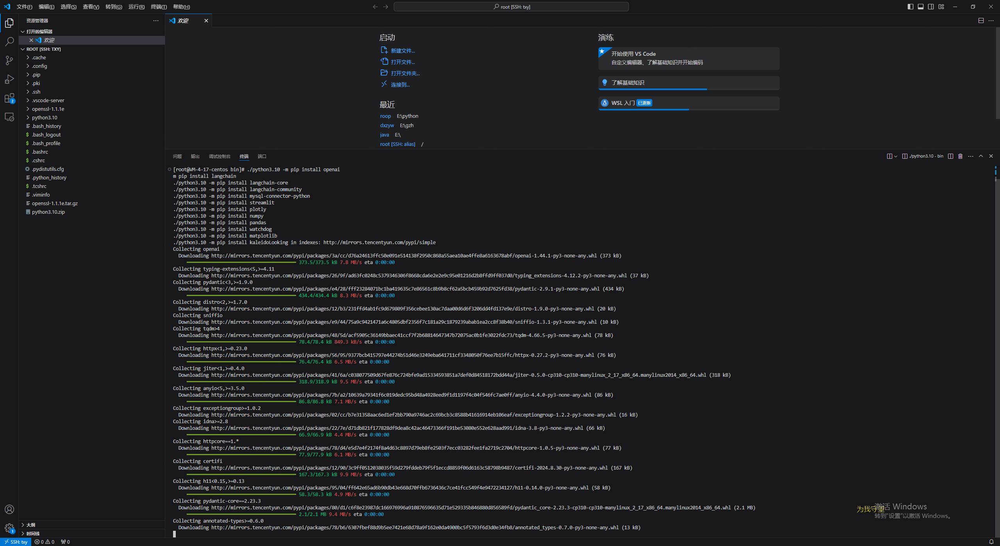
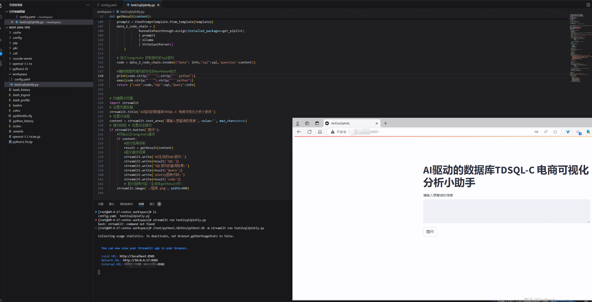

【AI驱动TDSQL-C Serverless数据库技术实战营】结合AI进行

在正式介绍本次项目之前，我们先来介绍几个名词，方便后面文章的理解。

文章中涉及到了腾讯云的TDSQL-C Mysql Serverless、HAI(Hyper Application Inventor)产品，前者之前已经有文章介绍过，今天这篇文章简单聊下，而后者是在如今大模型趋势下，推出的AI算力产品。

## 关于TDSQL-C Mysql

TDSQL-C MySQL 版（TDSQL-C for MySQL）是腾讯云自研的新一代云原生关系型数据库，你可以理解为云上的mysql，简单讲就是paas服务，你不需要关注背后的技术，只需要当成常规的mysql使用即可。

但实际上它不仅融合了传统数据库，而且有云计算与新硬件技术的优势，如果你正在用到mysql，那么它100%兼容 MySQL，而最关键的是它可以为用户提供极致弹性、高性能、高可用、高可靠、安全的数据库服务。

根据官方的测试及数据显示，它可以实现超百万 QPS 的高吞吐、PB 级海量分布式智能存储、Serverless 秒级伸缩，助力企业加速完成数字化转型。


关于产品更多的一些特点，可以到官方文档去查看


## 关于serverless

关于serverless，简单介绍下

Serverless是一种云计算执行模型，允许开发者编写和部署功能而无需关注底层的服务器管理。

它通过按需计费和自动扩展资源，使得应用能够更有效地利用云计算资源，提升开发效率和成本效益。

TDSQL-C MySQL的Serverless版本带来了几个显著的优势：

1. **弹性伸缩**: Serverless架构允许根据实际需求自动扩展和收缩数据库资源。这意味着在负载较低时，数据库可以自动缩减成本，而在负载增加时，可以自动扩展以满足性能需求，这样可以节省成本并确保数据库的稳定性和响应性能。

2. **按需计费**: 用户只需根据实际使用的资源量支付费用，而不需要预付费或维护固定容量。这种按需计费的模式特别适合对数据库使用情况有较大波动的场景，如开发和测试环境，或具有不规律工作负载的应用程序。

3. **管理简化**: Serverless模式下，数据库管理层面的操作（如备份、补丁更新、容灾恢复）通常由云服务提供商自动处理，减少了运维工作量，使开发团队可以更专注于应用程序开发和业务逻辑。

4. **高可用性**: TDSQL-C MySQL的Serverless版本通常会内置高可用性特性，如自动备份和灾难恢复机制，以确保数据安全和业务持续性。

5. **灵活性**: 开发团队可以根据需要快速部署新的数据库实例，而不受物理资源或固定容量的限制，这种灵活性可以帮助应对快速扩展或新项目的需求。


## 关于HAI介绍

高性能应用服务（Hyper Application Inventor，HAI）是一款面向 AI 、科学计算 的 GPU 应用服务产品，提供即插即用的澎湃算力与常见环境。

在目前的大趋势下，很多企业都希望有自己的AI工具或产品，但是如果纯靠公司自己搞算力，很困难，该工具可以助力中小企业及开发者快速部署 LLM。

相比于常规的GPU云服务器，HAI的优势也更加明显


## 开发环境介绍

因为本实验用到了python环境，我们计划使用云上的主机完成python环境安装部署，这样可以在任何网络可通的地方进行开发配置。

## 上述结合下完成一个项目测试

因为涉及到多个产品的配合使用，我们逐个展开介绍：

### 开通 Serverless 数据库 TDSQL-C Mysql

访问腾讯云官网申请 TDSQL-C Mysql 服务器

点击链接：https://cloud.tencent.com/product/tdsqlc



本次实验我们选定的服务器为 serverless 的服务器



配置的同时我们需要设置对应的账户及密码


配置完成后，直接购买即可，因为我们需要公网访问，所以需要去在控制台开启公网访问

在本次实验中，我们还需要初始化一个shop库，可以通过在在线控制台去完成，如果你本地有图形化工具，也可以通过工具链接

具体数据库初始化脚本如下,提前新建shop库

```
CREATE TABLE `ecommerce_sales_stats` (
  `category_id` int NOT NULL COMMENT '分类ID（主键）',
  `category_name` varchar(100) NOT NULL COMMENT '分类名称',
  `total_sales` decimal(15,2) NOT NULL COMMENT '总销售额',
  `steam_sales` decimal(15,2) NOT NULL COMMENT 'Steam平台销售额',
  `offline_sales` decimal(15,2) NOT NULL COMMENT '线下实体销售额',
  `official_online_sales` decimal(15,2) NOT NULL COMMENT '官方在线销售额',
  PRIMARY KEY (`category_id`)
) ENGINE=INNODB DEFAULT CHARSET=utf8mb4 AUTO_INCREMENT=1 COMMENT='电商分类销售统计表';
INSERT INTO `ecommerce_sales_stats` VALUES (1,'电子产品',150000.00,80000.00,30000.00,40000.00),(2,'服装',120000.00,20000.00,60000.00,40000.00),(3,'家居用品',90000.00,10000.00,50000.00,30000.00),(4,'玩具',60000.00,5000.00,30000.00,25000.00),(5,'书籍',45000.00,2000.00,20000.00,23000.00),(6,'运动器材',70000.00,15000.00,25000.00,30000.00),(7,'美容护肤',80000.00,10000.00,30000.00,40000.00),(8,'食品',50000.00,5000.00,25000.00,20000.00),(9,'珠宝首饰',30000.00,2000.00,10000.00,18000.00),(10,'汽车配件',40000.00,10000.00,15000.00,25000.00),(11,'手机配件',75000.00,30000.00,20000.00,25000.00),(12,'电脑配件',85000.00,50000.00,15000.00,20000.00),(13,'摄影器材',50000.00,20000.00,15000.00,15000.00),(14,'家电',120000.00,60000.00,30000.00,30000.00),(15,'宠物用品',30000.00,3000.00,12000.00,16800.00),(16,'母婴用品',70000.00,10000.00,30000.00,30000.00),(17,'旅行用品',40000.00,5000.00,15000.00,20000.00),(18,'艺术品',25000.00,1000.00,10000.00,14000.00),(19,'健康产品',60000.00,8000.00,25000.00,27000.00),(20,'办公用品',55000.00,2000.00,20000.00,33000.00);
CREATE TABLE `users` (
  `user_id` int NOT NULL AUTO_INCREMENT COMMENT '用户ID（主键，自增）',
  `full_name` varchar(100) NOT NULL COMMENT '用户全名',
  `username` varchar(50) NOT NULL COMMENT '用户名',
  `email` varchar(100) NOT NULL COMMENT '用户邮箱',
  `password_hash` varchar(255) NOT NULL COMMENT '用户密码的哈希值',
  `created_at` datetime DEFAULT CURRENT_TIMESTAMP COMMENT '创建时间',
  `updated_at` datetime DEFAULT CURRENT_TIMESTAMP ON UPDATE CURRENT_TIMESTAMP COMMENT '更新时间',
  `is_active` tinyint(1) DEFAULT '1' COMMENT '是否激活',
  PRIMARY KEY (`user_id`),
  UNIQUE KEY `email` (`email`)
) ENGINE=INNODB AUTO_INCREMENT=1 DEFAULT CHARSET=utf8mb4  COMMENT='用户表';
INSERT INTO `users` VALUES (1,'张伟','zhangwei','zhangwei@example.com','hashed_password_1','2024-08-18 04:07:18','2024-08-18 04:07:18',1),(2,'李娜','lina','lina@example.com','hashed_password_2','2024-08-18 04:07:18','2024-08-18 04:07:18',1),(3,'王芳','wangfang','wangfang@example.com','hashed_password_3','2024-08-18 04:07:18','2024-08-18 04:07:18',1),(4,'刘洋','liuyang','liuyang@example.com','hashed_password_4','2024-08-18 04:07:18','2024-08-18 04:07:18',1),(5,'陈杰','chenjie','chenjie@example.com','hashed_password_5','2024-08-18 04:07:18','2024-08-18 04:07:18',1),(6,'杨静','yangjing','yangjing@example.com','hashed_password_6','2024-08-18 04:07:18','2024-08-18 04:07:18',1),(7,'赵强','zhaoqiang','zhaoqiang@example.com','hashed_password_7','2024-08-18 04:07:18','2024-08-18 04:07:18',1),(8,'黄丽','huangli','huangli@example.com','hashed_password_8','2024-08-18 04:07:18','2024-08-18 04:07:18',1),(9,'周杰','zhoujie','zhoujie@example.com','hashed_password_9','2024-08-18 04:07:18','2024-08-18 04:07:18',1),(10,'吴敏','wumin','wumin@example.com','hashed_password_10','2024-08-18 04:07:18','2024-08-18 04:07:18',1),(11,'郑伟','zhengwei','zhengwei@example.com','hashed_password_11','2024-08-18 04:07:18','2024-08-18 04:07:18',1),(12,'冯婷','fengting','fengting@example.com','hashed_password_12','2024-08-18 04:07:18','2024-08-18 04:07:18',1),(13,'蔡明','caiming','caiming@example.com','hashed_password_13','2024-08-18 04:07:18','2024-08-18 04:07:18',1),(14,'潘雪','panxue','panxue@example.com','hashed_password_14','2024-08-18 04:07:18','2024-08-18 04:07:18',1),(15,'蒋磊','jianglei','jianglei@example.com','hashed_password_15','2024-08-18 04:07:18','2024-08-18 04:07:18',1),(16,'陆佳','lujia','lujia@example.com','hashed_password_16','2024-08-18 04:07:18','2024-08-18 04:07:18',1),(17,'邓超','dengchao','dengchao@example.com','hashed_password_17','2024-08-18 04:07:18','2024-08-18 04:07:18',1),(18,'任丽','renli','renli@example.com','hashed_password_18','2024-08-18 04:07:18','2024-08-18 04:07:18',1),(19,'彭涛','pengtao','pengtao@example.com','hashed_password_19','2024-08-18 04:07:18','2024-08-18 04:07:18',1),(20,'方圆','fangyuan','fangyuan@example.com','hashed_password_20','2024-08-18 04:07:18','2024-08-18 04:07:18',1),(21,'段飞','duanfei','duanfei@example.com','hashed_password_21','2024-08-18 04:07:18','2024-08-18 04:07:18',1),(22,'雷鸣','leiming','leiming@example.com','hashed_password_22','2024-08-18 04:07:18','2024-08-18 04:07:18',1),(23,'贾玲','jialing','jialing@example.com','hashed_password_23','2024-08-18 04:07:18','2024-08-18 04:07:18',1);
CREATE TABLE `orders` (
  `order_id` int NOT NULL AUTO_INCREMENT,
  `user_id` int DEFAULT NULL,
  `order_amount` decimal(10,2) DEFAULT NULL,
  `order_status` varchar(20) DEFAULT NULL,
  `order_time` datetime DEFAULT NULL,
  PRIMARY KEY (`order_id`)
) ENGINE=InnoDB AUTO_INCREMENT=1 DEFAULT CHARSET=utf8mb4 ;
INSERT INTO `orders` VALUES (1,3,150.50,'已支付','2024-08-23 10:01:00'),(2,7,89.20,'待支付','2024-08-23 10:03:15'),(3,12,230.00,'已支付','2024-08-23 10:05:30'),(4,2,99.90,'已发货','2024-08-23 10:07:45'),(5,15,120.00,'待发货','2024-08-23 10:10:00'),(6,21,180.50,'已支付','2024-08-23 10:12:15'),(7,4,105.80,'待支付','2024-08-23 10:14:30'),(8,18,210.00,'已支付','2024-08-23 10:16:45'),(9,6,135.20,'已发货','2024-08-23 10:19:00'),(10,10,160.00,'待发货','2024-08-23 10:21:15'),(11,1,110.50,'已支付','2024-08-23 10:23:30'),(12,22,170.80,'待支付','2024-08-23 10:25:45'),(13,8,145.20,'已发货','2024-08-23 10:28:00'),(14,16,190.00,'待发货','2024-08-23 10:30:15'),(15,11,125.50,'已支付','2024-08-23 10:32:30'),(16,19,165.20,'待支付','2024-08-23 10:34:45'),(17,5,130.00,'已发货','2024-08-23 10:37:00'),(18,20,175.80,'待发货','2024-08-23 10:39:15'),(19,13,140.50,'已支付','2024-08-23 10:41:30'),(20,14,155.20,'待支付','2024-08-23 10:43:45'),(21,9,135.50,'已发货','2024-08-23 10:46:00'),(22,23,185.80,'待发货','2024-08-23 10:48:15'),(23,17,160.50,'已支付','2024-08-23 10:50:30'),(24,12,145.20,'待支付','2024-08-23 10:52:45'),(25,3,130.00,'已发货','2024-08-23 10:55:00'),(26,8,115.50,'已支付','2024-08-23 10:57:15'),(27,19,120.20,'待支付','2024-08-23 10:59:30'),(28,6,145.50,'已发货','2024-08-23 11:01:45'),(29,14,130.20,'待支付','2024-08-23 11:04:00'),(30,5,125.50,'已支付','2024-08-23 11:06:15'),(31,21,135.20,'待支付','2024-08-23 11:08:30'),(32,7,140.50,'已发货','2024-08-23 11:10:45'),(33,16,120.20,'待支付','2024-08-23 11:13:00'),(34,10,135.50,'已支付','2024-08-23 11:15:15'),(35,2,140.20,'待支付','2024-08-23 11:17:30'),(36,12,145.20,'待支付','2024-08-23 12:00:00'),(37,15,130.20,'已支付','2024-08-23 12:02:15'),(38,20,125.50,'待发货','2024-08-23 12:04:30'),(39,17,135.20,'已支付','2024-08-23 12:06:45'),(40,4,140.50,'待支付','2024-08-23 12:09:00'),(41,10,120.20,'已发货','2024-08-23 12:11:15'),(42,13,135.50,'已支付','2024-08-23 12:13:30'),(43,18,145.20,'待支付','2024-08-23 12:15:45'),(44,6,130.20,'已发货','2024-08-23 12:18:00'),(45,11,125.50,'已支付','2024-08-23 12:20:15'),(46,19,135.20,'待支付','2024-08-23 12:22:30'),(47,5,140.50,'已发货','2024-08-23 12:24:45'),(48,20,120.20,'待支付','2024-08-23 12:27:00'),(49,17,135.50,'已支付','2024-08-23 12:29:15'),(50,4,145.20,'待支付','2024-08-23 12:31:30'),(51,10,130.20,'已发货','2024-08-23 12:33:45'),(52,13,125.50,'已支付','2024-08-23 12:36:00'),(53,18,135.20,'待支付','2024-08-23 12:38:15'),(54,6,140.50,'已发货','2024-08-23 12:40:30'),(55,11,120.20,'待支付','2024-08-23 12:42:45'),(56,19,135.50,'已支付','2024-08-23 12:45:00'),(57,5,145.20,'待支付','2024-08-23 12:47:15'),(58,20,130.20,'已发货','2024-08-23 12:49:30'),(59,17,125.50,'已支付','2024-08-23 13:01:45'),(60,4,135.20,'待支付','2024-08-23 13:04:00'),(61,10,140.50,'已发货','2024-08-23 13:06:15'),(62,13,120.20,'待支付','2024-08-23 13:08:30'),(63,18,135.50,'已支付','2024-08-23 13:10:45'),(64,6,145.20,'待支付','2024-08-23 13:13:00'),(65,11,130.20,'已发货','2024-08-23 13:15:15'),(66,19,125.50,'已支付','2024-08-23 13:17:30'),(67,5,135.20,'待支付','2024-08-23 13:19:45'),(68,20,140.50,'已发货','2024-08-23 13:22:00'),(69,17,120.20,'待支付','2024-08-23 13:24:15'),(70,4,135.50,'已支付','2024-08-23 13:26:30'),(71,10,145.20,'待支付','2024-08-23 13:28:45'),(72,13,130.20,'已发货','2024-08-23 13:31:00'),(73,18,125.50,'已支付','2024-08-23 13:33:15'),(74,6,135.20,'待支付','2024-08-23 13:35:30'),(75,11,140.50,'已发货','2024-08-23 13:37:45'),(76,19,120.20,'待支付','2024-08-23 13:40:00'),(77,5,135.50,'已支付','2024-08-23 13:42:15'),(78,20,145.20,'待支付','2024-08-23 13:44:30'),(79,17,130.20,'已发货','2024-08-23 13:46:45'),(80,4,125.50,'已支付','2024-08-23 13:49:00'),(81,10,135.20,'待支付','2024-08-23 13:51:15'),(82,13,140.50,'已发货','2024-08-23 13:53:30'),(83,18,120.20,'待支付','2024-08-23 13:55:45'),(84,6,135.50,'已支付','2024-08-23 13:58:00'),(85,11,145.20,'待支付','2024-08-23 14:00:15'),(86,19,130.20,'已发货','2024-08-23 14:02:30'),(87,5,125.50,'已支付','2024-08-23 14:04:45'),(88,20,135.20,'待支付','2024-08-23 14:07:00'),(89,17,140.50,'已发货','2024-08-23 14:09:15'),(90,4,120.20,'待支付','2024-08-23 14:11:30'),(91,10,135.50,'已支付','2024-08-23 14:13:45'),(92,13,145.20,'待支付','2024-08-23 14:16:00'),(93,18,130.20,'已发货','2024-08-23 14:18:15'),(94,6,125.50,'已支付','2024-08-23 14:20:30'),(95,11,135.20,'待支付','2024-08-23 14:22:45'),(96,19,140.50,'已发货','2024-08-23 14:25:00'),(97,5,120.20,'待支付','2024-08-23 14:27:15'),(98,20,135.50,'已支付','2024-08-23 14:29:30'),(99,17,145.20,'待支付','2024-08-23 14:31:45'),(100,4,130.20,'已发货','2024-08-23 14:34:00'),(101,10,125.50,'已支付','2024-08-23 14:36:15'),(102,13,135.20,'待支付','2024-08-23 14:38:30'),(103,18,140.50,'已发货','2024-08-23 14:40:45'),(104,16,120.20,'待支付','2024-08-23 14:43:00'),(105,12,135.50,'已支付','2024-08-23 14:45:15'),(106,3,145.20,'待支付','2024-08-23 14:47:30'),(107,8,130.20,'已发货','2024-08-23 14:49:45'),(108,19,125.50,'已支付','2024-08-23 14:52:00'),(109,6,135.20,'待支付','2024-08-23 14:54:15'),(110,14,140.50,'已发货','2024-08-23 14:56:30'),(111,10,120.20,'待支付','2024-08-23 14:58:45'),(112,13,135.50,'已支付','2024-08-23 15:01:00'),(113,18,145.20,'待支付','2024-08-23 15:03:15'),(114,6,130.20,'已发货','2024-08-23 15:05:30'),(115,11,125.50,'已支付','2024-08-23 15:07:45'),(116,19,135.20,'待支付','2024-08-23 15:10:00'),(117,5,140.50,'已发货','2024-08-23 15:12:15'),(118,20,120.20,'待支付','2024-08-23 15:14:30'),(119,17,135.50,'已支付','2024-08-23 15:16:45'),(120,4,145.20,'待支付','2024-08-23 15:19:00'),(121,10,130.20,'已发货','2024-08-23 15:21:15'),(122,13,125.50,'已支付','2024-08-23 15:23:30'),(123,18,135.20,'待支付','2024-08-23 15:25:45'),(124,6,140.50,'已发货','2024-08-23 15:28:00'),(125,11,120.20,'待支付','2024-08-23 15:30:15'),(126,19,135.50,'已支付','2024-08-23 15:32:30'),(127,5,145.20,'待支付','2024-08-23 15:34:45'),(128,20,130.20,'已发货','2024-08-23 15:37:00'),(129,17,125.50,'已支付','2024-08-23 15:39:15'),(130,4,135.20,'待支付','2024-08-23 15:41:30'),(131,10,140.50,'已发货','2024-08-23 15:43:45'),(132,13,120.20,'待支付','2024-08-23 15:46:00'),(133,18,135.50,'已支付','2024-08-23 15:48:15'),(134,6,145.20,'待支付','2024-08-23 15:50:30'),(135,11,130.20,'已发货','2024-08-23 15:52:45'),(136,19,125.50,'已支付','2024-08-23 15:55:00'),(137,5,135.20,'待支付','2024-08-23 15:57:15'),(138,20,140.50,'已发货','2024-08-23 15:59:30'),(139,17,120.20,'待支付','2024-08-23 16:01:45'),(140,4,135.50,'已支付','2024-08-23 16:04:00'),(141,10,145.20,'待支付','2024-08-23 16:06:15'),(142,13,130.20,'已发货','2024-08-23 16:08:30'),(143,18,125.50,'已支付','2024-08-23 16:10:45'),(144,6,135.20,'待支付','2024-08-23 16:13:00'),(145,11,140.50,'已发货','2024-08-23 16:15:15'),(146,19,120.20,'待支付','2024-08-23 16:17:30'),(147,5,135.50,'已支付','2024-08-23 16:19:45'),(148,20,145.20,'待支付','2024-08-23 16:22:00'),(149,17,130.20,'已发货','2024-08-23 16:24:15'),(150,4,125.50,'已支付','2024-08-23 16:26:30'),(151,10,135.20,'待支付','2024-08-23 16:28:45'),(152,13,140.50,'已发货','2024-08-23 16:31:00'),(153,18,120.20,'待支付','2024-08-23 16:33:15'),(154,6,135.50,'已支付','2024-08-23 16:35:30'),(155,11,145.20,'待支付','2024-08-23 16:37:45'),(156,19,130.20,'已发货','2024-08-23 16:40:00'),(157,5,125.50,'已支付','2024-08-23 16:42:15'),(158,20,135.20,'待支付','2024-08-23 16:44:30'),(159,17,140.50,'已发货','2024-08-23 16:46:45'),(160,4,120.20,'待支付','2024-08-23 16:49:00'),(161,10,135.50,'已支付','2024-08-23 16:51:15'),(162,13,145.20,'待支付','2024-08-23 16:53:30'),(163,18,130.20,'已发货','2024-08-23 16:55:45'),(164,6,125.50,'已支付','2024-08-23 16:58:00'),(165,11,135.20,'待支付','2024-08-23 17:00:15'),(166,19,140.50,'已发货','2024-08-23 17:02:30'),(167,5,120.20,'待支付','2024-08-23 17:04:45'),(168,20,135.50,'已支付','2024-08-23 17:07:00'),(169,17,145.20,'待支付','2024-08-23 17:09:15'),(170,4,130.20,'已发货','2024-08-23 17:11:30'),(171,10,125.50,'已支付','2024-08-23 17:13:45'),(172,13,135.20,'待支付','2024-08-23 17:16:00'),(173,18,140.50,'已发货','2024-08-23 17:18:15'),(174,6,120.20,'待支付','2024-08-23 17:20:30'),(175,11,135.50,'已支付','2024-08-23 17:22:45'),(176,19,145.20,'待支付','2024-08-23 17:25:00'),(177,5,130.20,'已发货','2024-08-23 17:27:15'),(178,20,125.50,'已支付','2024-08-23 17:29:30'),(179,17,135.20,'待支付','2024-08-23 17:31:45'),(180,4,140.50,'已发货','2024-08-23 17:34:00'),(181,10,120.20,'待支付','2024-08-23 17:36:15'),(182,13,135.50,'已支付','2024-08-23 17:38:30'),(183,18,145.20,'待支付','2024-08-23 17:40:45'),(184,6,130.20,'已发货','2024-08-23 17:43:00'),(185,11,125.50,'已支付','2024-08-23 17:45:15'),(186,19,135.20,'待支付','2024-08-23 17:47:30'),(187,5,140.50,'已发货','2024-08-23 17:49:45'),(188,20,120.20,'待支付','2024-08-23 17:52:00'),(189,17,135.50,'已支付','2024-08-23 17:54:15'),(190,4,145.20,'待支付','2024-08-23 17:56:30'),(191,10,130.20,'已发货','2024-08-23 17:58:45'),(192,13,125.50,'已支付','2024-08-23 18:01:00'),(193,18,135.20,'待支付','2024-08-23 18:03:15'),(194,6,140.50,'已发货','2024-08-23 18:05:30'),(195,11,120.20,'待支付','2024-08-23 18:07:45'),(196,19,135.50,'已支付','2024-08-23 18:10:00'),(197,5,145.20,'待支付','2024-08-23 18:12:15'),(198,20,130.20,'已发货','2024-08-23 18:14:30'),(199,17,125.50,'已支付','2024-08-23 18:16:45'),(200,4,135.20,'待支付','2024-08-23 18:19:00'),(201,10,140.50,'已发货','2024-08-23 18:21:15'),(202,13,120.20,'待支付','2024-08-23 18:23:30'),(203,18,135.50,'已支付','2024-08-23 18:25:45'),(204,6,145.20,'待支付','2024-08-23 18:28:00'),(205,11,130.20,'已发货','2024-08-23 18:30:15'),(206,19,125.50,'已支付','2024-08-23 18:32:30'),(207,5,135.20,'待支付','2024-08-23 18:34:45'),(208,20,140.50,'已发货','2024-08-23 18:37:00'),(209,17,120.20,'待支付','2024-08-23 18:39:15'),(210,4,135.50,'已支付','2024-08-23 18:41:30'),(211,10,145.20,'待支付','2024-08-23 18:43:45');

```

### HAI llama3 8b 大模型开通与使用

访问腾讯云 HAI 官网

官网地址：https://cloud.tencent.com/product/hai


根据实际需要配置需要的算力服务器



同样因为公网访问，所以我们需要配置开放对应的6399端口，默认是开启的，可以在策略中查看

如果没有开启可以通过配置自行开启


### python环境准备

我们是用的是腾讯云的主机，直接通过vscode进行联调



具体python环境安装不再介绍，安装完成后，需要提前安装一些依赖包，如下：



### 应用部署

我们在服务起上新建名为 workspace 文件夹进行保存项目代码

在项目文件夹（workspace）中新建配置文件 config.yaml

在项目文件夹（workspace）中新建应用主文件 text2sql2plotly.py

如下：


#### 代码部署

具体代码如下：

```
from langchain_community.utilities import SQLDatabase
from langchain_core.prompts import ChatPromptTemplate
from langchain_community.chat_models import ChatOllama
from langchain_core.output_parsers import StrOutputParser
from langchain_core.runnables import RunnablePassthrough
import yaml
import mysql.connector
from decimal import Decimal
import plotly.graph_objects as go
import plotly
import pkg_resources
import matplotlib

yaml_file_path = 'config.yaml'

with open(yaml_file_path, 'r') as file:
    config_data = yaml.safe_load(file)

#获取所有的已安装的pip包
def get_piplist(p):
    return [d.project_name for d in pkg_resources.working_set]


#获取llm用于提供AI交互
ollama = ChatOllama(model=config_data['hai']['model'],base_url=config_data['hai']['base_url'])

db_user = config_data['database']['db_user']
db_password = config_data['database']['db_password']
db_host = config_data['database']['db_host']
db_port= config_data['database']['db_port']
db_name = config_data['database']['db_name']
# 获得schema
def get_schema(db):
    
    schema = mysql_db.get_table_info()
    return schema
def getResult(content):
    global mysql_db
    # 数据库连接
    mysql_db = SQLDatabase.from_uri(f"mysql+mysqlconnector://{db_user}:{db_password}@{db_host}:{db_port}/{db_name}")
    # 获得 数据库中表的信息
    #mysql_db_schema = mysql_db.get_table_info()
    #print(mysql_db_schema)
    template = """基于下面提供的数据库schema, 根据用户提供的要求编写sql查询语句,要求尽量使用最优sql,每次查询都是独立的问题，不要收到其他查询的干扰:
    {schema}
    Question: {question}
    只返回sql语句，不要任何其他多余的字符，例如markdown的格式字符等:
    如果有异常抛出不要显示出来
    """
    prompt = ChatPromptTemplate.from_template(template)
    text_2_sql_chain = (
                RunnablePassthrough.assign(schema=get_schema)
                | prompt
                | ollama
                | StrOutputParser()
        )
    
    # 执行langchain 获取操作的sql语句
    sql = text_2_sql_chain.invoke({"question": content})

    print(sql)
    #连接数据库进行数据的获取
    # 配置连接信息
    conn = mysql.connector.connect(
    
        host=db_host,
        port=db_port,
        user=db_user,
        password=db_password,
        database=db_name
    )
    # 创建游标对象
    cursor = conn.cursor()
    # 查询数据
    cursor.execute(sql.strip("```").strip("```sql"))
    info = cursor.fetchall()
    # 打印结果
    #for row in info:
        #print(row)
    # 关闭游标和数据库连接
    cursor.close()
    conn.close()
    #根据数据生成对应的图表
    print(info)
    template2 = """
    以下提供当前python环境已经安装的pip包集合:
    {installed_packages};
    请根据data提供的信息，生成是一个适合展示数据的plotly的图表的可执行代码,要求如下：
        1.不要导入没有安装的pip包代码
        2.如果存在多个数据类别，尽量使用柱状图，循环生成时图表中对不同数据请使用不同颜色区分，
        3.图表要生成图片格式,保存在当前文件夹下即可，名称固定为：图表.png,
        4.我需要您生成的代码是没有 Markdown 标记的，纯粹的编程语言代码。
        5.生成的代码请注意将所有依赖包提前导入， 
        6.不要使用iplot等需要特定环境的代码
        7.请注意数据之间是否可以转换，使用正确的代码
        8.不需要生成注释
    data:{data}

    这是查询的sql语句与文本:

    sql:{sql}
    question:{question}
    返回数据要求:
    仅仅返回python代码，不要有额外的字符
    """
    prompt2 = ChatPromptTemplate.from_template(template2)
    data_2_code_chain = (
                RunnablePassthrough.assign(installed_packages=get_piplist)
                | prompt2
                | ollama
                | StrOutputParser()
        )
    
    # 执行langchain 获取操作的sql语句
    code = data_2_code_chain.invoke({"data": info,"sql":sql,'question':content})
    
    #删除数据两端可能存在的markdown格式
    print(code.strip("```").strip("```python"))
    exec(code.strip("```").strip("```python"))
    return {"code":code,"SQL":sql,"Query":info}


# 构建展示页面
import streamlit
# 设置页面标题
streamlit.title('AI驱动的数据库TDSQL-C 电商可视化分析小助手')
# 设置对话框
content = streamlit.text_area('请输入想查询的信息', value='', max_chars=None)
# 提问按钮 # 设置点击操作
if streamlit.button('提问'):
    #开始ai及langchain操作
    if content:
        #进行结果获取
        result = getResult(content)
        #显示操作结果
        streamlit.write('AI生成的SQL语句:')
        streamlit.write(result['SQL'])
        streamlit.write('SQL语句的查询结果:')
        streamlit.write(result['Query'])
        streamlit.write('plotly图表代码:')
        streamlit.write(result['code'])
        # 显示图表内容（生成在getResult中）
    streamlit.image('./图表.png', width=800) 

```

#### 配置文件配置

配置文件内容涉及如下：

这里主要分为 database 配置 和 hai 的配置

- database 的配置详解：
- db_user: 数据库账号，默认为 root
- db_password: 创建数据库时的密码
- db_host: 数据库连接地址
- db_port: 数据库公网端口
- db_name 创建的数据库名称，如果按手册来默认是 shop
- hai 配置详解：
- model 使用的大模型
- base_url 模型暴露的 api 地址，是公网 ip 和端口的组合，默认 llama端口是6399
- database 中填入 TDSQL-C 的相关配置，db_host、db_port可以在集群列表中找到

```
database: 
  db_user: root
  db_password: tencent_TDSQL
  db_host: sh-cynosdbmysql-grp-9d8prc9o.sql.tencentcdb.com
  db_port: 21919
  db_name: shop

hai:
  model: llama3.1:8b
  base_url: http://82.156.229.112:6399

```

#### 访问效果

在终端执行如下命令，然后在浏览器访问对应的8501端口，因为是ecs主机，所以需要提前开放该端口

```
streamlit run text2sql2plotly.py
```

我们可以查询 查询一下每类商品的名称和对应的销售总额 测试效果


### 资源释放

删除TDSQL-C Serverless

删除 HAI 算力

## 总结

本文通过对TDSQL-C MySQL serveless与HAI的结合使用，完成了AI项目的实践，希望对大家的实践有所启发。

在本次实验中，我们成功地利用了腾讯云的 TDSQL-C MySQL Serverless 和高性能应用服务 HAI，构建了一个高效、可扩展的 AI 电商数据分析系统。以下是实验的关键成果和学习点：

- 云原生数据库的优势
通过使用 TDSQL-C MySQL Serverless，我们体验了云原生数据库在处理大规模数据时的弹性和高性能。这种弹性和高性能对于电商数据分析尤为重要，能够有效应对数据量的快速增长和变化。

- GPU 加速的 AI 模型
HAI 提供的 GPU 加速能力显著提升了 AI 模型的训练和推理速度，使得系统能够快速响应市场变化和用户需求。这种加速能力不仅提高了模型的效率，还增强了系统的实时分析能力。

- 实战演练的价值
通过具体的案例研究，开发者不仅理解了理论知识，还通过实际操作加深了对系统功能的认识。这种实战演练帮助开发者更好地掌握了技术应用，并为未来的项目积累了宝贵的经验。

- 持续学习与改进
实验的总结也指出了系统可能存在的局限性和改进空间，鼓励开发者持续学习最新的技术和方法，以不断优化和升级系统。通过不断的学习和改进，我们可以确保系统始终处于技术前沿，满足不断变化的市场需求。

这次实验不仅展示了云原生数据库和 GPU 加速在 AI 电商数据分析中的应用潜力，还为开发者提供了宝贵的实践经验和持续改进的动力。