【AI驱动TDSQL-C Serverless数据库技术实战营】结合AI进行电商数据分析

去年我们已经发布过关于 TDSQL-C serverless 的文章，并进行了相关的性能测试和实验。今天这篇文章将结合当前热门的 AI 大模型，继续对该产品进行深入实验和分析。

在正式开始实验之前，按照惯例，我们先介绍一下文中涉及到的一些产品和技术。首先，TDSQL-C serverless 是一种高性能、弹性扩展的数据库解决方案，适用于各种复杂的应用场景。其次，AI 大模型近年来在自然语言处理、图像识别等领域取得了显著进展，成为推动技术创新的重要力量。

本次实验将重点关注 TDSQL-C serverless 在处理 AI 大模型相关数据时的性能表现。

如果想了解更多详细信息，可以参考官方文档。


## 产品介绍

TDSQL-C（Cloud Native Database TDSQL-C）是腾讯云自研的新一代高性能、高可用的企业级分布式云数据库。它融合了传统数据库、云计算与新硬件技术的优势，100% 兼容 MySQL 和 PostgreSQL，旨在为用户提供极致弹性、高性能和海量存储的数据库服务。

### 功能特点
1. **全面兼容**：
   - 100% 兼容 MySQL 5.7、8.0 和 PostgreSQL 10.17，几乎无需改动代码，即可完成现有数据库的查询、应用和工具的平滑迁移。

2. **超高性能**：
   - 深度定制开发的数据库内核（TXSQL），性能远超同引擎的开源产品，特别适用于企业级的重要场景。

3. **海量存储**：
   - 支持最高 PB 级的海量存储，采用无服务器（Serverless）架构，自动扩缩容，轻松应对业务数据量的动态变化和持续增长。

4. **快速恢复**：
   - 计算节点实现无状态，支持本地和跨设备的秒级故障切换和恢复；支持基于快照的秒级备份和回档。

5. **数据高可靠**：
   - 集群支持安全组和 VPC 网络隔离，自动维护数据和备份的多个副本，保障数据安全可靠，可靠性达 99.9999999%。

6. **弹性扩展**：
   - 计算节点可根据业务需要快速升降配，秒级完成扩容，结合弹性存储，实现计算资源的成本最优。

### 应用场景
TDSQL-C 适用于多种应用场景，包括但不限于：
- **游戏应用**：灵活弹性扩展，高稳定性，适应业务峰值。
- **电商/直播/教育**：支持大容量数据应用，快速响应业务需求。
- **金融/保险**：高安全性和可靠性，保障数据安全。
- **互联网/移动 APP**：高性能和高可用性，满足复杂应用需求。


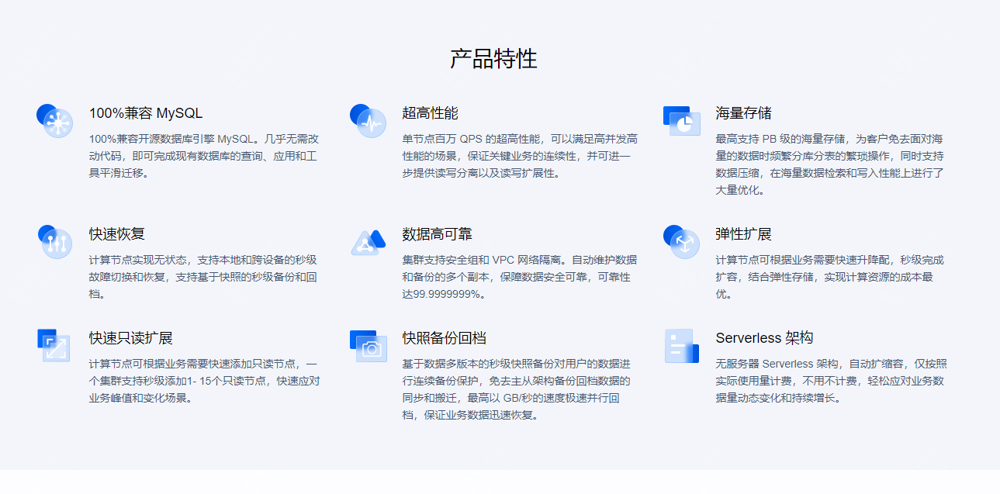

TDSQL-C Serverless 是腾讯云自研的新一代云原生关系型数据库 TDSQL-C MySQL 版的无服务器架构版。它采用了“存算分离”的架构设计，具备高弹性、高性能和高可用性等特点。

### 主要特点
1. **按需启动和停止**：
   - 数据库实例会根据业务负载自动启动和停止，无需手动干预，极大地节省了资源和成本。

2. **自动扩缩容**：
   - 根据实际的 CPU 和内存使用情况，系统会自动进行扩容或缩容，确保在高峰期也能稳定运行。

3. **按使用计费**：
   - 费用按实际使用的计算和存储资源量收取，不用不付费，按秒计量，按小时结算。

4. **高性能**：
   - 采用深度定制的数据库内核，性能远超同类开源产品，特别适用于需要高性能和高可用性的企业级应用。

### 适用场景
- **开发和测试环境**：适合低频使用的数据库场景。
- **物联网（IoT）和边缘计算**：应对不确定负载的场景。
- **小程序云开发和中小企业建站**：适用于 SaaS 应用场景。
- **学校实验或教学环境**：全托管，免运维。

TDSQL-C Serverless 通过这些特点，为用户提供了灵活、高效且经济的数据库解决方案。


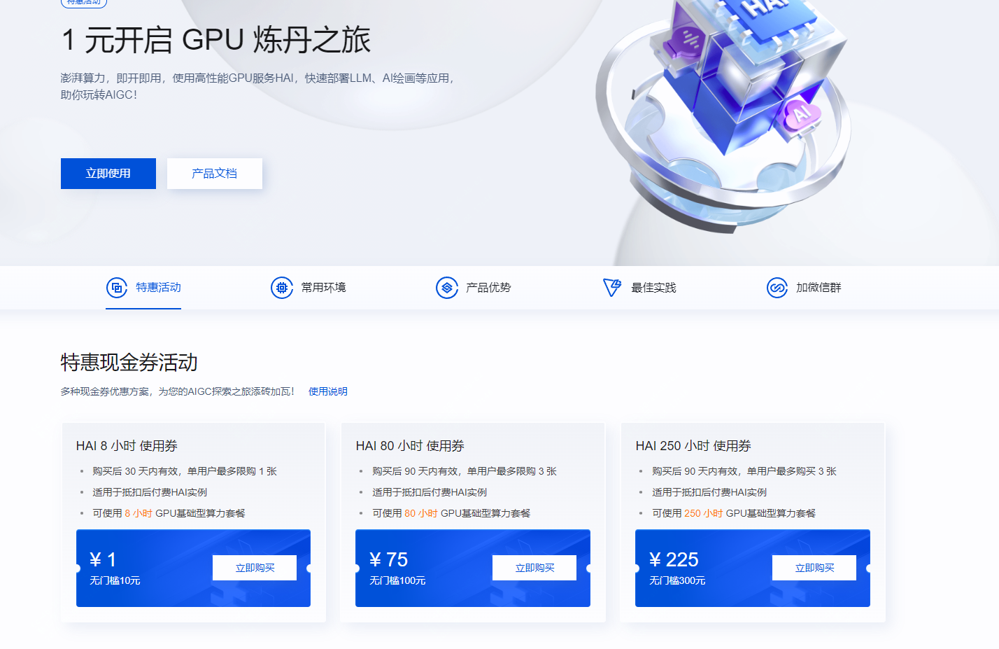


腾讯云的HAI（High-Performance AI）平台是一款面向AI和科学计算的高性能GPU算力服务产品。它提供即插即用的强大算力和常见环境，帮助中小企业和开发者快速部署大语言模型（LLM）、AI作画、数据科学等高性能应用。

### 主要特点
1. **即插即用**：HAI平台提供预装的开发工具和组件，用户可以快速启动并使用。
2. **灵活使用**：支持关机不计费和数据保留，用户可以根据需求动态开关机，节省成本。
3. **一键部署**：分钟级自动构建LLM、AI作画等应用环境，预置如StableDiffusion、ChatGLM等热门模型。
4. **可视化界面**：提供友好的图形界面，支持JupyterLab、WebUI等多种算力连接方式，降低AI研究和调试的门槛。

### 应用场景
- **AI作画**：利用深度学习算法进行创作，广泛应用于数字媒体、游戏、动画、电影和广告等领域。
- **AI对话/写作**：部署和调试大语言模型，进行自然语言处理任务。
- **数据科学**：处理和分析大规模数据集，进行科学计算和研究。

### 优势
- **智能匹配算力**：多种算力套餐满足不同需求，预置主流AI模型及常用插件。
- **动态更新**：模型版本与时俱进，无需频繁操作。
- **高效开发**：大幅提高应用层的开发生产效率，降低GPU云服务器使用门槛。
  
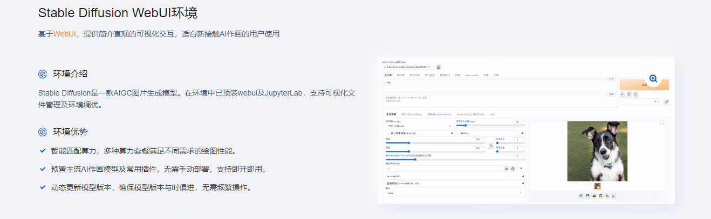


而在如今AI时代，TDSQL-C结合AI又会有怎样的火花，今天这篇文章将结合**TDSQL-C、serverless、HAI**（高性能应用服务）完成一个应用实验，给大家提供一个AI场景的新实验。


## 实验内容介绍
本次实验是基于python与Langchain，来完成对电商数据的分析
### 具体实验步骤

- 1.购买TDSQL-C Mysql Serverless
- 2.部署HAI llama 大模型
- 3.python环境及开发环境配置
- 4.验证结果
  
### 1.购买TDSQL-C Mysql Serverless

访问如下链接，进入数据库页面,点击立即选购
>https://cloud.tencent.com/product/tdsqlc 

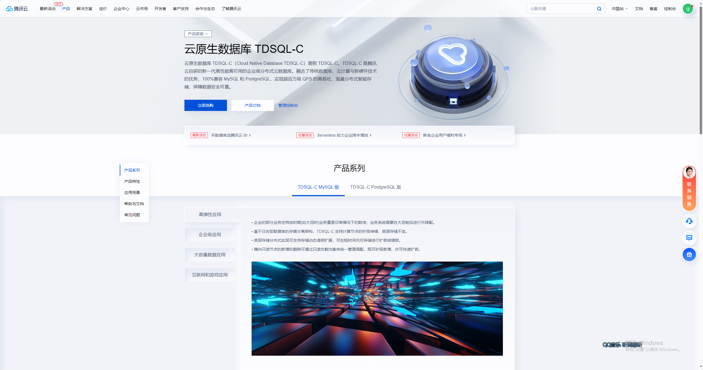 

根据图表选择选定服务器
选定的服务器为 serverless 的服务器，具体配置如下：

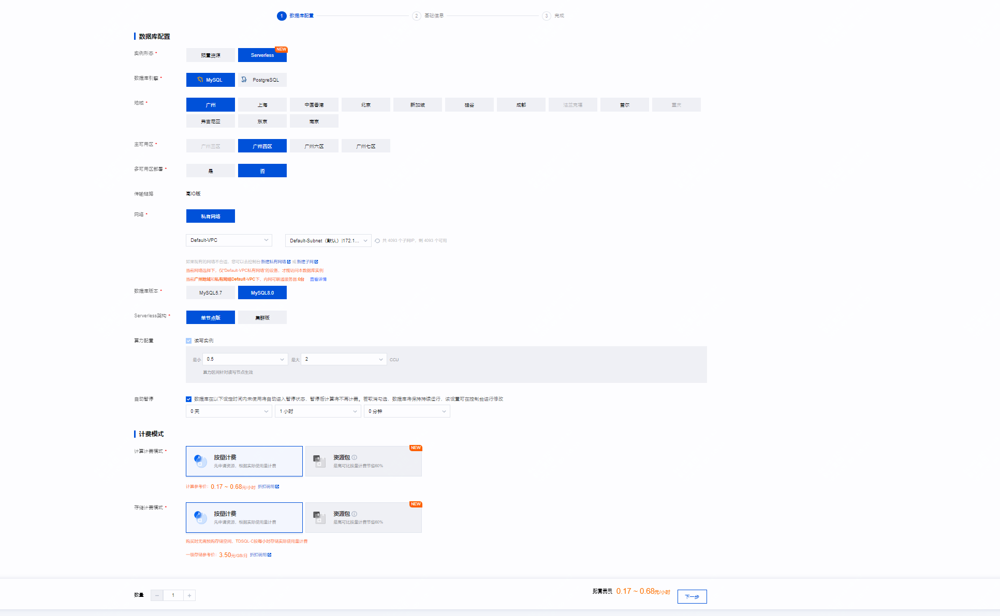

设置账户信息，配置密码，选择字符集等，如下图：

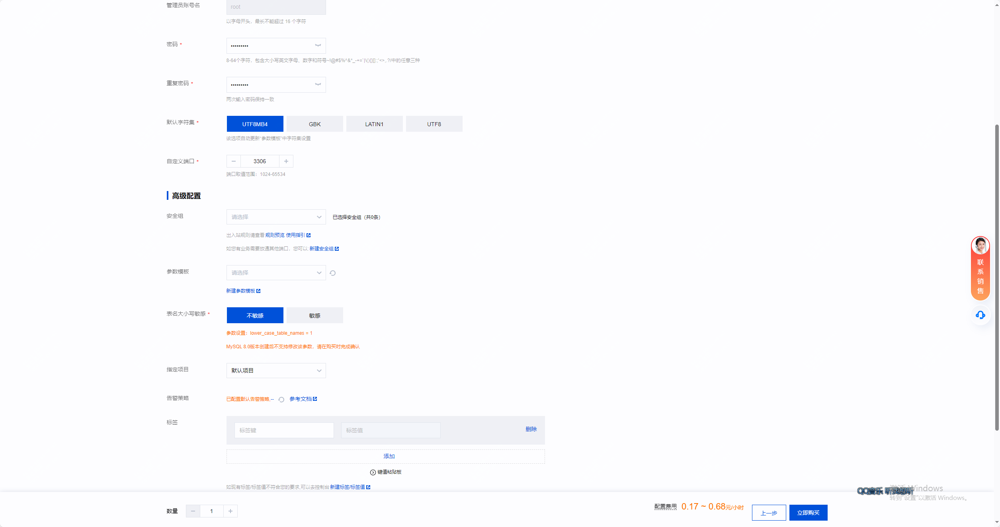

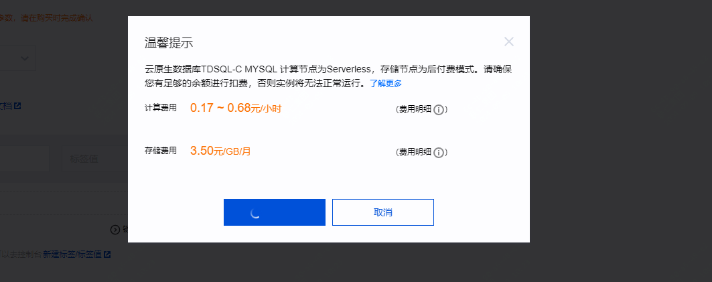

然后前往管理页面，配置开启公网访问，通过在线管理工具，创建数据库，并完成数据初始化

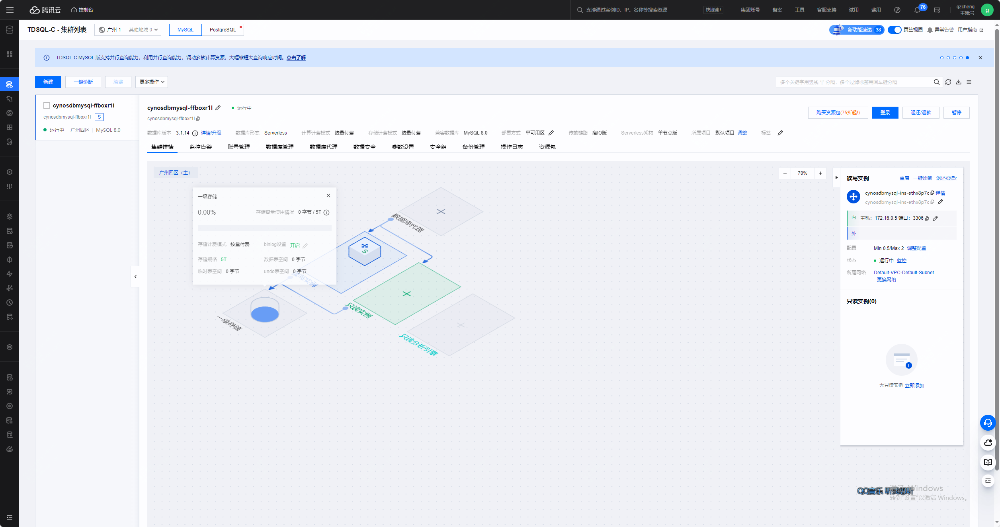

如下登录管理工具

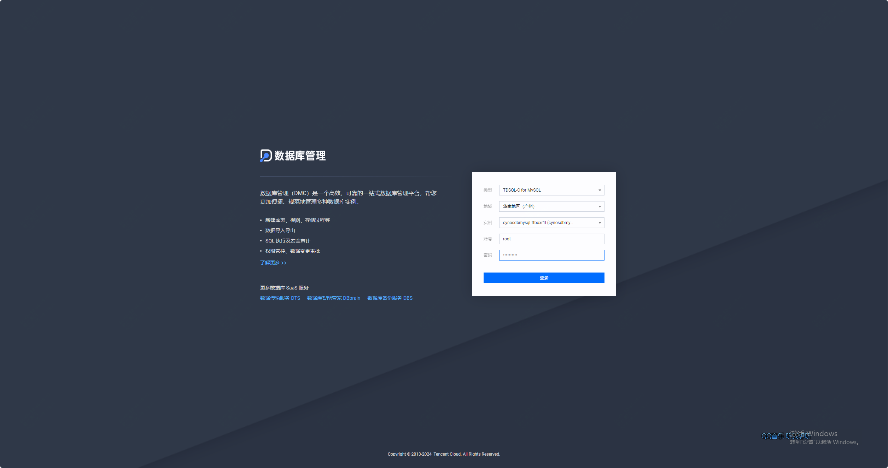

下面为新建库，并且初始化表

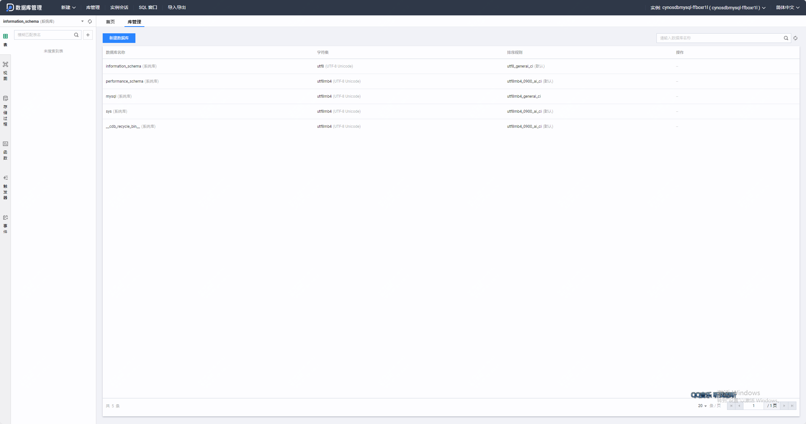

```
```

导入数据完成

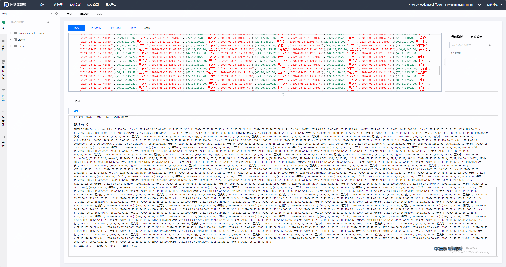

如上完成了数据库导入

### 2.部署HAI llama 大模

访问如下地址：

>官网地址：https://cloud.tencent.com/product/hai

页面如下：

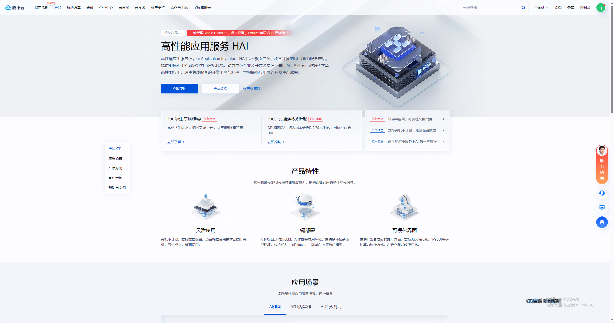

点击立即使用后，新建服务器
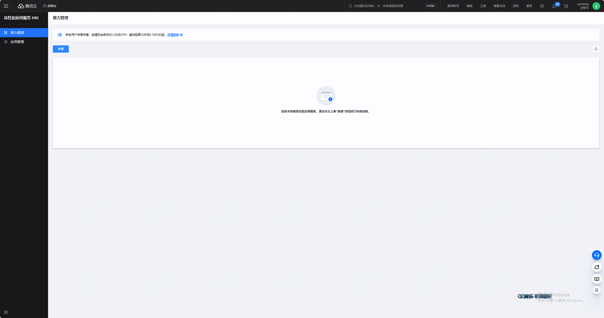

如下选择立即购买即可

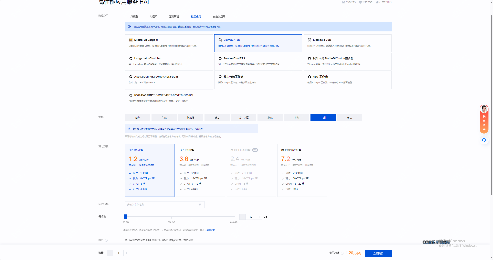

如下可以查看HAI算力服务器的llama对外端口

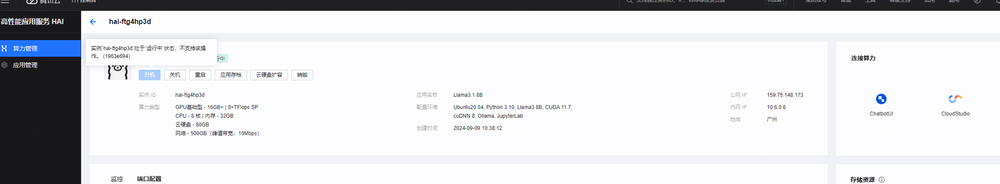

检查是否已经默认开放 6399端口，如下状态即是开放

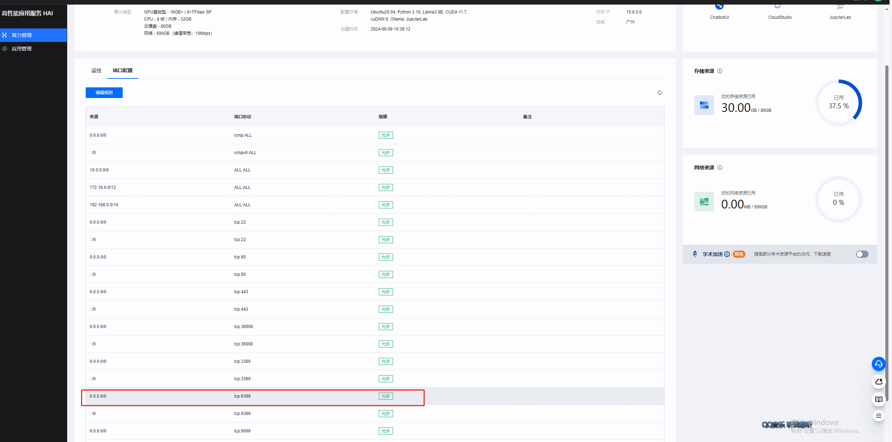

llama 大模型服务准备完毕！

### 3.python环境及开发环境配置

具体不在详细介绍，推荐版本3.10.11

python就绪后，需要安装对应模块，如下

```
pip install openai 
pip install langchain 
pip install langchain-core 
pip install langchain-community 
pip install mysql-connector-python 
pip install streamlit 
pip install plotly 
pip install numpy
pip install pandas
pip install watchdog
pip install matplotlib
pip install kaleido
```

### 4.应用搭建并验证


新建名为 shop 文件夹进行保存项目代码
在项目文件夹（shop）中新建配置文件 config.yaml
在项目文件夹（shop）中新建应用主文件 text2sql2plotly.py

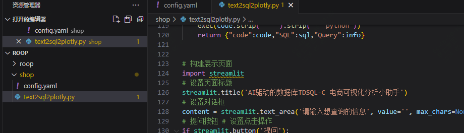

根据实际配置修改config.yaml的配置

这里主要分为 database 配置 和 hai 的配置

- database 的配置详解：
db_user: 数据库账号，默认为 root
db_password: 创建数据库时的密码
db_host: 数据库连接地址
db_port: 数据库公网端口
db_name 创建的数据库名称，如果按手册来默认是 shop
- hai 配置详解：
model 使用的大模型
base_url 模型暴露的 api 地址，是公网 ip 和端口的组合，默认 llama端口是6399
database 中填入 TDSQL-C 的相关配置，db_host、db_port可以在集群列表中找到

hai base_url将实例的ip进行替换，ip可以在HAI的控制台-> 算力管理中找到

配置完成后，copy如下代码

```

```

然后运行并测试效果，在终端执行如下代码

```
streamlit run text2sql2plotly.py
```

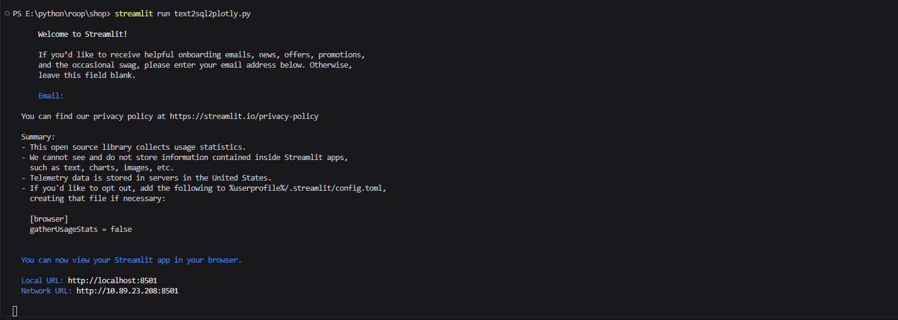

访问本地的8501端口，可以看到已经可以正常访问了

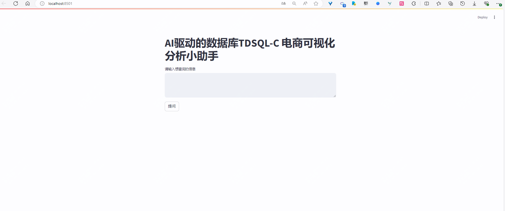

比如把你可以去**查询一下每类商品的名称和对应的销售总额**

### 相关资源释放

删除TDSQL-C Serverless
点击退还实例，退还后实例会在回收站中点击回收站即可看到已被退还的实例，为了数据安全，实例默认会在回收站中保留3天，如不需要可以进行立即释放


删除 HAI 算力

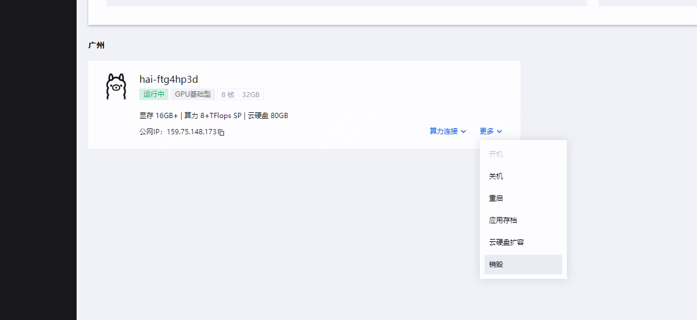

## 总结

本实验结合了 TDSQL-C Serverless 和 HAI 服务，展示了如何利用 AI 技术进行电商数据分析。

通过创建和配置 TDSQL-C Serverless 数据库实例，收集和清洗电商数据，并在 HAI 上训练和部署 AI 模型，能够实现高效的数据处理和分析。

在本次实验中，我们成功地利用了腾讯云的 TDSQL-C MySQL Serverless 和高性能应用服务 HAI，构建了一个高效、可扩展的 AI 电商数据分析系统。以下是实验的关键成果和学习点：

### 关键成果和学习点

1. **云原生数据库的优势**：
   - 通过使用 TDSQL-C MySQL Serverless，我们体验了云原生数据库在处理大规模数据时的弹性和高性能。这种弹性和高性能对于电商数据分析尤为重要，能够有效应对数据量的快速增长和变化。

2. **GPU 加速的 AI 模型**：
   - HAI 提供的 GPU 加速能力显著提升了 AI 模型的训练和推理速度，使得系统能够快速响应市场变化和用户需求。这种加速能力不仅提高了效率，还增强了系统的实时分析能力。

3. **实战演练的价值**：
   - 通过具体的案例研究，开发者不仅理解了理论知识，还通过实际操作加深了对系统功能的认识。这种实战演练帮助开发者更好地掌握了技术应用，并提升了他们解决实际问题的能力。

4. **持续学习与改进**：
   - 实验的总结也指出了系统可能存在的局限性和改进空间，鼓励开发者持续学习最新的技术和方法，以不断优化和升级系统。这种持续改进的理念对于保持系统的先进性和竞争力至关重要。

通过本次实验，我们不仅验证了技术方案的可行性，还为未来的优化和扩展提供了宝贵的经验和思路。希望开发者们能够继续探索和创新，推动 AI 电商数据分析系统的发展。

通过可视化工具展示分析结果，并生成数据分析报告，为业务决策提供有力支持。该实验不仅展示了云原生数据库和 AI 技术的结合应用，还为企业在电商领域的数据分析提供了实用的解决方案。
