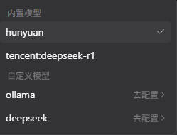
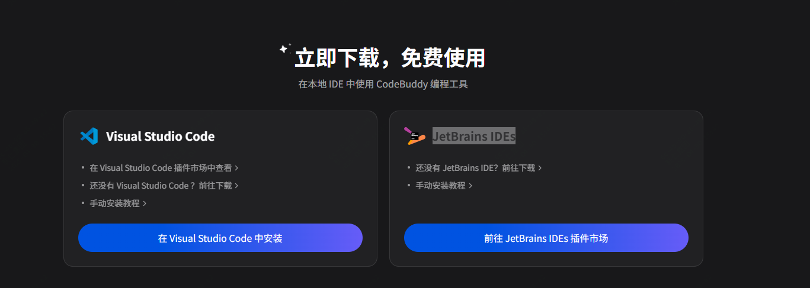
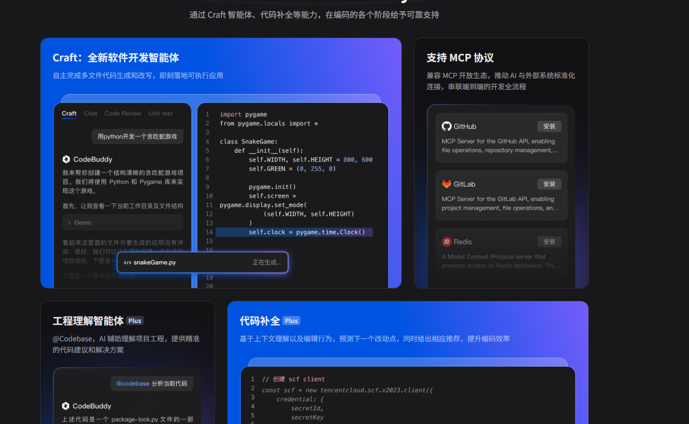
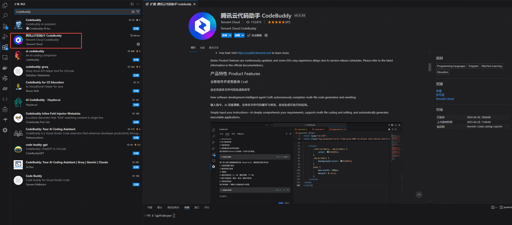
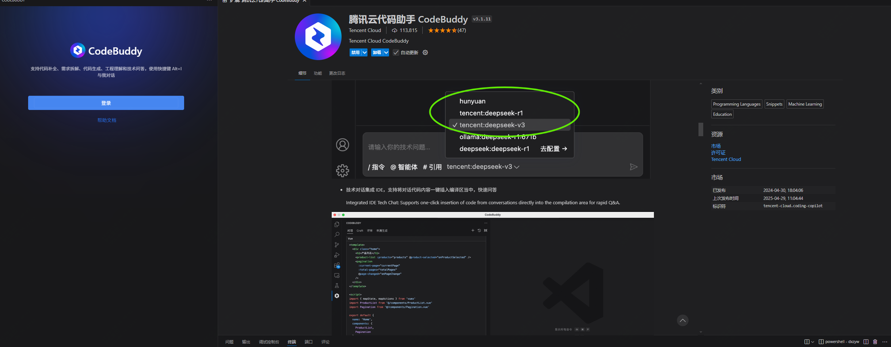
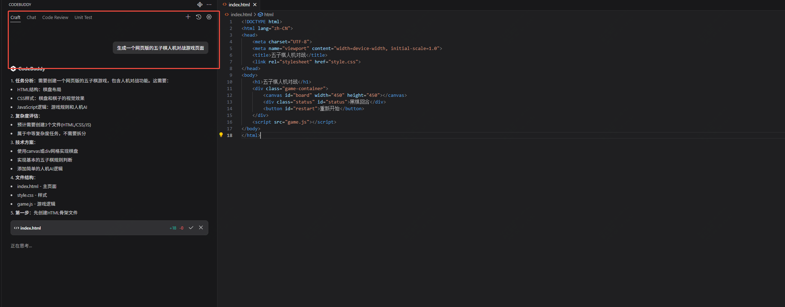
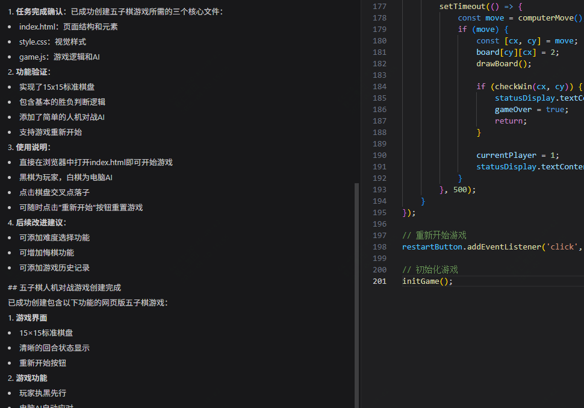
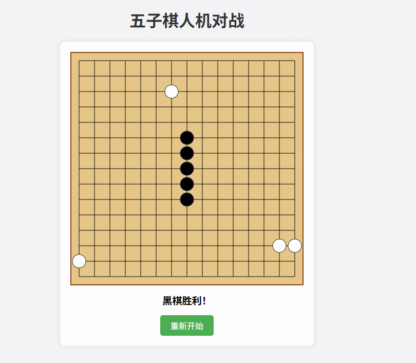
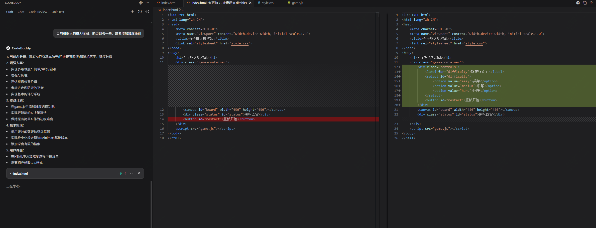

我正在参加CodeBuddy「首席试玩官」内容创作大赛，本文所使用的 CodeBuddy 免费下载链接：[腾讯云代码助手 CodeBuddy - AI 时代的智能编程伙伴”；](https://copilot.tencent.com/?fromSource=gwzcw.9661261.9661261.9661261&utm_medium=cpc&utm_id=gwzcw.9661261.9661261.9661261&from_column=20421&from=20421)

最近AI编程很火，据说我司程序员现在每天可以准点下班，AI起到了很大的作用。那么你有没有找到适合你的趁手工具。

今天看到腾讯云推出的最新的代码助手，立马去体验了一把，当真是舒服，免费的感觉真爽！

那么就一起来看下它的神奇与独特之处吧！

## 关于CodeBuddy

腾讯云代码助手（CodeBuddy）是腾讯自研的AI编程提效工具，目前支持专为开发者打造的deepseek-r1模型以及腾讯自己的混元模型。

最最关键的是，目前可以免费使用，你可以直接在vscode中查找对应插件，也可以在JetBrains IDEs中使用

那么与其他AI编程助手相比，它有哪些独特之处呢？

## CodeBuddy有哪些功能特点？

- CodeBuddy支持超过200种编程语言，可以兼容多种主流IDE
- 支持 MCP
- 提供开发智能体 Craft、智能代码补全、单元测试、代码诊断等多项高效功能

据说目前腾讯大佬都有85% 以上的开发者在使用 CodeBuddy了，并且有25%的代码是用AI生成的。

## CodeBuddy快速使用

好的，那么现在就到了今天的重头戏，我们来个简单快速使用，后面还会有一些关于结合mcp的使用。

我们直接到vscode中找到对应的插件，然后安装登录就可以使用了！

我们通过craft的方式来让助手生成一个网页版的五子棋人机对战游戏页面生成一个网页版的五子棋人机对战游戏页面

可以看到它首先生成了index页面，然后接着创建CSS样式文件，为五子棋游戏添加视觉样式，后面接着创建JavaScript游戏逻辑文件，实现五子棋的核心功能，对于这类开发小任务基本不需要去调整。

在任务完成后，它会给出一定的说明，我们去试一下这个效果。

貌似它的棋力有点弱，不过基本功能还是实现了

我们让AI助手，调整下棋力试下

感兴趣的，快去试下吧！
