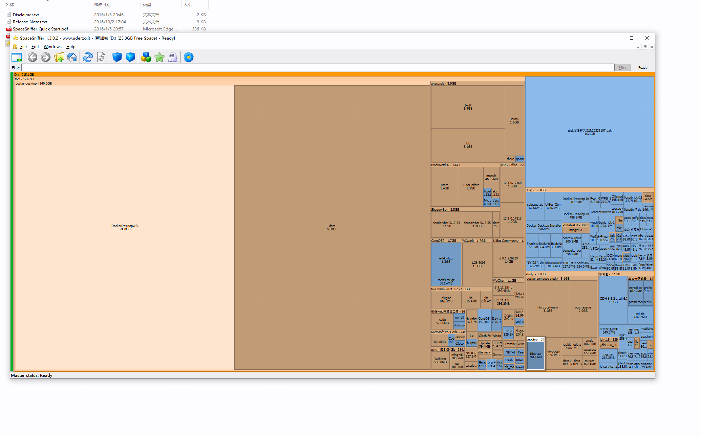

问题：如果你的磁盘红了，确找不到哪个文件大怎么办？

今天推荐一个磁盘分析工具，可以快速将你某个盘符下的所有文件及文件夹关系梳理出来

可以看到具体文件夹占了D盘的多大空间

而该文件夹下又有哪些文件。

可以看到我D盘的docker-desketop就用了140G，这玩意还是挺费盘的

然后下载文件夹下有很多小文件

在开始使用的时候，根据文件的多少会需要一定时间分析，需要耐心等待。

快去尝试一下吧，工具地址在评论区获取