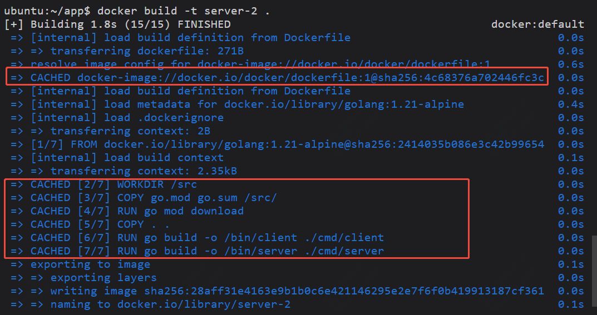
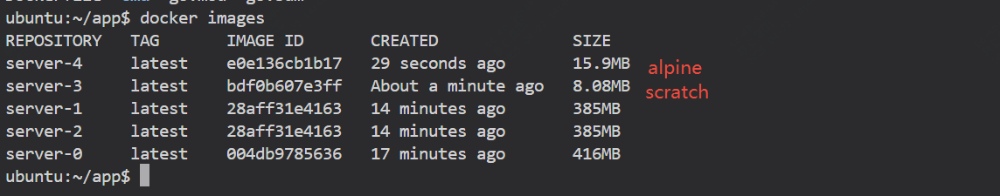

为什么你打包的镜像那么大？为什么打包过程耗时这么久？导致整个部署的效率很低，如果你有这样的疑问，那么很多时候是因为dockerfile的问题，这篇文章将会深入介绍dockerfile的最佳实践，帮助你构建更高效、更小、更可维护的镜像。


## 缓存机制

缓存是导致镜像打包时长的关键因素。docker在构建镜像时，每一条命令都是一层，也就是layer，如果某一层没有变化，那么就会使用已有缓存，避免重复执行。

比如一个python项目,下面就是一个错误使用，因为requirement这些依赖不一定每次都会变

```
COPY . .
RUN pip install -r requirements.txt
```

所以正确的配置应该是:

```
COPY requirements.txt .
RUN pip install -r requirements.txt
COPY . .
```

如果某个层的输入（比如 COPY 的文件内容）没有变，Docker 会 使用缓存，否则就会重新构建该层及其后续层。

一旦某层失效，后续层都会重新构建：如果 COPY . . 改变了，那它之后的 RUN pip install -r requirements.txt 也必须重新执行。

此优化适用于：

Python (pip install -r requirements.txt)

Go (go mod download)

Node.js (npm install)

那么如何确认这次构建有使用到缓存呢？我们通过一个go项目来展示

这是最开始没有优化的dockerfile,构建耗时81s

```
# syntax=docker/dockerfile:1
FROM golang:1.20-alpine
WORKDIR /src
COPY . .
RUN go mod download
RUN go build -o /bin/client ./cmd/client
RUN go build -o /bin/server ./cmd/server
ENTRYPOINT [ "/bin/server" ]
```

我们先做缓存优化,如下cached的行是会进行缓存的，第一次执行过后，部分内容就会缓存

```
# syntax=docker/dockerfile:1
FROM golang:1.21-alpine # cached
WORKDIR /src # cached
COPY go.mod go.sum /src/ # cached
RUN go mod download # cached
COPY . .
RUN go build -o /bin/client ./cmd/client
RUN go build -o /bin/server ./cmd/server
ENTRYPOINT [ "/bin/server" ]
```

可以看到再次执行，很多地方都用到了缓存，时间直接降到1.8s



但现在还有问题，打包的镜像时间是短了，但是镜像依旧很大，我们继续优化。

## 多阶段构建

如果想要有效的减小镜像的体积，那么采用多阶段构建可以减小最终体积，适合java或者go这种有编译步骤的。除了可以减小镜像体积外，还有就是可以减少攻击面。

我们还是用上面这个go来做演示。

下面是一个采用的了多阶段构建的dockerfile
```
# syntax=docker/dockerfile:1
FROM golang:1.21-alpine
WORKDIR /src
COPY go.mod go.sum /src/
RUN go mod download
COPY . .
RUN go build -o /bin/client ./cmd/client
RUN go build -o /bin/server ./cmd/server
# as it is just a build step, we don't need CMD or ENTRYPOINT command

FROM scratch # minimal base image
COPY --from=0 /bin/server /bin/ # copy /bin/server file from the previously build image (0 as we didn't name it)
ENTRYPOINT [ "/bin/server" ]
```

我们这里用到了一个基础镜像 scratch

scratch 是 Docker 提供的 最小基础镜像，它几乎是一个 空镜像——没有 Shell、包管理器或任何系统库。它通常用于：

- 创建最小化的容器（只包含需要的二进制文件）。

- 构建静态编译的应用（如 Go），不依赖额外的库或动态链接文件。

- 提高安全性，减少攻击面，因为它不包含任何系统工具。

由于 scratch 没有 Shell，容器启动时只能运行 一个二进制文件，并且无法进入 bash 或 sh 进行调试。

如果希望有一些基础环境那么可以使用**alpine:latest**


`alpine:latest` 和 `scratch` 是两种 **完全不同** 的 Docker 基础镜像


| 特性            | `scratch` | `alpine:latest` |
|---------------|-----------|--------------|
| **大小**       | 0MB（完全空） | ~5MB |
| **是否带 Shell** | ❌ 无 (`bash/sh` 都没有) | ✅ 有 (`sh`) |
| **是否有包管理** | ❌ 无 (`apk`、`apt` 都没有) | ✅ 有 (`apk`) |
| **是否有标准库** | ❌ 无 (`libc`, `musl`) | ✅ 有 (`musl`) |
| **是否可调试** | ❌ 无调试工具 | ✅ 可以使用 `apk add` 安装调试工具 |
| **适用于** | **静态编译** 应用 | 轻量化 Linux 发行版，适用于需要动态库的应用 |


可以看到最终的镜像大小有了显著的变化



前面的dockerfile还有一个点要介绍

就是里面有一行是
```bash
COPY --from=0 
```
首先解释在这个的含义，如果你在 FROM 语句后没有指定 AS 关键字，Docker 会自动按顺序编号构建阶段，从 0 开始。

这部分的使用，还可以这样

```bash
FROM golang:1.21 AS builder
WORKDIR /src
COPY go.mod go.sum ./
RUN go mod download
COPY . .
RUN go build -o /bin/server ./cmd/server


FROM alpine:latest
COPY --from=builder /bin/server /bin/server
ENTRYPOINT [ "/bin/server" ]
```

## 使用target参数构建多个镜像

```
# syntax=docker/dockerfile:1
FROM golang:1.21-alpine AS base
WORKDIR /src
COPY go.mod go.sum /src/
RUN go mod download
COPY . .

# build client
FROM base AS build-client
RUN go build -o /bin/client ./cmd/client

# build server
FROM base AS build-server
RUN go build -o /bin/server ./cmd/server

# copy client binary to client image
FROM scratch AS client
COPY --from=build-client /bin/client /bin/
ENTRYPOINT [ "/bin/client" ]

# copy server binary to server image
FROM scratch AS server
COPY --from=build-server /bin/server /bin/
ENTRYPOINT [ "/bin/server" ]
```

这样我们可以分别执行

构建客户端镜像：

```
docker build -t run-client --target=client .
```
构建服务端镜像：

```
docker build -t run-server --target=server .
```

## 构建传参

```
# syntax=docker/dockerfile:1

# defining variable
ARG GO_VERSION=1.21

# using variable
FROM golang:${GO_VERSION}-alpine AS base
WORKDIR /src
COPY go.mod go.sum /src/
RUN go mod download
COPY . .

FROM base AS build-client
RUN go build -o /bin/client ./cmd/client

FROM base AS build-server
RUN go build -o /bin/server ./cmd/server

FROM scratch AS client
COPY --from=build-client /bin/client /bin/
ENTRYPOINT [ "/bin/client" ]

FROM scratch AS server
COPY --from=build-server /bin/server /bin/
ENTRYPOINT [ "/bin/server" ]
```
通过如下命令传参构建镜像
```
docker build --build-arg="GO_VERSION=1.22" .
```