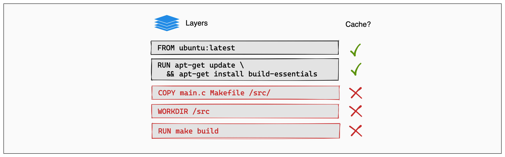

如果你是开发或者运维人员，那么你对docker一定不陌生，但是在具体使用上，是否更加的安全和高效？

合理使用 Docker 不仅可以提高系统的稳定性，还能减少资源消耗，提高应用的可移植性。

今天这篇文章就具体介绍几种docker的最佳实践，全文干货，建议点赞、收藏，以备不时之需。

部分内容在之前的dockerfile最佳实践中就已经介绍过，这里还有一些补充介绍

## 最佳实践一：使用官方镜像

安全！而且可以及时获得最新的补丁，尽量不要使用部分社区更新的镜像，以确保安全性。

其实这些官方镜像是大部分用户的起点，比如Alpine，比如openjdk等。

那么如何在dockerhub中确认是否为官方镜像呢？你可以查看是否有如下标志。


## 最佳实践二：采用特定的镜像版本

这个主要是用来规避默认拉取latest的行为，所以建议指定固定的基础镜像版本，避免导致一些不可预测的影响。

甚至在官方的建议中，最好都指定具体的digest

```dockerfile
# syntax=docker/dockerfile:1
FROM alpine:3.19@sha256:13b7e62e8df80264dbb747995705a986aa530415763a6c58f84a3ca8af9a5bcd
```

## 最佳实践三：优化缓存顺序

在前面的文章中，我们有简单介绍过关于docker打包镜像的缓存机制。

Docker使用的是分层缓存机制，建议将最不经常变更的部分放在Dockerfile前面，例如一些npm基础依赖的安装

如下：这样可以利用缓存，使 npm install 只在 package.json 变化时才重新执行。

```dockerfile
COPY package.json /app/
RUN npm install
COPY . /app/
```

## 最佳实践四：使用环境变量

采用变量可以增加可移值性，这样可以在不同环境中快速调整配置，而无需修改代码。

```dockerfile
ENV APP_ENV=production
ENV DB_HOST=db-server
```

## 最佳实践五：多阶段构建镜像

多阶段构建应该是目前使用最多的，可以有效调整镜像大小，尤其是在涉及同个镜像多次构建的情况下。



例如，在编译 Go 应用时，我们可以在第一阶段使用完整的 Go 构建环境，而在第二阶段仅保留可执行文件：

```dockerfile
FROM golang:1.19 AS builder
WORKDIR /app
COPY . .
RUN go build -o myapp

FROM alpine:latest
COPY --from=builder /app/myapp /usr/bin/myapp
CMD ["myapp"]
```


## 最佳实践六：使用 .dockerignore 文件

.dockerignore 文件可以防止不必要的文件被复制到镜像中，减少构建时间和镜像大小。

如下操作可以避免将 node_modules 或 .git 目录包含在镜像中，从而减少冗余数据。

```dockefile
node_modules
.git
*.log
```
## 最佳实践七：不要安装不必要的安装包

避免安装额外或不必要的软件包时，镜像将降低复杂性、减少依赖项、减小文件大小并缩短构建时间。

例如在数据库镜像中安装文本编辑器或在 Web 服务器镜像中包含额外的编译工具，这些都会增加镜像的复杂性和冗余。


## 最佳实践八： 优先使用COPY，仅在需要使用ADD

COPY 仅用于从构建上下文复制文件或目录到容器中，而 ADD 还支持从远程 URL 下载文件并自动解压 tar 压缩文件。由于 COPY 的行为更可预测，因此在大多数情况下应优先使用 COPY。

如果需要自动解压 tar 文件或从远程 URL 下载文件，可以使用 ADD，但要注意安全性


## 最佳实践九：使用 VOLUME 进行持久化存储

Docker 容器的文件系统是临时的，容器删除后数据会丢失。因此，建议使用 VOLUME 来存储需要持久化的数据，例如数据库、日志文件或用户上传的内容。

当然了，数据库还是不建议使用docker的。

```dockerfile
docker volume create my_data
docker run -d -v my_data:/var/lib/mysql mysql
```


