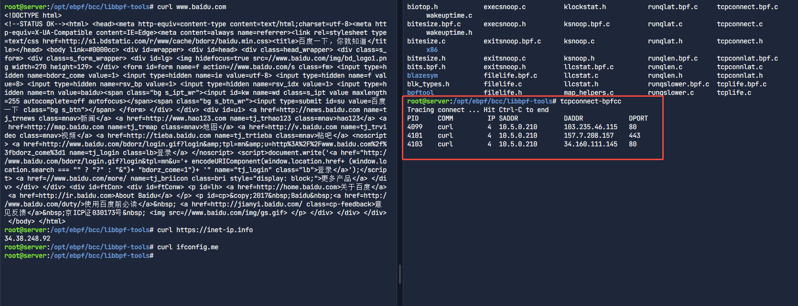
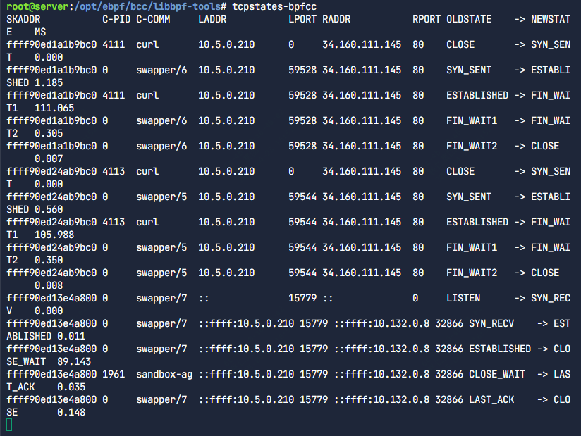
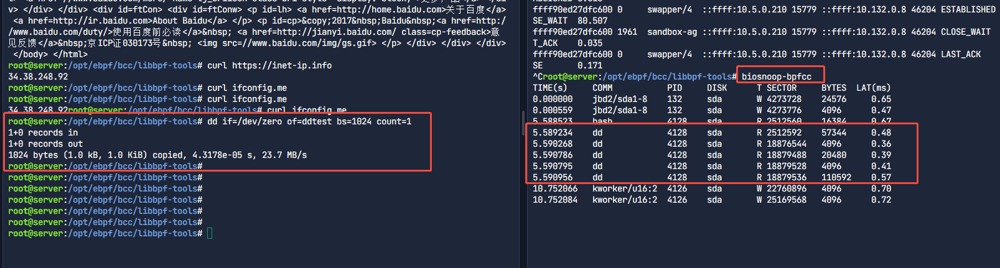
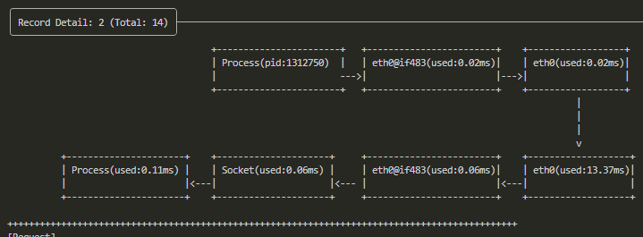
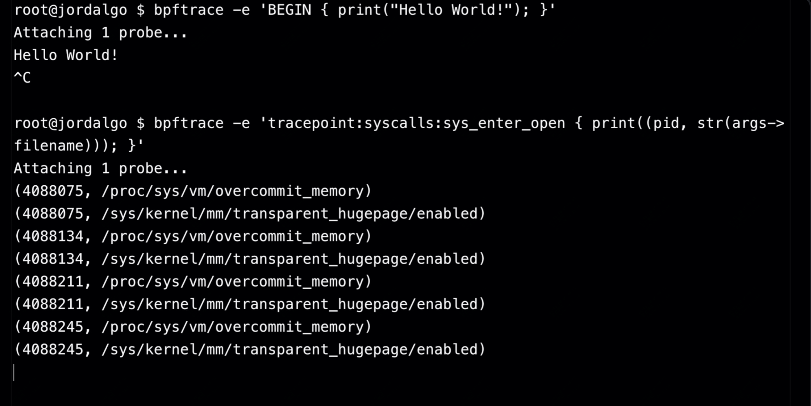
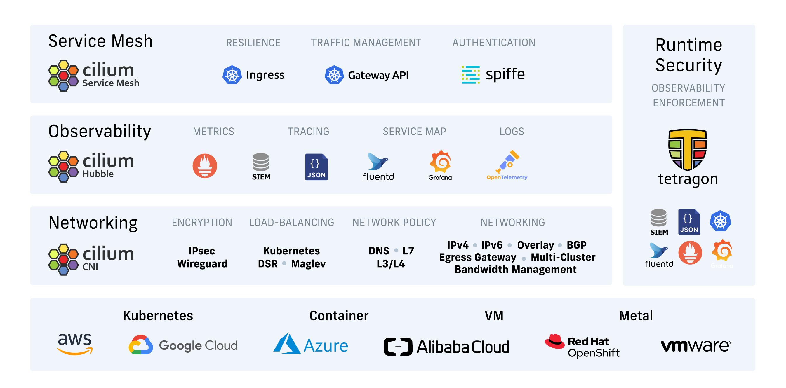

## ebpf简介

eBPF 是一种新标准，可以安全高效地对 Linux 内核功能进行编程，而无需更改内核源代码或加载内核模块。它支持开发新一代高性能工具，涵盖网络、安全性和可观测性用例。

## bcc项目

BCC 是一个用于创建高效内核跟踪和处理程序的工具包，它包含几个有用的工具和示例。BCC（BPF Compiler Collection）是 eBPF 的重要工具库，提供了更友好的开发体验，使用户能够使用 Python 和 C 语言编写 eBPF 程序。它封装了低级 API，并提供了一系列常用的 eBPF 监控工具。


https://github.com/iovisor/bcc 


## 最简单的命令使用


tcpconnect-bpfcc

tcpconnect-bpfcc是BCC工具包中的一个 eBPF 追踪工具，它用于主动 TCP 连接跟踪，即监测当前机器发起的 TCP 连接。它会在每次调用 connect() 系统调用时，打印一行信息，包含源地址、目标地址和端口等信息



在比如tcpstates-bpfcc可以用于追踪 TCP 连接状态变化




biosnoop-bpfcc

biosnoop-bpfcc 是一个用于追踪块设备 I/O（磁盘 I/O）的 eBPF 工具。它可以监测系统中的磁盘读写操作，并打印详细信息，包括进程 ID（PID）、进程名称、I/O 类型（读/写）、数据大小、I/O 延迟等




## 关于bpftool

bpftool 是一个用于管理和调试 eBPF 程序的命令行工具，它可以帮助开发者查看、加载、卸载 eBPF 程序，并操作 eBPF maps（映射）2。它是 Linux 内核工具的一部分，专门用于与 eBPF 相关的任务。

查看当前系统中加载的 eBPF 程序
```
bpftool prog list
```

查看 eBPF maps
```
bpftool map list
```

## 现有的ebpf工具


目前除了 BCC，还有许多其他的 eBPF 相关工具：

**kyanos**

基于 eBPF 的网络问题分析工具，能够捕获和分析网络请求

尤其是传统 tcpdump 需要先抓包、下载 PCAP 文件，再使用 wireshark 进行分析，流程冗长，而 Kyanos 提供即时分析，节省时间。并且Kyanos 支持根据 HTTP Path、Redis Key 等特定字段直接抓包。



而且可以根据固定应用镜像抓包如Redis、MySQL 等请求的捕获和分析。

**bpftrace**

一个更高级的 eBPF 追踪工具，适用于快速构建监测脚本。bpftrace 直接使用 eBPF 运行，无需额外编译。bpftrace 提供直观的统计和直方图，如 hist(args.ret) 生成系统调用返回值的分布图。



**Falco**

一个安全监控工具，利用 eBPF 进行实时威胁检测。Falco 是一个开源的云原生运行时安全工具，专为 Kubernetes 和容器环境设计.

**Cilium**

用于 Kubernetes 的网络监控和安全增强方案，基于 eBPF 构建。

Cilium 结合 Hubble 提供实时流量分析和可视化。




