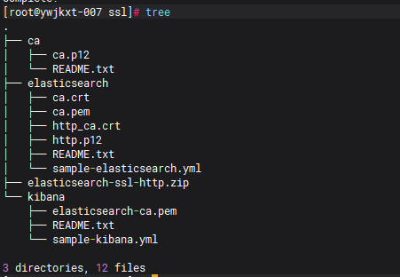

昨天更新了elasticsearch8.0版本的证书，今天记录下，提供给需要的朋友

官方文档其实给的比较详细了，也可直接去参考。

参考官方文档：www.elastic.co/guide/en/elasticsearch/reference/current/update-node-certs-same.html

我们是用的是同一的CA为http层更新证书，只需要在其中一个节点上生成即可，然后同步到多台即可

步骤如下：

```
./bin/elasticsearch-certutil http
```

通过该命令会生成一个zip压缩包，里面包含了证书及密钥

```
Generate a CSR? [y/N]n
 
 
Use an existing CA? [y/N]y
 
（可以使用了已有的CA证书，但是如果忘记密码或者没有选择n）
 
 
CA Key: /etc/elasticsearch/certs/http.p12
 
（根据实际填写证书路径）
 
 
For how long should your certificate be valid? [5y] 100y
 
（设置证书有效期，这里直接续了100年）
 
 
Generate a certificate per node? [y/N]n
 
（这里我们为所有节点使用统一的证书，可以根据实际需求设置）
 
 
Enter all the hostnames that you need, one per line.
 
When you are done, press <ENTER> once more to move on to the next step.
 
（填写集群内所有节点的hostname）
 
 
 
Enter all the IP addresses that you need, one per line.
 
When you are done, press <ENTER> once more to move on to the next step.
 
（填写集群内所有节点服务器的IP地址）
 
 
Do you wish to change any of these options? [y/N]n
 
 
If you wish to use a blank password, simply press <enter> at the prompt below.
 
Provide a password for the "http.p12" file:  [<ENTER> for none]（设置密码）
 
Repeat password to confirm: （重复密码以确认）
 
 
What filename should be used for the output zip file? [/usr/share/elasticsearch/elasticsearch-ssl-http.zip] 
（设置输出文件路径及名称，默认即可，按【Enter】键继续）
 
 
Zip file written to /usr/share/elasticsearch/elasticsearch-ssl-http.zip
```

然后去替换掉所有节点上证书文件，逐台重启

证书生成的目录结果如下



替换kibana证书文件，可以看到上述是有一个kibanan文件夹的，然后需要去修改kibana文件

因为我们平时使用python会去调用es，使用到的是crt明文证书文件，所以还需要去做个转化

```
openssl pkcs12 -in http.p12 -nokeys -out ca.crt
```