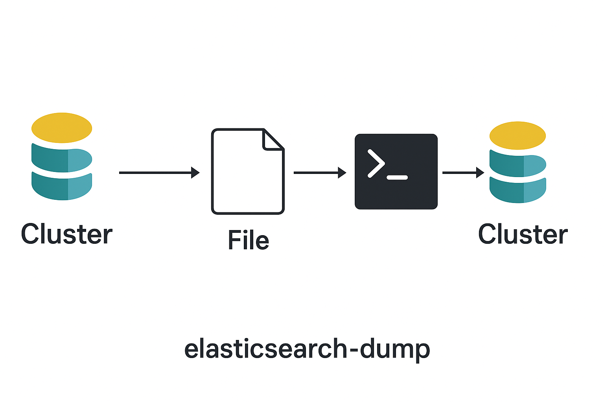

推荐一款es导出导入小工具elasticdump

最近在做压降工作，其中涉及到一个工作点就是一些边缘业务的es需要整合，就会涉及到一些es数据的导出导入。

elasticdump这个工具之前就有用过，但是每次都是用的时候去现查，今天这篇文章简单记录下，方便后续使用。

该工具可以使用命令行的方式使用，也可以通过docker形式使用，这里的导出通过命令行方式，导入通过docker的方式，具体如下：


## es数据的导出


导出采用常规方式

```bash
npm install elasticdump -g
```

```bash
cd index_1
elasticdump --input=http://elastic:nF@172.16.2.1:9200/index_1 --output=mapping.json --type=mapping
elasticdump --input=http://elastic:nF@172.16.2.1:9200/index_1 --output=settings.json --type=settings
elasticdump --input=http://elastic:nF@172.16.2.1:9200/index_1 --output=data.json --type=data --limit=10000 --concurrency=4 --scrollTime=15m
cd ..
```

命令行里面的--limit=1000 参数可以分批导出，避免内存爆炸。
另外示例里面是有密码的，如果你的es没有认证，那么可以去掉，还有一个需要注意的点就是如果你的密码有特殊字符，那么可能需要转义

## es数据的导入

因为涉及到多个索引，所以导入采用docker+脚本


```bash
#!/bin/bash

# 设置目标ES地址
# %40 用于替换@
TARGET_ES="10.89.136.31:9200"
ES_AUTH="elastic:elastic%40"

# 定义索引数组
indices=(
  "index_drug"
  "index_exam"
  "index_lab"
  "index_1"
  "index_operation"
  "index_all_20241204"
)

# 遍历处理每个索引
for index in "${indices[@]}"
do
  echo "开始导入 $index ..."

  echo "导入 settings..."
  docker run --rm -ti -v ${PWD}/$index:/tmp elasticdump/elasticsearch-dump \
    --input=/tmp/settings.json \
    --output=http://$ES_AUTH@$TARGET_ES/$index \
    --type=settings

  echo "导入 mapping..."
  docker run --rm -ti -v ${PWD}/$index:/tmp elasticdump/elasticsearch-dump \
    --input=/tmp/mapping.json \
    --output=http://$ES_AUTH@$TARGET_ES/$index \
    --type=mapping

  echo "导入 data..."
  docker run --rm -ti -v ${PWD}/$index:/tmp elasticdump/elasticsearch-dump \
    --input=/tmp/data.json \
    --output=http://$ES_AUTH@$TARGET_ES/$index \
    --type=data \
    --limit=10000 \
    --concurrency=4

  echo "$index 导入完成"
  echo "-------------------"
done

echo "所有索引导入完成！"

```
 

## 常见问题与优化

* **大数据量迁移时内存不足**
  👉 使用 `--limit` 分批导出，并调整 `--scrollTime`

* **中文分词器丢失**
  👉 记得按顺序导出：`mapping → analyzer → data`

* **数据导出乱码**
  👉 确认文件编码为 `UTF-8`，并保持 JSON 格式完整

* **性能优化**
  👉 结合 `xargs` 或 `GNU parallel` 多进程并行导出大索引

## 其它

该工具是开源工具，各位也可以到github上查看，地址如下：

github.com/elasticsearch-dump/elasticsearch-dump 

该工具轻量、灵活、上手快，尤其适合 中小规模数据迁移 / 调试
