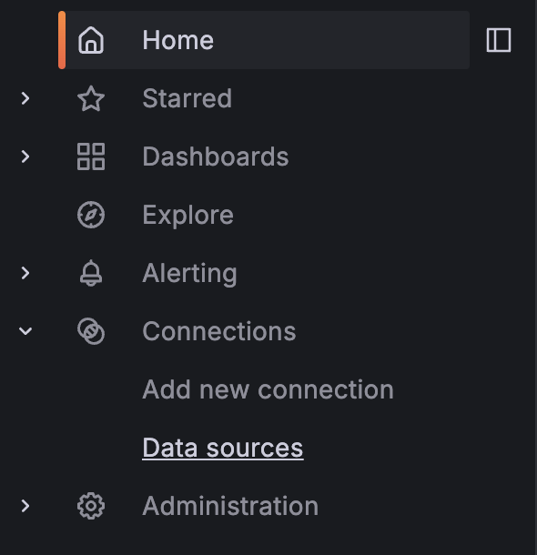
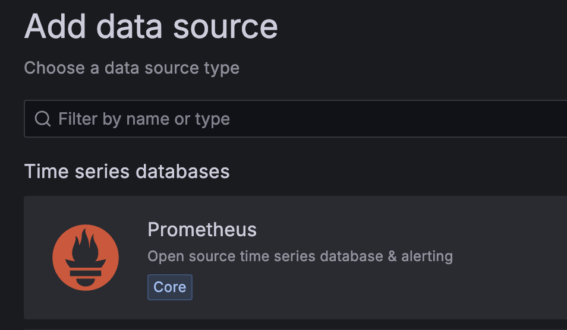
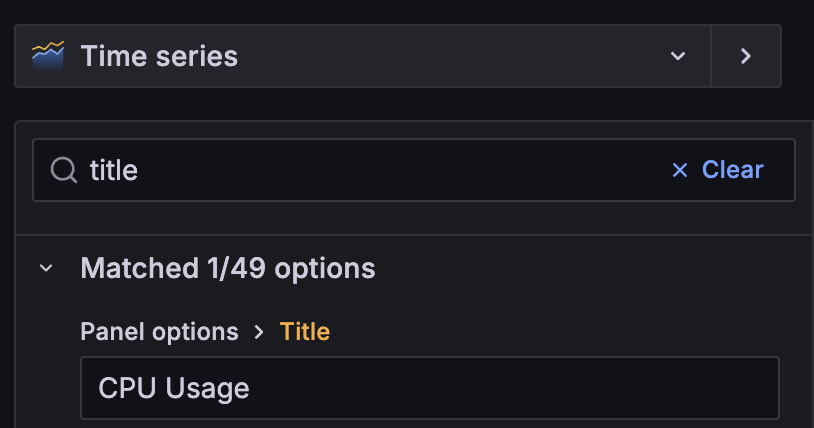
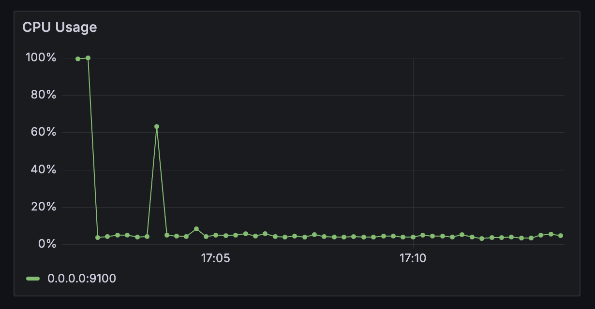
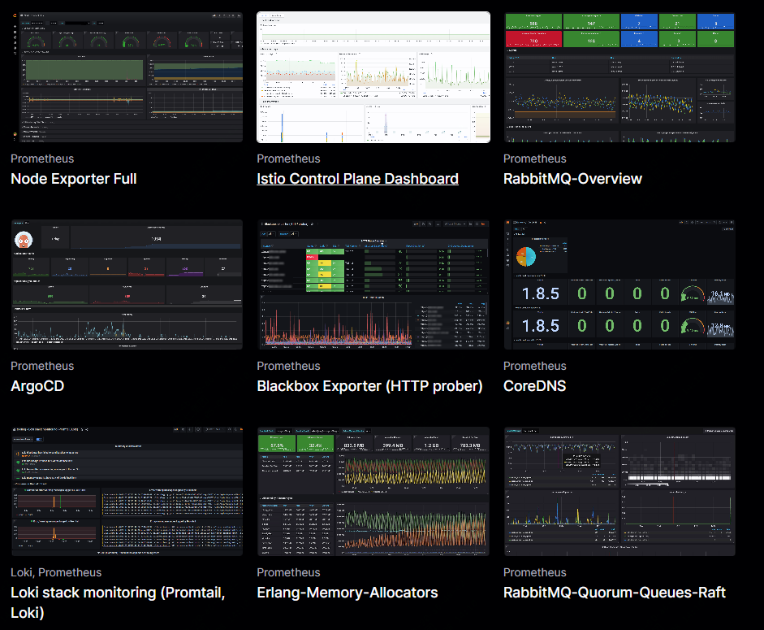

从这篇文章开始，详细介绍关于grafana如何部署、使用，如何结合prometheus等使用，如何配置实用、好看的仪表盘。

本篇文章主机介绍：

- 如何安装部署grafana
- 如何配置prometheus数据源到grafana
- 创建最基础的展示面板


注意：演示环境用的是ubuntu环境

## 从收集指标聊起

比如我们要监控一台主机，那么线下用到最多的方案是nodeexporter+prometheus，今天采用的也是这套方案。

在prometheus世界中，有很多的exporter，其中node exporter是用go语言写的用于采集 Linux/Unix 服务器的系统指标（CPU、内存、磁盘等）。

通过如下命令可以获取最新的node exporter

```bash
wget https://github.com/prometheus/node_exporter/releases/download/v1.7.0/node_exporter-1.7.0.linux-amd64.tar.gz
```

下载完毕后，如下命令解压并拷贝二进制文件

```bash
wget https://github.com/prometheus/node_exporter/releases/download/v1.7.0/node_exporter-1.7.0.linux-amd64.tar.gz
```

为了方便后面对进程的处理，我们需要把它配置为服务

```bash
sudo useradd -rs /bin/false node_exporter && echo -e "[Unit]\nDescription=Node Exporter\nAfter=network.target\n\n[Service]\nUser=node_exporter\nGroup=node_exporter\nType=simple\nExecStart=/usr/local/bin/node_exporter\n\n[Install]\nWantedBy=multi-user.target" | sudo tee /etc/systemd/system/node_exporter.service > /dev/null && sudo systemctl daemon-reload && sudo systemctl start node_exporter
```

```bash
cat /etc/systemd/system/node_exporter.service 
[Unit]
Description=Node Exporter
After=network.target

[Service]
User=node_exporter
Group=node_exporter
Type=simple
ExecStart=/usr/local/bin/node_exporter

[Install]
WantedBy=multi-user.target
```

然后可以通过在浏览器中访问URL来检查 Node Exporter 是否正在运行：http://localhost:9100。如果看到一个包含大量指标的页面，则 Node Exporter 运行正常。

## 指标收集完成后配置prometheus

Prometheus是一个监控和警报工具包，旨在实现可靠性、可扩展性和可维护性。它是收集和查询指标的强大工具，是存储 Node Exporter 收集的指标的好方法。

如下获取prometheus

```bash
wget https://github.com/prometheus/prometheus/releases/download/v2.50.1/prometheus-2.50.1.linux-amd64.tar.gz
```

然后同样解压，配置服务

```bash
tar -xvf prometheus-2.50.1.linux-amd64.tar.gz && cd prometheus-2.50.1.linux-amd64 && sudo cp prometheus /usr/local/bin
sudo useradd -rs /bin/false prometheus && sudo mkdir /etc/prometheus /var/lib/prometheus && sudo cp prometheus.yml /etc/prometheus/prometheus.yml && sudo cp -r consoles/ console_libraries/ /etc/prometheus/ && sudo chown -R prometheus:prometheus /etc/prometheus /var/lib/prometheus && echo -e "[Unit]\nDescription=Prometheus\nAfter=network.target\n\n[Service]\nUser=prometheus\nGroup=prometheus\nType=simple\nExecStart=/usr/local/bin/prometheus --config.file=/etc/prometheus/prometheus.yml --storage.tsdb.path=/var/lib/prometheus --web.console.templates=/etc/prometheus/consoles --web.console.libraries=/etc/prometheus/console_libraries\n\n[Install]\nWantedBy=multi-user.target" | sudo tee /etc/systemd/system/prometheus.service > /dev/null && sudo systemctl daemon-reload && sudo systemctl start prometheus
```

```bash
cat /etc/systemd/system/prometheus.service 
[Unit]
Description=Prometheus
After=network.target

[Service]
User=prometheus
Group=prometheus
Type=simple
ExecStart=/usr/local/bin/prometheus --config.file=/etc/prometheus/prometheus.yml --storage.tsdb.path=/var/lib/prometheus --web.console.templates=/etc/prometheus/consoles --web.console.libraries=/etc/prometheus/console_libraries

[Install]
WantedBy=multi-user.target
```

新建一个prometheus的配置文件，并且复制到prometheus配置目录下，重启服务

```yml
# my global config
global:
  scrape_interval: 5s # Set the scrape interval to every 15 seconds. Default is every 1 minute.
  evaluation_interval: 5s # Evaluate rules every 15 seconds. The default is every 1 minute.
  # scrape_timeout is set to the global default (10s).

# Alertmanager configuration
alerting:
  alertmanagers:
    - static_configs:
        - targets:
          # - alertmanager:9093

# Load rules once and periodically evaluate them according to the global 'evaluation_interval'.
rule_files:
  # - "first_rules.yml"
  # - "second_rules.yml"

# A scrape configuration containing exactly one endpoint to scrape:
scrape_configs:
  # The job name is added as a label `job=<job_name>` to any timeseries scraped from this config.
  - job_name: "Node Exporter"

    # metrics_path defaults to '/metrics'
    # scheme defaults to 'http'.

    static_configs:
      - targets: ["0.0.0.0:9100"]
```

```bash
cp ./prometheus.yml /etc/prometheus/prometheus.yml && sudo systemctl restart prometheus
```

最后，通过在浏览器中访问以下 URL 来检查 Prometheus 是否正在运行：http://localhost:9090。如果您看到带有图表的页面，则 Prometheus 运行正常。

## 安装grafana

Grafana 是一个用于监控和可观测性的开源平台，允许您创建、探索和共享控制面板和数据可视化。

grafana的安装方式很多，这里我们采用apt方式

```bash
sudo apt-get install -y apt-transport-https software-properties-common wget &&
sudo mkdir -p /etc/apt/keyrings/ &&
wget -q -O - https://apt.grafana.com/gpg.key | gpg --dearmor | sudo tee /etc/apt/keyrings/grafana.gpg > /dev/null &&
echo "deb [signed-by=/etc/apt/keyrings/grafana.gpg] https://apt.grafana.com stable main" | sudo tee -a /etc/apt/sources.list.d/grafana.list &&
sudo apt-get update && sudo apt-get install -y grafana
```

安装完成后，确保服务正常
```bash
sudo systemctl start grafana-server && sudo systemctl status grafana-server
```

我们现在应该能够通过在浏览器中访问以下 URL 来访问 Grafana：http://localhost:3000。如果看到带有登录提示的页面，则 Grafana 运行正常。

## 配置prometheus数据源

你可以在界面上配置，也可以直接通过修改配置文件设置，如下：

### 界面设置


1. 打开浏览器访问Grafana链接
2. 使用默认账户密码admin登录
3. 登录后，打开左侧菜单，然后单击 Connections -> Data Sources。
4. 单击 Add data source 按钮。
5. 从数据源列表中选择 Prometheus。
6. 在 Connection （连接 ） 部分中，设置以下字段：Prometheus server URL: http://localhost:9090   
7. 点击保存并测试按钮以保存数据源并测试与 Prometheus 的连接。 
   

### 配置文件设置

新建一个配置文件prometheus_datasource.yml

cp ./prometheus_datasource.yml /etc/grafana/provisioning/datasources/ && sudo systemctl restart grafana-server


登录后可以看到数据源已经添加完成


## 最简单的仪表盘

在此步骤中，我们在 Grafana 中创建一个基本控制面板，以可视化 Prometheus 收集的指标。我们将首先添加新的控制面板，然后创建一个简单的图表来显示主机的 CPU 使用率。        

1. 登录后，打开左侧菜单，然后单击 Dashboards（控制面板 ）。接下来，选择按钮 + Create Dashboard。
2. 单击 Add visualization 按钮，将新面板添加到功能板。
3. 从数据源列表中选择 Prometheus。
4. 从右侧面板中选择 Time Series 可视化。
5. 在 Query （查询 ） 部分中，设置以下字段，数据来源：Prometheus
6. 在 Query （查询 ） 选项卡中，从 Builder （生成器 ） 切换到 Code （ 代码 ） 并输入以下 promQL 查询：
```bash
Query: 100 - (avg by (instance) (irate(node_cpu_seconds_total{mode="idle"}[5m])) *
```
这个公式查询计算过去 5 分钟内每个实例的平均 CPU 利用率 （未处于空闲模式）。它从 100% 中减去每个 CPU 实例处于空闲状态的平均时间百分比（以 5 分钟为间隔测量），从而有效地得出平均活动 CPU 使用率。

我们可以时间序列图添加一些额外的配置



标题：CPU Usage
单位：percent(0-100)
Min：0
Max: 100

然后单击 Apply 按钮将更改应用于图形面板。



##  拓展

你可以直接在grafana官方网站中找到更好看可以直接使用的dashboard

