https://killercoda.com/devops-tutorial/scenario/loki-grafana


使用 Loki 和 Grafana 进行实时日志监控

本文是关于使用loki+grafana进行日志采集、展示、告警的实操文章。

现在用到的是elk这一套日志收集，那么为什么要用loki？

在当下的微服务架构的情况，日志的收集和分析是目前系统可观测性的重要点，传统的ELK虽然强大，但是在云原生的挑战下，也有一些维护成本高、维护复杂等一些问题。

而grafana loki是新兴的日志聚合系统，通过其独特的设计理念和架构，为我们提供了一个更轻量、更经济的选择。


## 开始之前

本教程采用docker及docker compose介绍，所以需要提前对该类内容有所了解

## 看完本文，你将会了解

- 了解loki、grafana、promtail的作用
- 使用docker compose部署该三个服务
- 使用promtail发送日志到loki
- 配置promtail从docker 的套接字中获取日志
- 将loki配置到grafana并展示，配置告警策略等


## 部署loki grafana

通过Docker Compose 部署 Loki 和 Grafana。前者是一种日志聚合服务 ，它接收和存储来自各种来源的日志，而后者是一种可视化和监控工具 ，将用于跟踪日志并在满足特定条件时发送警报。

```
mkdir loki-grafana
cd loki-grafana
```
在该目录下新建一个yml文件

```
touch docker-compose.yml
```

然后编辑该文件
```
version: "3"

services:
  grafana:
    image: grafana/grafana:11.2.2
    ports:
      - "3000:3000"
    volumes:
      - grafana-storage:/var/lib/grafana
    networks:
      - loki
  loki:
    image: grafana/loki:3.2.0
    volumes:
      - loki-storage:/loki
    networks:
      - loki

networks:
  loki:

volumes:
  grafana-storage:
  loki-storage:
```

保存并关闭文件

在上面的文件中，定义了2个服务，一个是3.2.0版本的loki，一个是11.2.2版本的grafana，每个服务都配置为重启后保留数据到数据卷，此外还暴露了grafana的3000端口。

## 配置promtail及demo程序

现在我们配置好了loki及grafana，但还需要一种可以将应用程序日志提取到loki的程序，loki官方配套的是promtail，当然你可以使用其它工具如fluent。

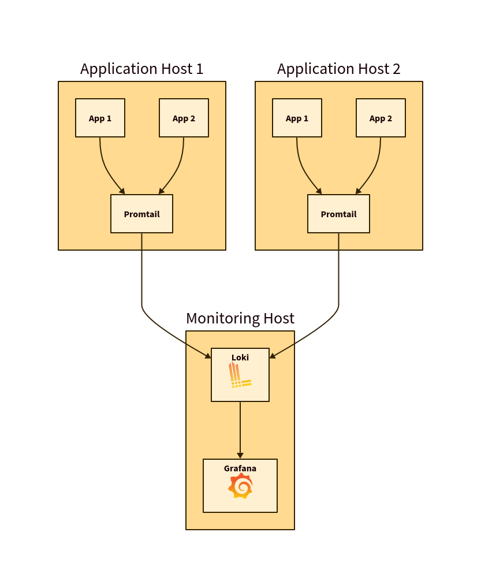

图中的箭头指示日志如何流经系统。

配置启动promtail之前新建一个配置文件

```
touch config-promtail.yml
```

然后配置文件

```
clients:
  - url: http://loki:3100/loki/api/v1/push

scrape_configs:
  - job_name: flog_scrape
    docker_sd_configs:
      - host: unix:///var/run/docker.sock
        refresh_interval: 5s
        filters:
          - name: label
            values: ["logging=promtail"]
    relabel_configs:
      - source_labels: ['__meta_docker_container_name']
        regex: '/(.*)'
        target_label: 'container'
```
这会将 Promtail 配置为从 Docker 获取日志 ，并对容器名称进行小的转换以删除前导斜杠 （/）。使用此配置，将记录所有带有 logging=promtail 标签注释的容器 将被 Promtail 摄取。

然后我们将启动promtail的配置加入前面的docker-compose文件中

```
  promtail:
    image: grafana/promtail:3.2.0
    volumes:
      - ./config-promtail.yml:/etc/promtail/config.yml:ro
      - /var/run/docker.sock:/var/run/docker.sock
    networks:
      - loki
```
在这里，我们挂载了刚刚创建的 Promtail 配置（只读）和 Docker 守护进程的套接字，允许 Promtail 从 Docker 查询日志。

然后我们还需要启动一个示例程序用于打印日志

```
  spoon-app:
    container_name: spoon-app
    image: ghcr.io/d-melita/devops-tutorial:edge
    labels:
      logging: "promtail"
```
如前所述，我们将 Promtail 配置为仅从具有 logging=promtail 标签，因此必须在此处设置。我们还为容器分配了一个名称，以便更轻松地按容器筛选日志。
此应用程序只是每隔几秒钟向 stdout 记录一条消息。

## 启动服务

```
docker-compose up -d
```

然后查看服务启动情况

```
docker ps -a

CONTAINER ID   IMAGE                                   COMMAND                  CREATED          STATUS          PORTS                                       NAMES
aaae2e5f454e   grafana/promtail:3.2.0                  "/usr/bin/promtail -…"   53 seconds ago   Up 6 seconds                                                loki-grafana_promtail_1
69f7fd4869ca   ghcr.io/d-melita/devops-tutorial:edge   "docker-entrypoint.s…"   53 seconds ago   Up 51 seconds                                               spoon-app
8ad67bd907e9   grafana/grafana:11.2.2                  "/run.sh"                2 minutes ago    Up 2 minutes    0.0.0.0:3000->3000/tcp, :::3000->3000/tcp   loki-grafana_grafana_1
8c061352e315   grafana/loki:3.2.0                      "/usr/bin/loki -conf…"   2 minutes ago    Up 2 minutes    3100/tcp                                    loki-grafana_loki_1
```

## 配置grafana

我们可以通过访问localhost:3000来访问grafana的页面，默认账户密码为admin

添加数据源为loki

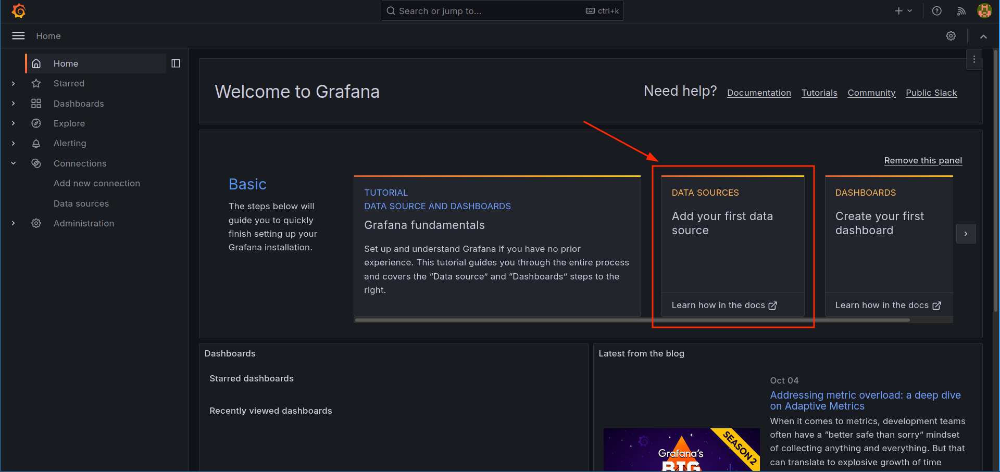


配置loki的链接信息

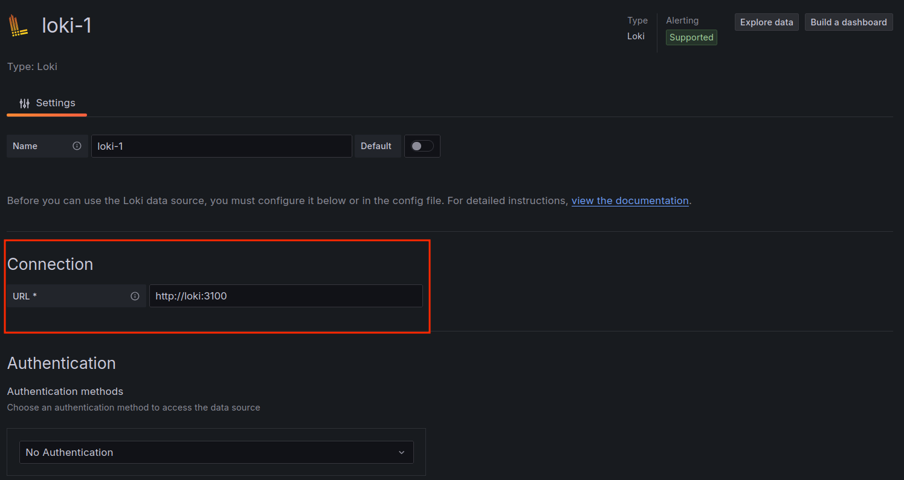

配置完成后点击保存并测试

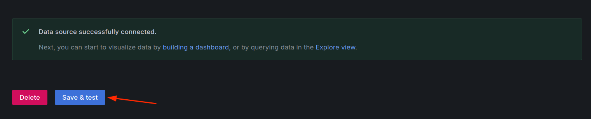


## loki数据查询

在此步骤中，我们将在 Grafana 中创建一个控制面板，以可视化存储在 Loki 中的日志。我们将使用 Loki 数据源来查询日志并将其显示在控制面板中。

在 Grafana Web 界面中，单击左侧边栏上的图标，然后选择 Dashboard （控制面板 ）。然后单击 Create dashboard（创建控制面板 ），然后选择 Add visualization（添加可视化 ），如下所示：


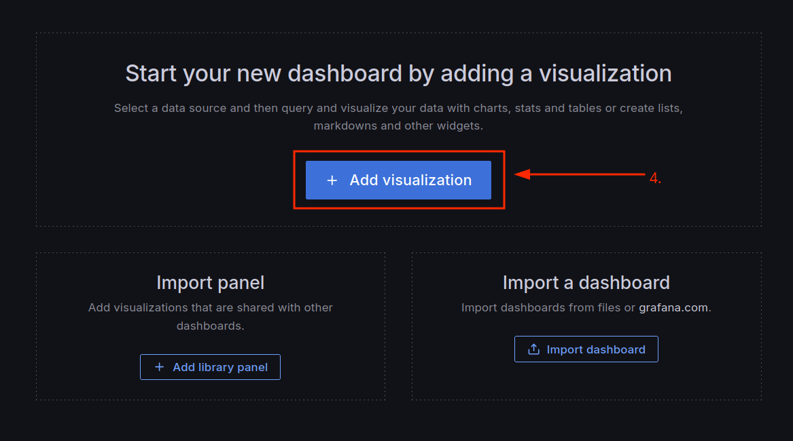
选择 Loki 作为控制面板的数据源。


选择logs类型

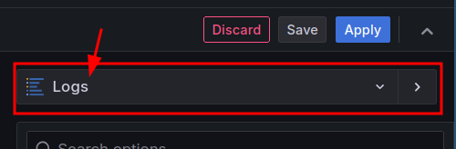

然后在查询编辑器中查找如下日志

```
{container="spoon-app"} | logfmt
```

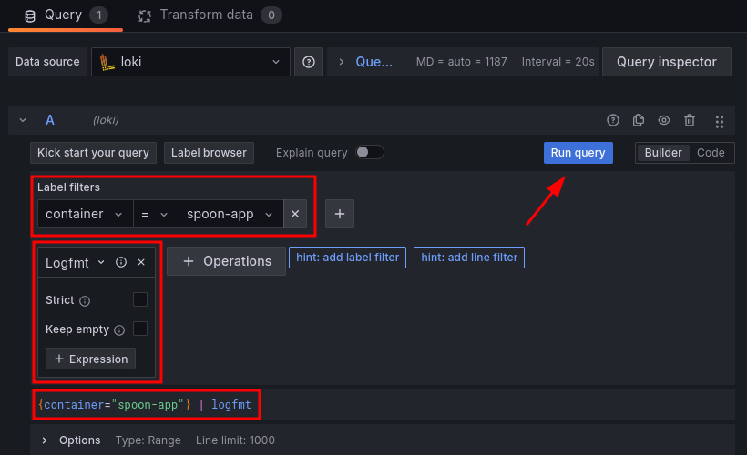

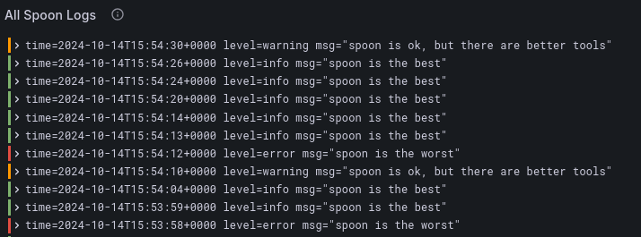

最后，通过单击右上角的蓝色 Apply 按钮保存仪表板。

### 新建错误日志仪表盘

同样上述的操作，但是修改查询编辑器的条件为

```
{container="spoon-app"} | logfmt | level =~ `warning|error`
```
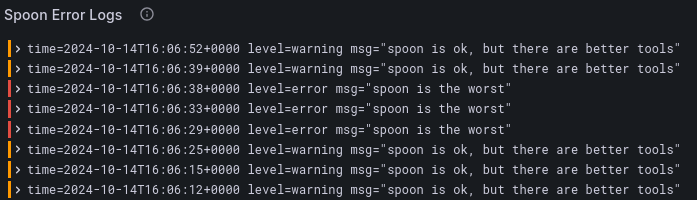


然后此刻的面板内容应该是

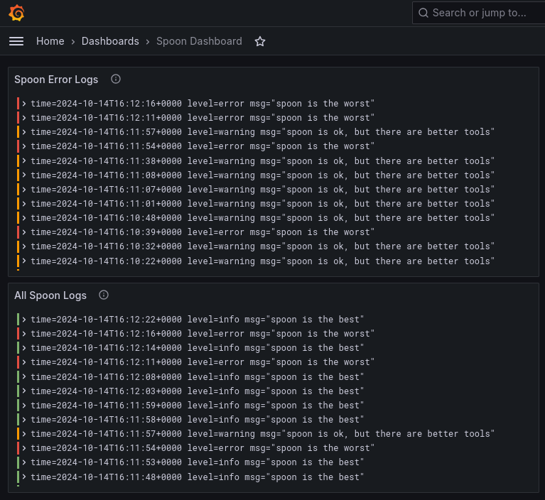


## 添加告警策略

首先点击contact point开始，选择alerting，选择添加


grafana目前支持包括dingding、企微机器人、邮件等多种告警渠道，我们这里测试通过webhook方式,有个测试站点：https://webhook.site/

你可以通过test测试告警通道是否可用

然后我们去配置告警规则


```
count(rate({container="spoon-app"} | logfmt | level = `error` [5m]))
```

比如我们可以配置阈值为5


通过单击 Preview （预览 ），您可以查看警报的行为方式。它可以是 Firing（触发），如图中所示，也可以是 Normal（正常 ）。


配置完成后，我们可以在webhook站点查看发送的通知

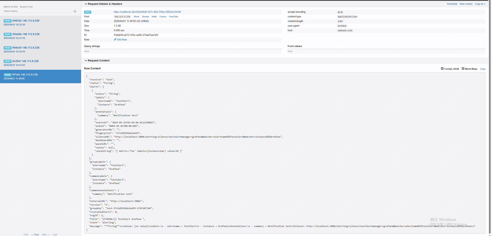

