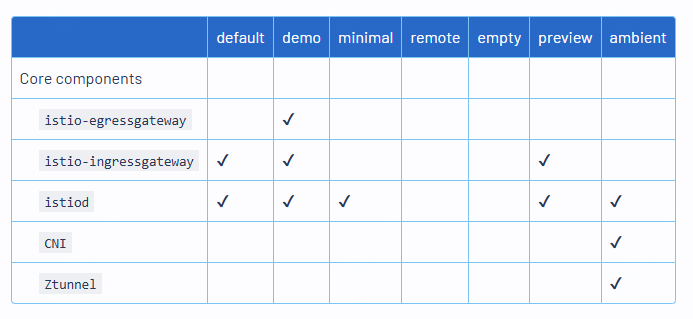
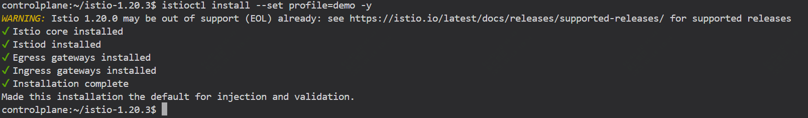

今天是2025年4月18日，今天开始学习istio相关内容


先从安装开始

## 使用 istioctl 进行 Istio 安装


通过如下命令可以快速安装，可以指定下载安装的版本及使用系统的架构

```
curl -L https://istio.io/downloadIstio             | ISTIO_VERSION=1.20.3               TARGET_ARCH=x86_64 sh -
```

添加环境变量

```
cd istio-1.20.3/
export PATH=$PWD/bin:$PATH
```

istio提供了多种配置文件可选，如default、minimal、demo等，这里演示安装demo版本，不同的配置文件会安装不同的组件。



```
istioctl install --set profile=demo -y
```




## 设置为sidecar

下面的操作是将istio作为sidecar配置自动注入到k8s集群中default命名空间的每个pod


```
kubectl label namespace default     istio-injection=enabled
```

启动一个nginx作为测试

```
kubectl run test --image=nginx
```

然后看下启动的容器

```
kubectl get pods -o     jsonpath='{range .items[*].spec.containers[*]}{.name}{"\n"}{end}'
```

```
test
istio-proxy
```

如果要更新istio的特性

```
istioctl install --set profile=demo -y     --set meshConfig.outboundTrafficPolicy.mode=REGISTRY_ONLY
```

