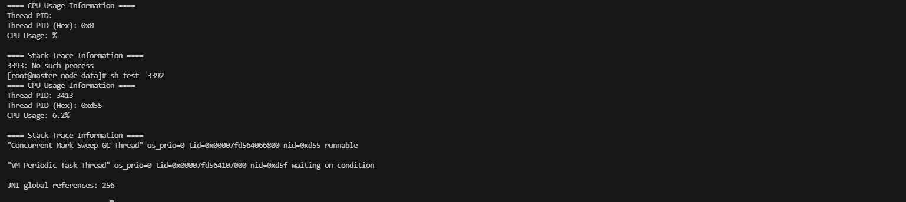

定位思路

1. top -HP pid 查看进程的cpu使用情况，确认哪个线程占用cpu过高
2. 使用printf "%x\n" 线程pid，获取线程pid 16进制表示
3. jstack pid | grep 线程pid 16进制表示 -A 30 查看线程堆栈信息
4. 根据堆栈信息，找到对应的方法，分析代码

在Java的堆栈信息中，nid（本地线程ID）通常是十六进制表示的。要将其转换为十进制以找到对应的线程PID

上述用shell脚本快速分析，参数为java服务pid

```shell
#!/bin/bash

if [ $# -ne 1 ]; then
    echo "Usage: $0 <java-pid>"
    exit 1
fi

pid=$1

# 创建临时文件存储top信息
top_file=$(mktemp)
trap 'rm -f $top_file' EXIT

# 获取进程信息并排序，找出CPU使用率最高的线程
top -b -n 1 -Hp $pid > $top_file

# 获取CPU占用最高的线程信息
thread_info=$(grep java $top_file | sort -k9rn | head -1)
thread_pid=$(echo $thread_info | awk '{print $1}')
cpu_usage=$(echo $thread_info | awk '{print $9}')
thread_hex=$(printf "%x\n" $thread_pid)

echo "==== CPU Usage Information ===="
echo "Thread PID: $thread_pid"
echo "Thread PID (Hex): 0x$thread_hex"
echo "CPU Usage: $cpu_usage%"
echo ""

echo "==== Stack Trace Information ===="
# 检查jstack命令是否存在
if ! command -v jstack &> /dev/null; then
    echo "Error: jstack command not found"
    exit p
fi

# 获取对应线程的堆栈信息
jstack $pid | grep -A 30 "nid=0x$thread_hex"
```

