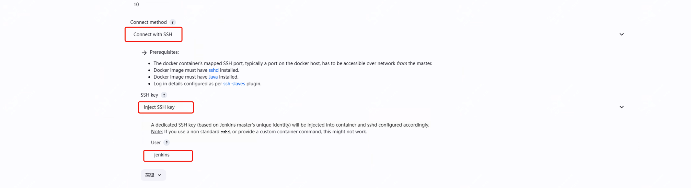

一文介绍如何使用docker作为jenkins的agent，提高效率、节省资源


jenkins在实际使用过程中，构建占据的时间还是比较少的，常规的使用方案，会配置主机作为agent，但这样其实会有一定的资源浪费。

今天介绍如何将docker作为动态agent，构建时创建，构建完销毁，这样可以更好的利用现有资源。

而且docker启动迅速，环境干净，适合作为对现有主机agent的替代。

## 前置准备

1.已经启动的jenkins
2.docker环境就绪

前面步骤不再做具体介绍，可以参考前面的部署文章

## docker配置调整

因为需要用到docker的api，所以需要调整相关配置。

```
vim /lib/systemd/system/docker.service

ExecStart=/usr/bin/dockerd -H tcp://0.0.0.0:4243 -H unix:///var/run/docker.sock
```

我们使用4243端口作为docker的远程api端口，你也可以定义需要的端口

另外需要确认master与部署docker主机的32768-60999端口的开放，因为master会通过这些端口来ssh连接docker

配置完成后，重启docker服务

```
systemctl daemon-reload
systemctl restart docker
```

## 配置jenkins以启动docker

这里建议直接使用官方提供的镜像，你也可以在此基础之上做修改


```
docker pull jenkins/ssh-agent
```

因为我用的是本地的dockerhub，所以还有一些其它配置,实际使用根据需要调整

```
docker tag jenkins/ssh-agent:latest 10.89.128.51:80/jenkins/myjenkins_image:10
docker push 10.89.128.51:80/jenkins/myjenkins_image:10
```

## 安装docker插件

这里要注意，因为jenkins存在多个docker相关插件如docker-pipeline

在系统管理-插件管理 搜索Docker即可，如下：


然后到系统管理-节点和云管理去配置


在cloud中选择新建，然后去配置docker cloud 的details


这部分只需要配置docker 的url即可,实际ip端口根据需要替换

```
tcp://10.89.128.51:4243
```

然后配置docker agent 模版，如下几个点需要配置，如果你同样使用habor还需要配置仓库的账户密码





关于最后一个环境变量，需要到master主机上去生成一下,公钥配置为环境变量，当然了你也可以选择配置为账户密码形式。

```
 ssh-keygen -f ~/.ssh/jenkins_agent_key
```

配置完成后，去测试任务

## jenkins job配置

新建任务，然后选择自由形式的任务新建

勾选限制项目的运行节点，然后配置前面的label。


然后你可以在后面的执行shell中配置一条测试命令

## 执行任务

就可以看到控制台输出了前面的命令结果


