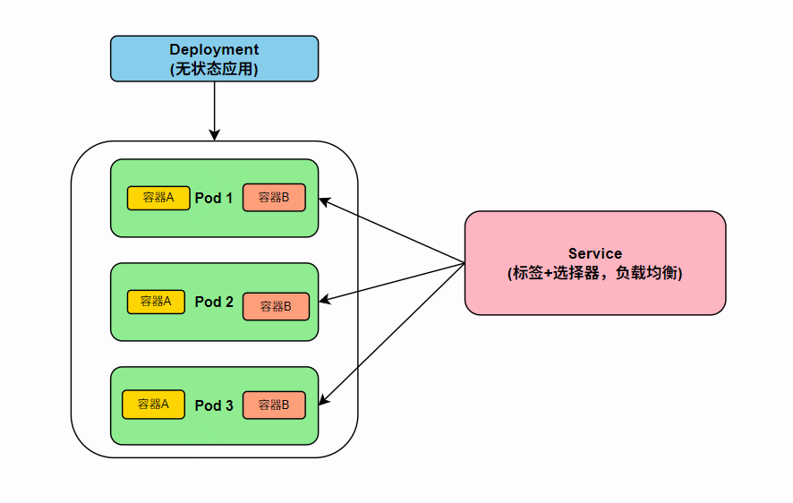

如果你最近在学习k8s相关内容，那么这篇内容不可错过，deployment是K8s中最核心的对象，这篇文章将通过一个最简单的例子来介绍下deployment。

## deployment初介绍

pod是k8s中最基础的单元，而deployment是对pod的抽象体现，deployment主要保证实现配置所声明的状态。

## 一些关键概念

- deployment可以调度和管理多个pod副本，比如可以确保pod的数量和状态符合预期，如果有pod异常退出，会自动拉起新的pod进行替换
- 一个pod可能包含多个容器，多个容器共享一套网络命名空间，因此ip地址是同一个，例如一个应用容器+一个sidecar容器
- pod的ip是临时的，因此k8s访问pod通过service来实现，后者通过标签（label）和选择器（selector）来路由流量，对于外部访问来讲，service提供了一个稳定的入口
- deployment适用于无状态服务，如果有状态需要持久化，应使用statefulset




## 实践

下面将会介绍一个完整的nginx deployment示例。

### deployment配置文件

deployment配置文件通常使用yaml格式，其中包含的主要配置有如下几项：

```bash
apiVersion
Kind
metadata
spec
```

在k8s中不仅deployment，其它诸如services, Replica Set, Configmap, Jobs都是被称作对象。

下面具体介绍上面几个配置的含义：

1.apiVersion

目前所使用的k8s对象的版本，生产环境默认使用apps/v1，属于生产稳定版本，另外还有其他如：Alpha：早期的候选版本，Beta：API 在 Alpha 测试后即成为 beta 版本，stable：不包含 alpha 和 beta 的 API 属于稳定类别。

```bash
```

2.kind
它用于声明当前配置文件要创建的资源对象类型。

```bash
kind: Deployment
```

3.metadata
它的作用在于定义对象的元数据信息，常用字段有name、namespace、labels、annotations等

其中labels：主要用于对Deployment对象进行分组和分类的键值对。
Name：表示要创建的 Deployment 的名称。
Namespace：要在其中创建Deployment的命名空间的名称。
Annotations：键值对（如标签），但用于不同的使用案例。

```bash
metadata:
  name: my-nginx
  labels:
    app: nginx
```

4.spec

核心部分，描述对象期望的状态，常用字段有replicas、selector、template

其中selector用于选择哪些pod用于该deployment管理，template其实是pod的模板，会包括其对应的metadata及spec(包括containers及volumes定义存储卷（ConfigMap、Secret、PVC 等）)

如：
```bash
spec:
  replicas: 3
  selector:
    matchLabels:
      app: nginx
  template:
    metadata:
      labels:
        app: nginx
    spec:
      containers:
      - name: nginx
        image: nginx:1.21
        ports:
        - containerPort: 80
```

### deployment完整案例

将会通过如下几步来给出一个deployment的实践


- 创建namespace
- 创建nginx deployment
- 创建nginx服务
- 暴露和访问nginx服务


# 🔹 Deployment 实践案例：部署 Nginx

### **步骤 1：创建 namespace**

我们先创建一个独立的命名空间，便于管理 Nginx 相关的资源。

```bash
kubectl create namespace demo-nginx
```

或者使用 YAML 文件：

```yaml
apiVersion: v1
kind: Namespace
metadata:
  name: demo-nginx
```

---

### **步骤 2：创建 Nginx Deployment**

创建一个 Deployment 来运行 Nginx，设置 **3 个副本**。

```yaml
apiVersion: apps/v1
kind: Deployment
metadata:
  name: nginx-deployment
  namespace: demo-nginx
  labels:
    app: nginx
spec:
  replicas: 3
  selector:
    matchLabels:
      app: nginx
  template:
    metadata:
      labels:
        app: nginx
    spec:
      containers:
      - name: nginx
        image: nginx:1.21
        ports:
        - containerPort: 80
```

应用配置：

```bash
kubectl apply -f nginx-deployment.yaml
```

验证：

```bash
kubectl get pods -n demo-nginx -o wide
```

---

### **步骤 3：创建 Nginx 服务**

Deployment 会启动多个 Pod，而 Pod IP 是临时的，因此我们需要创建 **Service** 来统一访问入口。

```yaml
apiVersion: v1
kind: Service
metadata:
  name: nginx-service
  namespace: demo-nginx
spec:
  selector:
    app: nginx
  ports:
  - protocol: TCP
    port: 80       # Service 暴露的端口
    targetPort: 80 # Pod 内部容器端口
  type: ClusterIP  # 只在集群内可访问
```

应用配置：

```bash
kubectl apply -f nginx-service.yaml
```

查看：

```bash
kubectl get svc -n demo-nginx
```

---

### **步骤 4：暴露和访问 Nginx 服务**

如果你需要 **集群外部访问**，可以把 Service 类型改为 **NodePort** 或通过 **Ingress Controller** 暴露。

#### NodePort

```yaml
apiVersion: v1
kind: Service
metadata:
  name: nginx-service
  namespace: demo-nginx
spec:
  selector:
    app: nginx
  ports:
  - port: 80
    targetPort: 80
    nodePort: 30080   # 手动指定 NodePort（范围 30000-32767）
  type: NodePort
```

访问方式（浏览器或 curl）：

```bash
http://<NodeIP>:30080
```


✅ **最终结果**：

* 你在 `demo-nginx` 命名空间中创建了一个 Nginx Deployment（3 个 Pod）。
* 通过 `Service` 暴露 Pod，并根据需要使用 NodePort 或 Ingress 对外提供访问。

