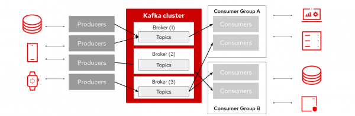

本篇文章是介绍kafka的第一篇，介绍kafka一些入门内容，后面还会持续更新关于kafka的内容。

# kafka101

## 什么是kafka？

kafka是一个分布式数据流平台，使应用程序能够实时发布、订阅、存储和处理消息流。发布/订阅 （pub/sub） 系统的特点是发送方将消息推送到一个中心点进行分类。

## kafka包含哪些组件？

Kafka的核心组件，有Producer（生产者）、Broker（消息中间件）、Consumer（消费者）、Topic（主题）、Partition（分区）、Zookeeper（协调服务）等。在 Kafka 4.0 版本中，Kafka 彻底移除了 Zookeeper，并采用 KRaft（Kafka Raft） 作为新的元数据管理和集群协调机制

## 什么是消息？

消息或记录是包含应用程序数据的键/值对。每条消息都存储在一个topic中。此消息在其配置的生命周期内是持久的。主题中每条消息的位置是其偏移量 。消息通常按照添加顺序从每个分区中使用。

## 什么是topic？

同一类消息的集合，topic通常在1个或者多个的broker跨区复制实现容错，每个topic上有不同的分区。

## 什么是分区？

分区是包含写入消息的topic的子集。新消息会进入到分区末尾，可以确保消息的有序性，多个分区可以在负载较高，数据共享复制的情况下提高性能。

另外分区可以在不同的broker之间进行复制，其中一个broker作为leader，用于消息的接收及消费，当该broker异常时，其中一个副本重新选举为leader。

## 什么是生产者?

创建者将消息发布到主题，该主题将每条消息附加到分区的末尾。默认情况下，如果消息包含键，则使用键的哈希值来决定哪个分区接收消息。如果 key 为 null，则循环算法将平衡所有分区之间的消息存储。
Kafka 保证，只要不添加新的分区，当使用默认分区器时，具有相同键的元素就会存储在同一个分区中。

## 什么是消费者？

发布到主题的每条消息都会传送给已订阅该主题的使用者。使用者可以从 topic 分区中的任何偏移量读取数据。在大多数情况下，使用者会线性推进其偏移量，但它可以从任何偏移量开始，并以任何顺序读取消息。使用者通常会将其偏移量“提交”回Kafka集群，以便使用者可以从中断的地方继续，例如，在重新启动时。

## kafka应用场景

- 消息队列
- 日志收集
- 流式数据
- 数据变更捕获
- 监控

  
## kafka的优势

- 高吞吐量 Kafka 采用 顺序写入磁盘 和 零拷贝（Zero Copy） 技术，使其比传统 MQ 具有更高的吞吐量
- 可扩展性 Kafka 采用 分区（Partition） 机制，支持水平扩展，能够处理 PB 级别的数据
- 持久化与可靠性 Kafka 采用 日志存储，所有消息都会持久化到磁盘，确保数据不会因 Broker 故障而丢失
- 流式处理支持 Kafka 与 Kafka Streams、Flink、Spark Streaming 等流处理框架深度集成，适用于实时数据处理

