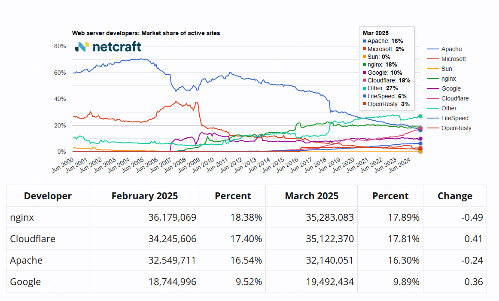

在2025年3月最新的web使用数据中，nginx占比18%，依旧排名第一，那么nginx为何会成为web服务的首选，它有哪些特性？

## 什么是web服务器？

web服务器是负责处理客户端请求并提供网页内容，通常用于托管网站、Web应用程序和API。常见的web服务器有nginx，apache http servern，HAProxy，Caddy等。

## 什么是nginx？

nginx是目前使用量占比最高的web服务器，它是一个高性能的Web服务器和反向代理，采用事件驱动的非阻塞I/O架构，擅长负载均衡、内容缓存和SSL终止，广泛用于优化网站性能和稳定性。

下面我们具体介绍下nginx的一些特性

## nginx架构

关于nginx的架构需要关注的只有两点，第一个是，它采用了master-worker工作模式，master负责管理工作进程，加载配置文件，并处理信号，worker执行实际的请求处理，每个进程独立运行，提高并发能力。还有一个就是它采用了epoll/kqueue等高效I/O复用技术，减少上下文切换，提高性能。

另外就是它是模块化设计，比如它的负载均衡模块、tcp代理模块、缓存模块等。

## 高性能，高可用

Nginx可以处理大量并发连接，并在高流量负载下提供静态内容服务。支持热更新，无需重启即可应用新配置，确保服务稳定运行。

## 反向代理及负载均衡

这个功能是nginx最常用到，也是最基础的功能。Nginx充当反向代理，位于Web服务器前端，并将流量分发至多个后端服务器，提升性能和可扩展性。

## ssl终止

所谓ssl终止就是ssl认证过程只发生在nginx，到后端的请求是已经解密过的，因此后端不需要再进行SSL认证或加解密，Nginx内置支持SSL/TLS终止，从而提高性能和效率。

## 内容缓存

关于缓存的利用，也是nginx最核心的功能之一。

Nginx缓存通过从缓存存储中获取内容，以极快的速度渲染页面，提升网站性能。

Nginx的缓存功能主要用于减少服务器负载、加速内容交付，并优化用户体验。它可以缓存静态资源（如图片、CSS、JS文件）以及动态内容（如API响应、数据库查询结果），从而减少后端服务器的压力，提高网站性能。

而关于nginx的缓存主要包括如下几种：

- 浏览器缓存：通过Expires和Cache-Control头部控制客户端缓存，减少重复请求。

- 代理缓存（Proxy Cache）：使用proxy_cache指令缓存后端服务器的响应，适用于反向代理场景。

- FastCGI缓存：使用fastcgi_cache缓存PHP等动态内容，提高应用程序响应速度。

- Microcaching（微缓存）：短时间缓存动态内容，适用于高频访问的API接口。

## 最后

关于nginx，你学废了吗？后面将带来关于nginx配置的具体介绍。

