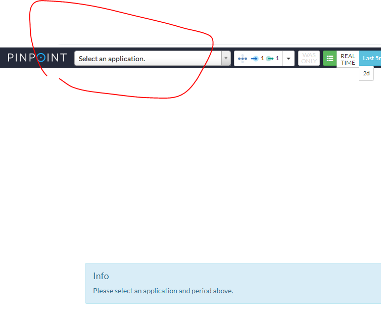
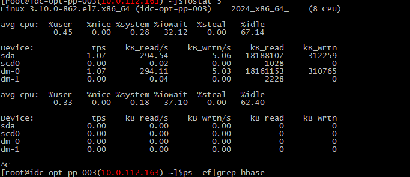
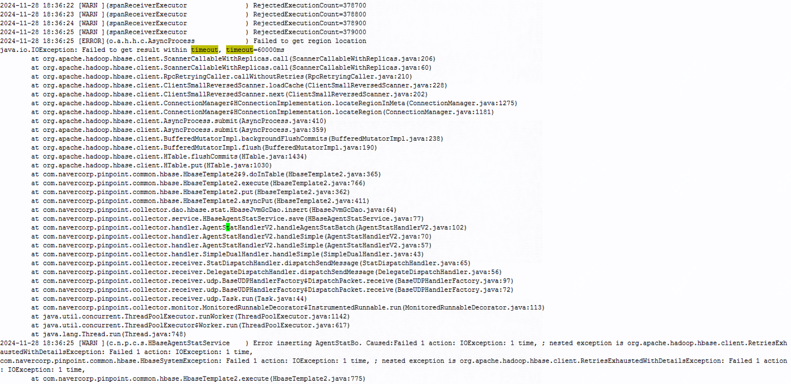
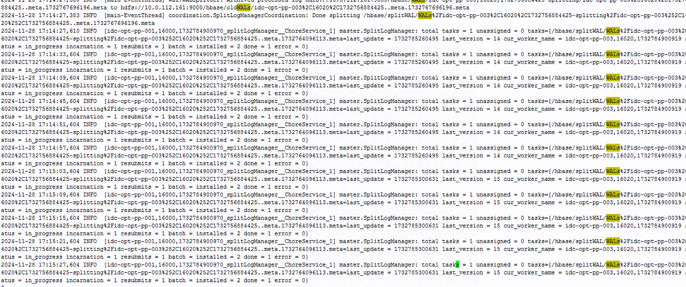
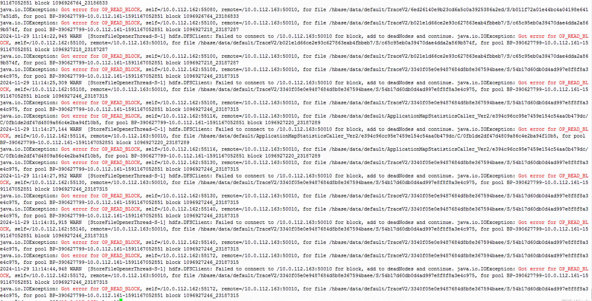
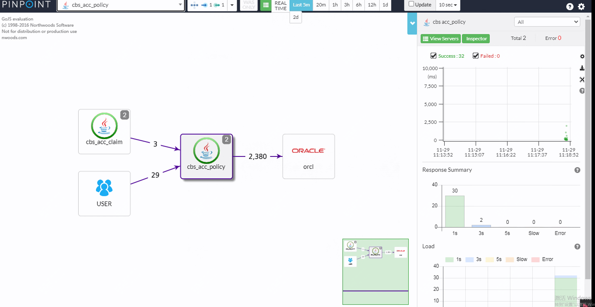
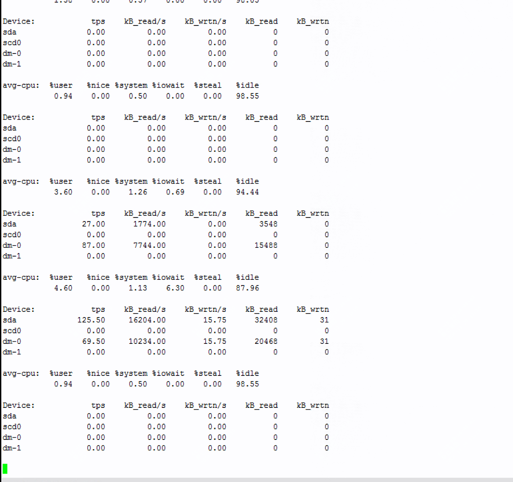

## **pinpoint及HBase 故障排查与解决思路**

### **背景**

pinpoint数据无法展示



iostat查看io很高



上主机查看日志：

pinpoint后端日志：



连接habse获取数据有超时情况

查看对应habsemater及region节点的日志发现：



大量时间在处理WALs日志


日志中有 `java.io.IOException: Got error for OP_READ_BLOCK` 这种日志通常是由 HDFS 数据块损坏、DataNode 不可用、HBase 配置问题或资源瓶颈引起的。
---

### **1. 故障现象**
- **错误信息**：`java.io.IOException: Got error for OP_READ_BLOCK`，常伴随 HDFS 错误如 `BlockMissingException` 或 `CorruptHFileException`。

在region主机上有大量的此类日志，该报错也是导致io突增的原因




### **2. 排查步骤**

#### **2.1 检查 HBase 日志**
首先，查看 HBase 日志文件（尤其是 RegionServer 日志），识别是否有关于 HFile、WALs 或 DataNode 连接的错误。
- **常见日志信息**：`HFile Trailer`, `Corrupt HFile`, `WALs`, `BlockMissingException`。
- **目标**：识别是否有损坏的文件或长时间占用 IO 资源的操作。

#### **2.2 检查 HDFS 状态**
通过 `hdfs fsck` 命令检查文件系统的健康状况。特别关注损坏的文件、缺失的块和副本数量：
```bash
hdfs fsck /hbase/data/default -files -blocks -locations
```

上述步骤可以查看整体文件系统状态，如果想要查看具体文件状态，可以拿日志中报错的文件去查

```
hdfs fsck /hbase/data/default/ApplicationMapStatisticsCaller_Ver2/e394c96cc95e7459e154c54aa0b479dc/C/0fb1de2df47d4809a86c4e2ba94f10b5 -files -blocks -locations
```

- **检查项**：
  - 是否有损坏的文件（`CORRUPT`）。
  - 是否有缺失的数据块（`MISSING`）。
  - 是否存在副本不足的文件（`UNDER_REPLICATED`）。 

在修复之前结果是missing，是有缺失的数据块，

#### **2.3 检查 DataNode 和网络**
确认 DataNode 是否正常工作，并检查网络连接是否通畅：
- **命令检查 DataNode**：
  ```bash
  jps | grep DataNode
  ```
  如果 DataNode 未启动，重启 DataNode 服务：
  ```bash
  $HADOOP_HOME/sbin/hadoop-daemon.sh start datanode
  ```
- **网络检查**：
  ```bash
  ping <DataNode_IP>
  telnet <DataNode_IP> <DataNode_Port>
  ```
  确保 RegionServer 和 DataNode 之间的网络连接正常。


---

### **3. 修复措施**

#### **修复损坏的 HFile 和数据块**
如果在 `hdfs fsck` 中检测到损坏的 HFile 或缺失的块：

 **修复整个目录**：

因为日志报错中涉及到了多个文件，所以选择修复整个目录

```
hdfs fsck /hbase/data/default -delete -files -blocks
```

修复后验证该数据块

```
hdfs fsck /hbase/data/default/ApplicationMapStatisticsCaller_Ver2/e394c96cc95e7459e154c54aa0b479dc/C/0fb1de2df47d4809a86c4e2ba94f10b5 -files -blocks -locations
```

或者直接查看hdfs数据块整体是否为health

观察日志是否还有异常，验证服务是否正常，io是否还有异常





---

### **4. 预防措施**

#### **4.1 定期检查和维护**
- 定期运行 `hdfs fsck` 来检查 HDFS 上的健康状况。
- 配置合理的 HBase 和 HDFS 副本策略，确保副本数充足（通常为 3）。

#### **4.2 监控资源使用情况**
- 设置监控系统来检查 HDFS、HBase 和各个 DataNode 的负载、存储使用率。
- 对 WAL 文件、RegionServer IO 和 HDFS 网络带宽进行监控，及时发现异常并进行处理。

#### **4.3 增强故障恢复能力**
- 配置 HBase 和 HDFS 的自动故障恢复策略，如自动迁移数据块、自动增加副本等。

---

### **5. 总结**
该故障的解决过程主要包括：
1. **检查 HBase 和 HDFS 日志，定位问题文件和数据块**。
2. **使用 `hdfs fsck` 修复损坏的数据块**。
3. **根据需要恢复数据或重新分配数据块**。

通过这些步骤，有效地排除数据损坏和 HDFS 资源瓶颈的问题，并确保 HBase 正常运行。