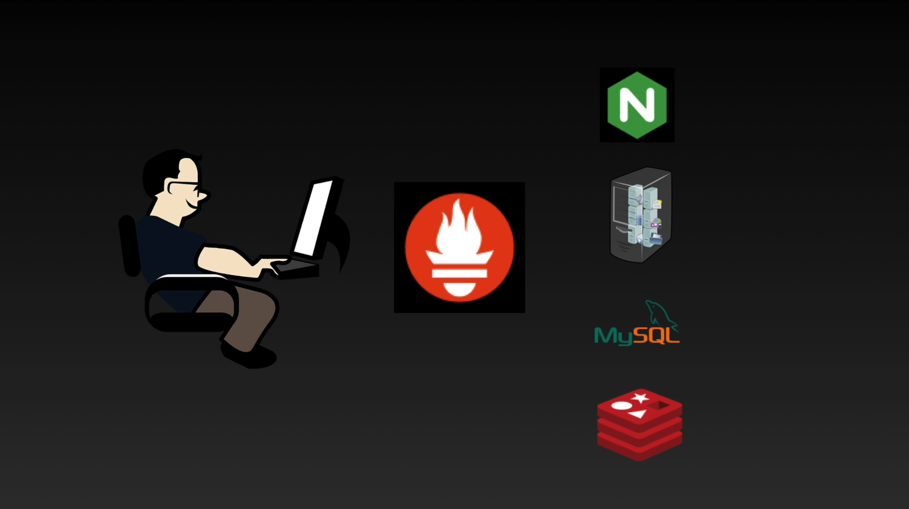
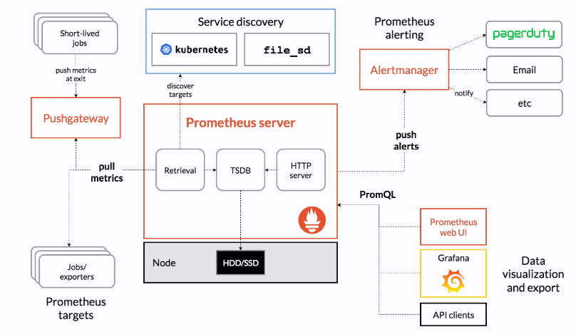

作为一个程序员，你开发了一套系统，部署上线后，它们运行情况是怎样的，mysql状态怎样？redis是否有压力？前端流量情况怎样？主机负载怎样，能否抗住压力？

在开发环境的时候，你可以上去查看各个组件的情况，而且测试也不会带来很大的压力。

但是生产上线后，不要说你也想上去查看各个组件的情况，就是运维人员也不可能让你上去的，你上去后，可能连门都进不去。

难过，难受，不理解，怎么办？

那么问题来了，有没有什么好的办法呢？

当然有的，没有什么问题是加一个中间层解决不了的，如果有，那就再加一个。这次我们介绍的是prometheus。

## prometheus是什么？

在当前的微服务架构下，每次的变更可能涉及数百个服务、上千个实例，我们需要一套更高效的监控系统，来帮助我们快速定位问题。

我们需要它支持多维度数据模型，以方便我们根据不同的标签去区分、判断。

需要它部署操作简单， 最好是无变更可完成监控，如支持服务发现，自动采集等。

最好能支持查询语言，可以快速的查看指标。

没错，prometheus就是这样一款支持众多特性的监控系统。我们来具体看下它是怎么做到的？

## 什么是metrics？

metrics，也就是指标，是prometheus世界中最核心的关注点。而在prometheus中还有一个核心概念就是时间序列，而指标就是在时间序列下的值。

指标有很多，比如一个数据库，你可能有连接数的指标，有查询情况的指标，对于一个后端服务，它可能是请求数，也可能是响应时长。

而指标的值就是你去判断问题发生在哪里的关键因素，比如你发现请求数在下降，那么问题可能出在服务端，如果发现响应时长在上升，那么问题可能出在数据库。

## 指标的类型

前面提到了指标，那么指标有什么具体区分吗？

是的指标类型有三种，分别是计数器、仪表和直方图

1. **计数器（Counter）**：计数器是一个只会增加的累积指标。它用于跟踪某个事件的累计发生次数。例如，`http_requests_total` 计数器可以记录某个服务接收到的HTTP请求总数。这个计数器只会增加，代表总请求量。

2. **仪表（Gauge）**：仪表是一个可以任意增加或减少的指标，适用于表示瞬时值，例如温度或队列长度。例如，`temperature_celsius` 仪表可以表示当前的温度值。这个值可以随着时间的推移而上升或下降。

3. **直方图（Histogram）**：直方图是一种用于度量一系列观察值分布的指标，通常用于测量请求持续时间或大小。例如，`http_request_duration_seconds` 直方图可以记录HTTP请求的响应时间。这个直方图会统计响应时间的分布情况，并提供总数、平均值等统计信息。

## promtheus的作业及实例

在prometheus中，作业和实例是两个核心概念。

作业（Job）：作业是prometheus中的一种概念，它代表了一组相关的监控任务。一个作业可以包含一个或多个实例。

实例（Instance）：实例是prometheus中的一种概念，它代表了一个监控目标。一个实例可以是一个服务、一个主机或者一个进程。

## prometheus相关组件

了解了指标，我们知道了prometheus监控的是什么？而对于prometheus的生态来讲，它还有一些其它组件，用于更好的实现监控的覆盖。

- prometheus server：负责收集和存储时间序列数据。
- pushgateway：用于临时和批量作业的推送指标。
- alertmanager：处理告警。
- exporters：用于收集和转换各种系统或服务的指标。
- node_exporter：收集主机级别的指标。
- blackbox_exporter：收集网络连通性指标。 

以上是部分prometheus的组件，可以根据需要选择是否使用

## prometheus的存储

监控中的指标了解了，相关组件也知道了，那么这些监控数据是怎么存储的，可以存储到哪里？

prometheus支持本地存储，也可以存储到远端，比如另外一套prometheus，或者一个时序数据库(influxdb,victoriametrics)。

它不需要分布式存储，就可以实现使用本地磁盘在单个服务器上运行具有数百万个时间序列和每秒提取数万个样本

## prometheus的架构

聊到这里，你应该脑海里已经有了一个整体的框架，那么prometheus的架构是怎样的呢？

常规情况下prometheus通过pull来拉取系统、应用，以及一些exporter暴露的指标，然后存储在本地，并提供查询。部分数据则是通过pushgateway来推送的。

如果有告警的需求、可视化的需求，则需要搭配一些组件，比如alertmanager、grafana等。

而这些规则、告警等，则需要通过prometheus的配置文件来完成。

## prometheus的查询语言

到了这里prometheus的架构应该已经很清晰了，而如果你想要更舒服的使用prometheus，你还需要了解下prometheus的查询语言。

prometheus的查询语言是promql，你可以通过promql来查询指标，并进行聚合、过滤等操作。

区别于别的监控系统，它可以根据不同的维度对数据进行切片、分割。

## prometheus到底是什么？

prometheus是一套开源的监控系统。它通过pull或者push的方式去获取到不同作业下不同实例的指标

然后存储到本地或者远端时序库，你可以通过promql来查询指标，并进行聚合、过滤等操作。

也可以定义一些rule规则去触发告警，用于检测服务、中间件、主机的状态。

