56.9k star,7年磨一剑，prometheus 3.0版本，速去感受了一把

prometheus2.0版本发布于7年前，年前发布了3.0beta版本，月初更新了3.1.0版本。


今天简单聊下有哪些不错的更新，供大家参考，文章后面整理了一些常用的promQL语句

### 新功能


#### **webui 重大变更**

prometheus3.0版本最大的变化就是新的web UI设计，新版的ui是默认启动，如果想要旧版的ui可以在启动时指定。

再介绍具体的细节之前，我们可以先来看下整体的界面及菜单结构。

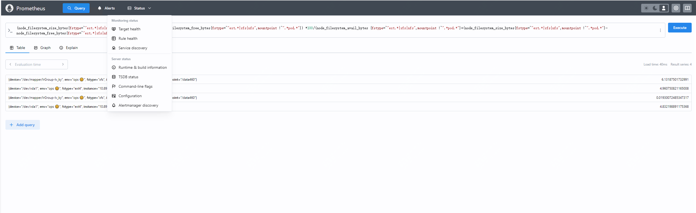

大部分的功能按钮还在，部分做了重命名，用到最多的query，在之前的版本是叫graph，之前就一直觉着不太合理。

而在targets里面，界面变得更加的整洁和简洁，可以对比下之前的图

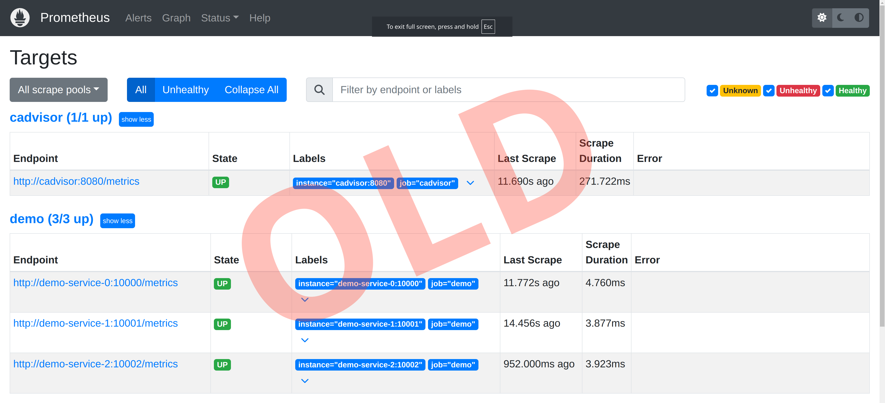

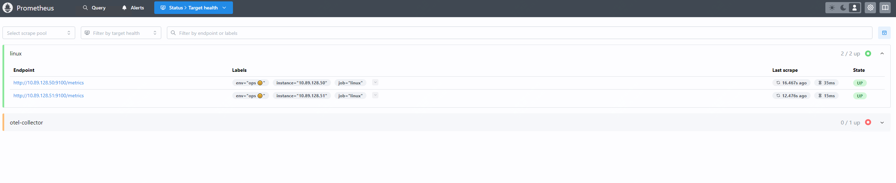

还有一个地方也是做了很大的变动，但是隐藏的比较深，就是在查询框的最右边的那三个点，里面有几个按钮。

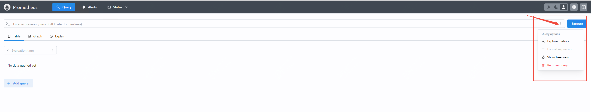

我们逐个看下并体验：

1. **Explore Metrics**：这个功能允许用户搜索和浏览所有可用的指标及其标签。用户可以快速找到所需的指标，并查看相关的元数据，从而更好地理解数据的结构和内容。

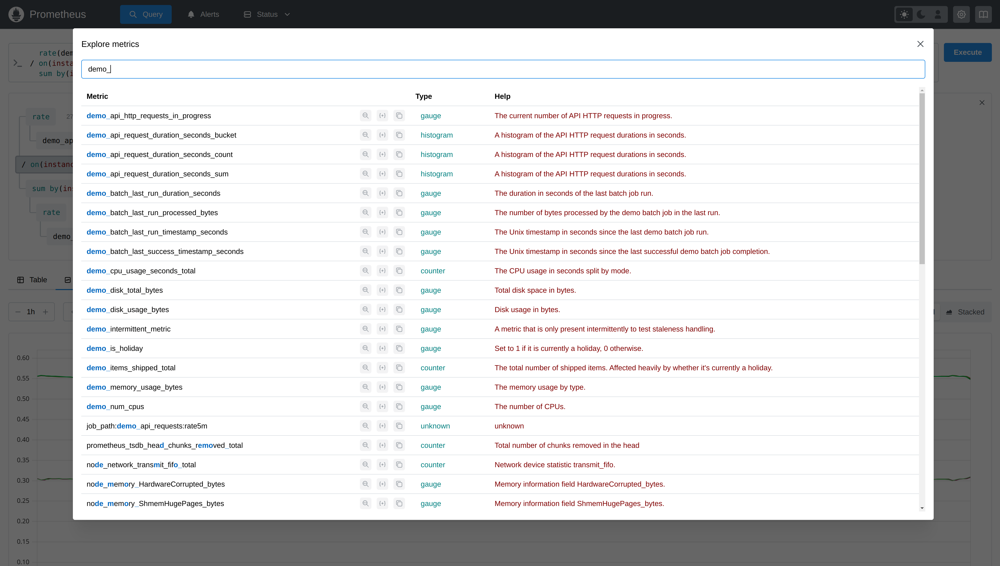

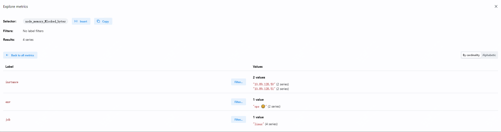

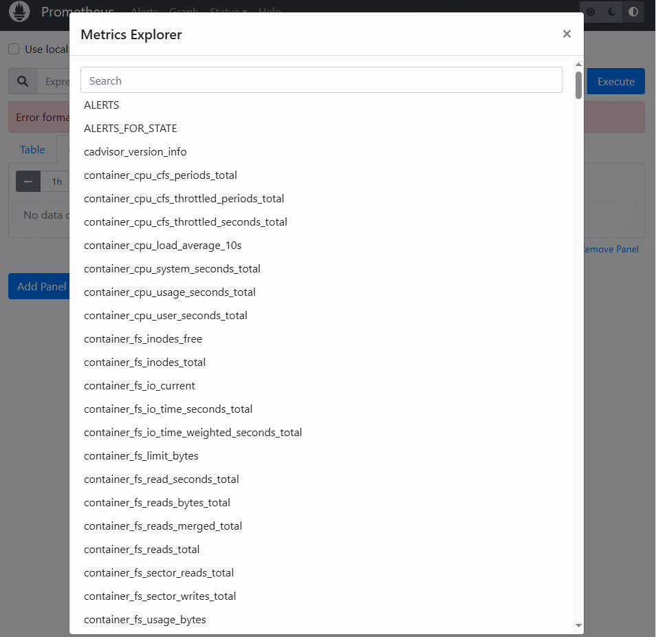

1. **Format Expression**：这个功能用于格式化 PromQL 查询表达式，使其更易读和理解。通过格式化查询，用户可以更清晰地看到查询的结构和逻辑，从而更容易进行调试和优化。
   
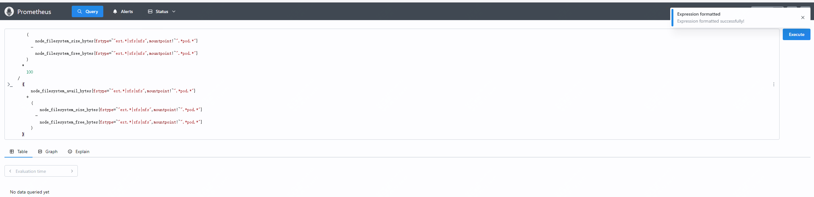

3. **Show Tree View**：这个功能采用了 PromLens 的查询树视图，允许用户将任何 PromQL 查询显示为子表达式的树状结构。这有助于用户更好地理解查询的组成部分和执行顺序，从而优化查询性能。


这些功能使得 Prometheus 3.0 的查询体验更加直观和强大，帮助用户更高效地进行监控和数据分析.

#### **远程写入2.0**

很多朋友其实没有使用过远程写入，但是如果你的指标数很多，监控数据量很多，甚至是多租户的，或者是其它场景是会用到远程写入的。

最简单的一个场景就是数据的备份，我们目前生产的监控数据是会远程写入VictoriaMetrics的，当然还支持Thanos、InfluxDB等

还有就是不同网络区域的监控数据，会汇聚到一个核心prometheus节点。

而在3.0版本中， 关于这个功能也是做了增强。

**增加了对元数据、示例、创建时间戳和原生直方图的支持。**

#### **UTF-8 支持**

虽然关于这个点可能使用场景不多，但是也是一个更新了，如下：

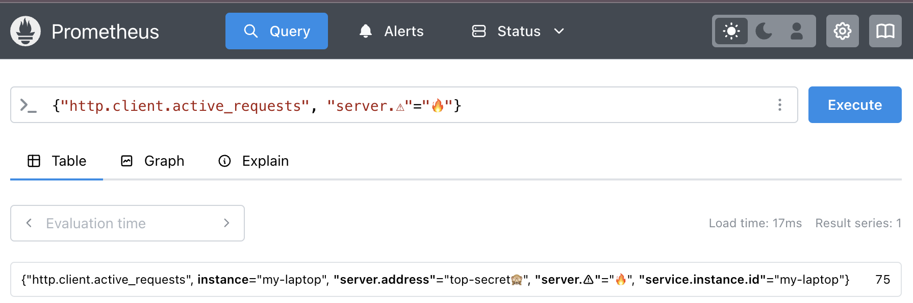   
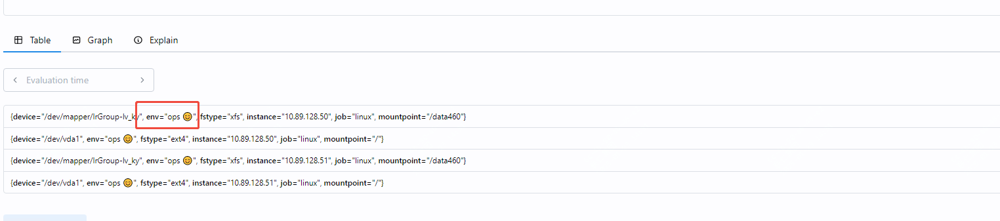

#### **OTLP 支持**

OTLP是一个传输协议，OTLP 定义了如何序列化和传输跟踪、指标和日志数据，从而简化了不同工具和服务之间的集成。

而这个也是可观测性监控的基础，关于这点，如果你用到了一些分布式链路监控的产品，如OpenTelemetry Collector、Loki、Zipkin等

那么可能会比较关注，因为在3.0版本中，它可以直接接收OpenTelemetry的数据，从而可以避免一些数据传输的消耗。


### 其它更新
- **功能标志**：对功能标志、配置文件、PromQL 和抓取协议进行了更改。
- **性能改进**：在 CPU 和内存使用方面进行了显著的效率提升。
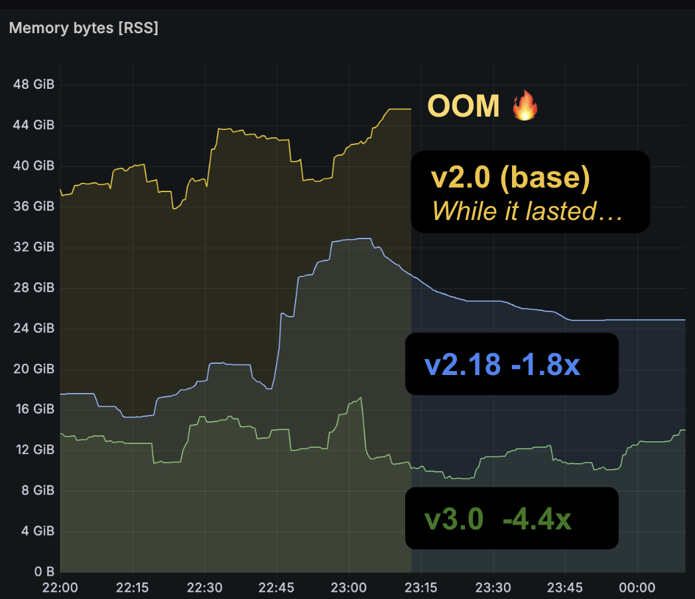
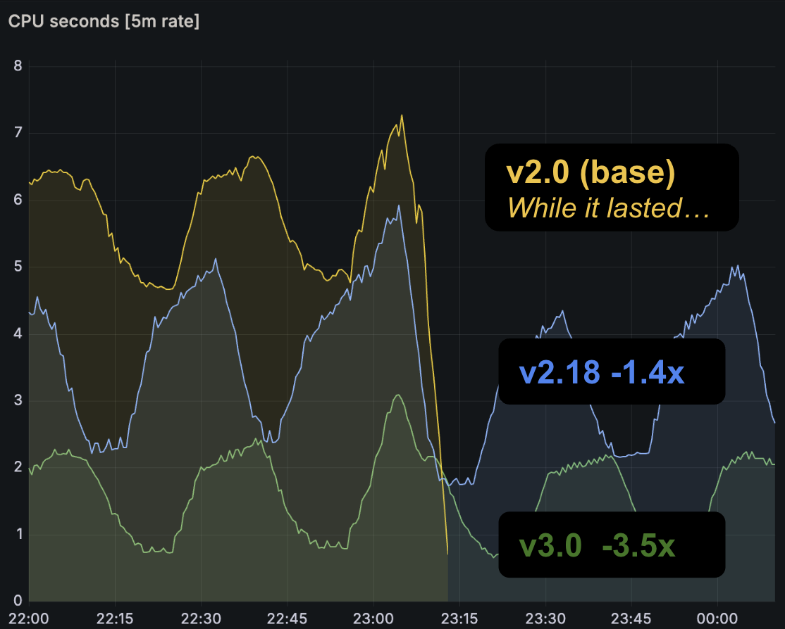


### 快速部署体验

快速部署最简单的办法就是docker部署，方式如下：

```
docker run --name prometheus -d -p 127.0.0.1:9090:9090 prom/prometheus
```

### promQL常用语句整理

**主机类**

#### 1. 基础系统信息
```promql
# 系统信息
node_uname_info{env=~"$env"} - 0

# 运行时间（天）
sum(time() - node_boot_time_seconds{env=~"$env"})by(instance)/86400

# CPU核心数
count(node_cpu_seconds_total{env=~"$env",mode='system'}) by (instance)
```

#### 2. CPU 相关指标
```promql
# CPU使用率
(1 - avg(rate(node_cpu_seconds_total{mode="idle"}[$interval])) by (instance)) * 100

# CPU负载
node_load5{env=~"$env"}

# CPU系统态使用率
avg(rate(node_cpu_seconds_total{mode="system"}[$interval])) by (instance) * 100

# CPU用户态使用率
avg(rate(node_cpu_seconds_total{mode="user"}[$interval])) by (instance) * 100

# CPU IO等待率
avg(rate(node_cpu_seconds_total{mode="iowait"}[$interval])) by (instance) * 100
```

#### 3. 内存相关指标
```promql
# 总内存
node_memory_MemTotal_bytes{env=~"$env"}

# 内存使用率
(1 - (node_memory_MemAvailable_bytes / node_memory_MemTotal_bytes)) * 100

# 已用内存
node_memory_MemTotal_bytes - node_memory_MemAvailable_bytes

# Swap使用率
(1 - ((node_memory_SwapFree_bytes + 1)/ (node_memory_SwapTotal_bytes + 1))) * 100
```

#### 4. 磁盘相关指标
```promql
# 磁盘使用率
(node_filesystem_size_bytes{fstype=~"ext.?|xfs"} - node_filesystem_free_bytes) * 100 / 
(node_filesystem_avail_bytes + (node_filesystem_size_bytes - node_filesystem_free_bytes))

# 磁盘读取速率
rate(node_disk_read_bytes_total[$interval])

# 磁盘写入速率
rate(node_disk_written_bytes_total[$interval])

# 磁盘IO使用率
rate(node_disk_io_time_seconds_total[$interval]) * 100

# inode使用率
1 - node_filesystem_files_free{fstype=~"ext.?|xfs"} / node_filesystem_files
```

#### 5. 网络相关指标
```promql
# TCP连接数
node_netstat_Tcp_CurrEstab

# TIME_WAIT连接数
node_sockstat_TCP_tw

# 网络接收速率（bit/s）
rate(node_network_receive_bytes_total[$interval]) * 8

# 网络发送速率（bit/s）
rate(node_network_transmit_bytes_total[$interval]) * 8

# TCP重传率
rate(node_netstat_Tcp_RetransSegs[$interval])
```

#### 6. 进程相关指标
```promql
# 运行进程数
node_procs_running

# 阻塞进程数
node_procs_blocked

# 文件描述符使用率
(node_filefd_allocated/node_filefd_maximum) * 100
```


使用这些查询语句时注意：
1. `$interval` 为时间范围变量，常用值如 `5m`、`1h` 等
2. `$env` 和 `$instance` 为标签匹配变量，需要根据实际环境调整
3. 部分查询可能需要根据实际监控指标的命名进行调整
4. rate() 和 irate() 函数使用时需要注意时间范围的选择
