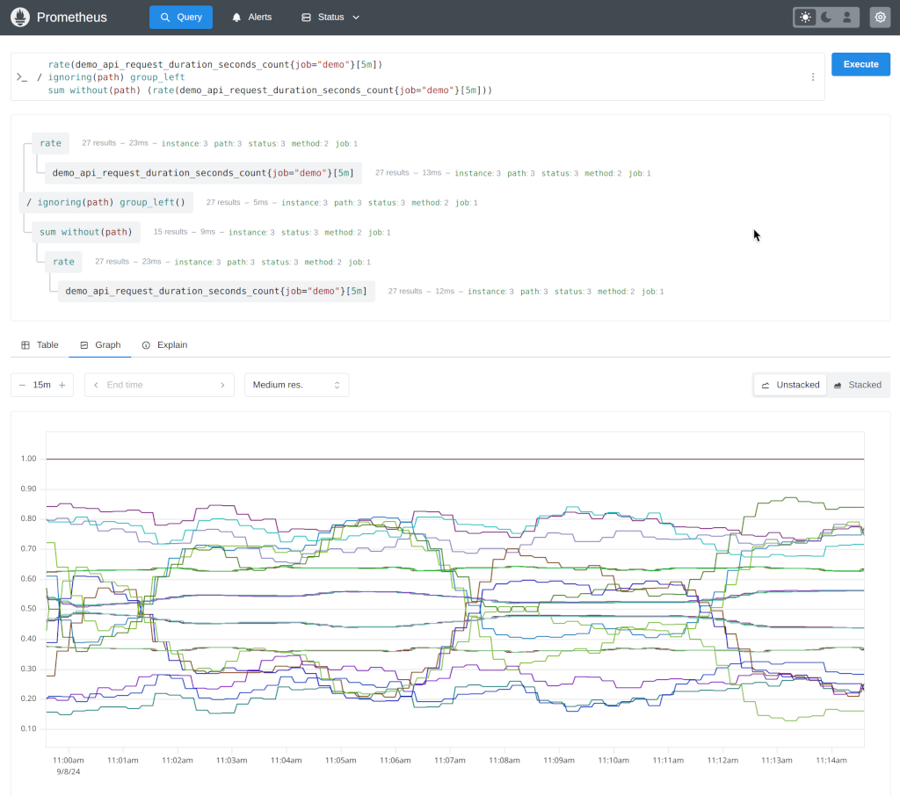

7年磨一剑，prometheus 3.0发布，带来重点变化!

prometheus2.0版本发布于7年前，在最近迎来了3.0版本的更新。

以下是一些主要更新和新功能：

### 新功能
- **新 UI**：全新设计的用户界面，默认启用，具有更现代的外观和感觉。

- **远程写入 2.0**：增加了对元数据、示例、创建时间戳和原生直方图的支持。
- **UTF-8 支持**：默认允许在指标和标签名称中使用所有有效的 UTF-8 字符。

- **OTLP 支持**：增强了与 OpenTelemetry 的互操作性。
- **原生直方图**：提供更高效和低成本的替代方案。

### 重大更改
- **功能标志**：对功能标志、配置文件、PromQL 和抓取协议进行了更改。
- **性能改进**：在 CPU 和内存使用方面进行了显著的效率提升。

### 下一步
- **更多 OpenTelemetry 兼容性和功能**。
- **OpenMetrics 2.0**：现在由 Prometheus 管理。
- **原生直方图稳定性**：包括自定义存储桶。

可以通过下载官方二进制文件和容器镜像来试用 Prometheus 3.0。如果从 Prometheus 2.x 升级，请查看迁移指南以了解更多信息。

