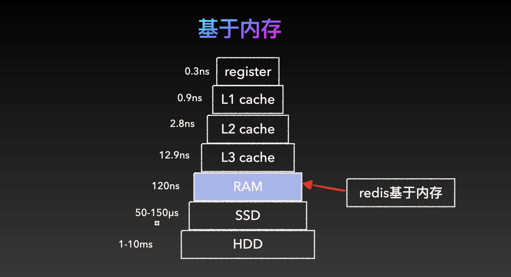
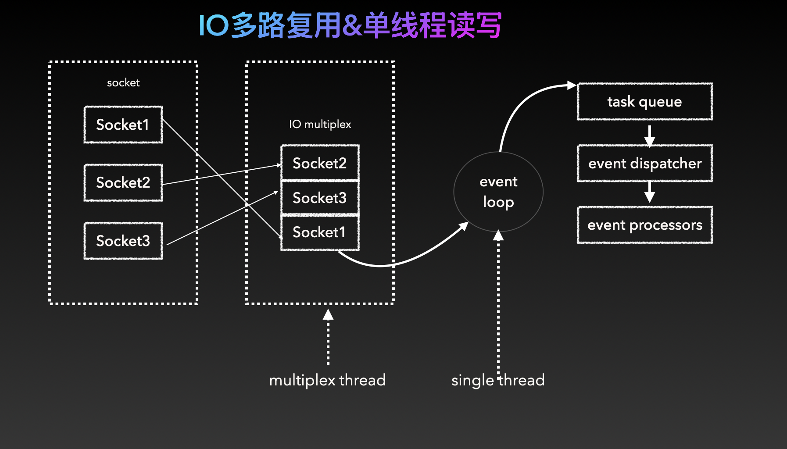
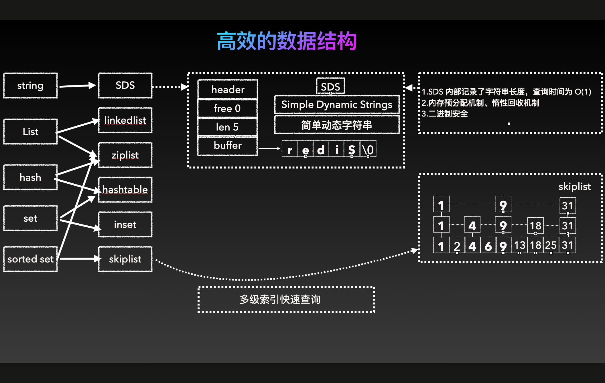

三张图看懂为什么redis这么快

## 数据存储在内存中

在现有的存储层次中，存储介质有多种类型，寄存器是最快的，仅用于处理器内部操作，L1、L2、L3级缓存主要用于临时存储属于用以加快处理速度。

而我们接触最多的内存，用于存储程序运行的临时数据，访速度远远快于硬盘。

而固态硬盘及机械硬盘则用于存储长期数据，速度相对较慢。

而redis是基于内存的，比常规的磁盘访问速度要快1000倍，这是redis快的原因之一。

## IO多路复用&单线程读写

redis快的第二点原因在于IO多路复用&单线程读写

多个套接字通过io多路复用汇总到一个单线程事件循环中，所以redis不需要为每个事件创建单独的线程，IO多路复用可以实现对客户端连接的高效管理，从而实现在单线程在依旧可以处理成千上万的并发请求。

redis的单线程任务处理，可以避免线程切换的开销，也可以保证高效，无需担心多线程并发的问题

## 高效的数据结构

而第三点redis快的原因是它采用的一些高效的数据结构

其中最核心使用到最多的就是SDS及skiplist，redis中用到最多的数据类型是字符串，它采用的就是SDS，Simple dynamic strings，简单动态字符串，它有如下特点

- 在数据的头部记录了字符串的len，所以查询时间为o(1)
- 优化内存管理，首先是内存预分配，当 SDS 增长时，它会预分配多于实际所需的内存，记录这些额外的空闲空间（free space）。这样，如果字符串后续需要进一步扩展，直接利用这部分空闲空间，而无需重新分配内存。当 SDS 缩短时（例如通过截断操作），空出来的空间不会立即释放，而是记录在 free 字段中，供未来再利用。
- 二进制安全，SDS不以空字符串来判断字符串是否结束，而是以len属性表示的长度来判断字符串是否结束，所以支持存储任何二进制数据。

还有一种数据结构是skip list

跳表（Skip List）用于实现 Sorted Set 数据结构，支持快速的范围查询和插入操作。

跳表通过多层索引优化查找效率，查询时间复杂度为 O(log n)，适合处理大量有序数据。

如上三点确保了redis为何快