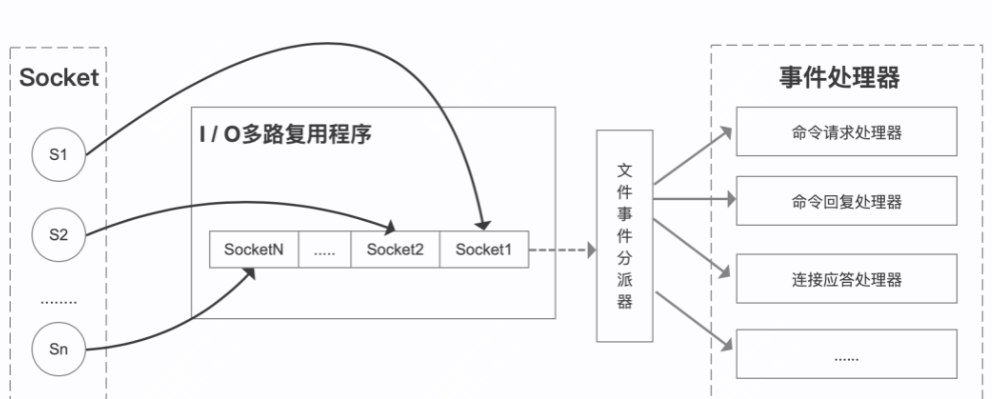

## redis单线程为什么这么快

### 数据存储在内存中

绝大部分请求为纯内存操作，避免了通过磁盘io的开销

### 高效的数据结构

redis的数据类型有string、list、hash、set、sortedset

不同的数据类型底层使用了一种或者多种数据结构来支撑，目的就是为了追求更快的速度。

### 单线程架构

采用单线程，省去了很多上下文切换的时间以及CPU消耗，不存在竞争条件，不用去考虑各种锁的问题，不存在加锁释放锁操作，也不会出现死锁而导致的性能消耗，且能够使用各种“线程不安全”命令，例如 Lpush。

单线程，指的是网络IO和键值对读写 (文件事件分派器) 使用一个线程来处理，即一个线程处理所有网络请求，但Redis的其他功能，比如持久化、异步删除、集群数据同步等等，实际是由额外的线程执行的。

那为什么使用单线程呢？官方答案是：因为CPU不是Redis的瓶颈，Redis的瓶颈最有可能是机器内存或者网络带宽。既然单线程容易实现，而且CPU不会成为瓶颈，那就顺理成章地采用单线程的方案了。

虽然多线程架构允许应用程序通过上下文切换并发处理任务，但 对 Redis 的性能提升微乎其微，因为大多数线程最终会在网络 I/O 中被阻塞。

同时要注意的是，正因为是单线程，如果某个命令执行过长（如hgetall命令），会造成阻塞。Redis是面向快速执行场景的内存数据库，所以要慎用如lrange和smembers、hgetall等命令。

### 非阻塞IO

使用基于网络 I/O多路复用机制(非阻塞IO)的线程模型，可以处理并发的链接，缓解网络 I/O 速度慢的问题。

redis的网络事件处理器是基于Reactor模式，又叫做文件事件处理器。

文件事件处理器使用I/O多路复用来同时监听多个套接字，并根据套接字执行的任务关联到不同的事件处理器。

文件事件以单线程方式运行，但通过使用I/O多路复用程序来监听多个套接字，文件事件处理器实现了高性能的网络通信模型。

Redis 在处理客户端的请求时，包括接收(socket读)、解析、执行、发送(socket 写) 等都由一个顺序串行的主线程处理，这就是所谓的单线程。

文件事件处理器的结构包含4个部分，线程模型如下图：



多个 Socket 可能会产生不同的操作，每个操作对应不同的文件事件，但是IO多路复用程序会监听多个Socket，将Socket产生的事件放入队列中排队，事件分派器每次从队列中取出一个事件，把该事件交给对应的事件处理器进行处理。

Redis客户端对服务端的每次调用都经历了发送命令，执行命令，返回结果三个过程。其中执行命令阶段，由于Redis是单线程来处理命令的，所有每一条到达服务端的命令不会立刻执行，所有的命令都会进入一个队列中，然后逐个被执行。并且多个客户端发送的命令的执行顺序是不确定的。但是可以确定的是不会有两条命令被同时执行，不会产生并发问题，这就是Redis的单线程基本模型。

## redis6.0 多线程说明

#### 1、Redis6.0 之前为什么一直不使用多线程？

Redis使用单线程的可维护性高。多线程模型虽然在某些方面表现优异，但是它却引入了程序执行顺序的不确定性，带来了并发读写的一系列问题，增加了系统复杂度、同时可能存在线程切换、甚至加锁解锁、死锁造成的性能损耗。

#### 2、Redis6.0 为什么要引入多线程呢？

因为Redis的瓶颈不在内存，而是在网络I/O模块带来CPU的耗时，所以Redis6.0的多线程是用来处理网络I/O这部分，充分利用CPU资源，减少网络I/O阻塞带来的性能损耗。

#### 3、Redis6.0 如何开启多线程？

默认情况下Redis是关闭多线程的，可以在conf文件进行配置开启


```
io-threads-do-reads yes
io-threads 线程数
```

官方建议的线程数设置：4核的机器建议设置为2或3个线程，8核的建议设置为6个线程，线程数一定要小于机器核数，尽量不超过8个。

#### 4、多线程模式下，是否存在线程并发安全问题？

一次redis请求，要建立连接，然后获取操作的命令，然后执行命令，最后将响应的结果写到socket上。