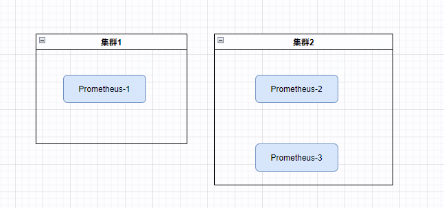
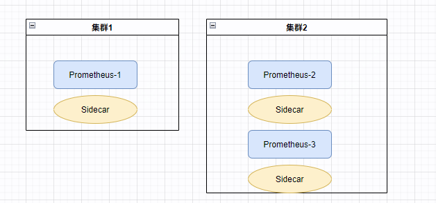
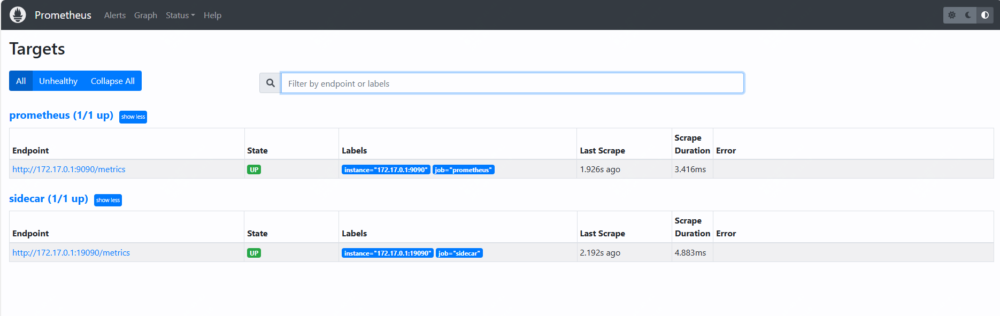
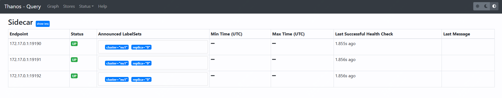
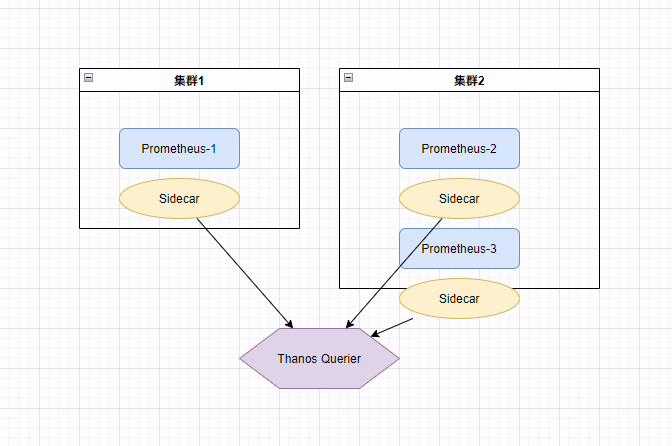

手把手带你了解thanos，如何实现promtheus的高可用

prometheus的本身设计不自带高可用机制，可以通过别的方式去实现，如VictoriaMetrics、Thanos、负载均衡等，这篇文章就讲介绍如何通过Thanos的Sidecar与Querier，实现对多副本Prometheus的全局查询。


## 关于thanos

thanos就是为prometheus而设计的，它的目标在于指标的全局查找，指标的无限期限保留，以及prometheusd的高可用，可以直接应用到现有的prometheus上。

## 开始之前

在正式开始之前，我们先部署三个prometheus实例用于演示。

这三个实例，我们假设是两个不同集群，其中集群2有两个实例，集群2抓取指标一致。

### 先准备三个配置文件

集群1-配置文件1 prometheus1_c1.yml

```yml
global:
  scrape_interval: 15s
  evaluation_interval: 15s
  external_labels:
    cluster: eu1
    replica: 0

scrape_configs:
  - job_name: 'prometheus'
    static_configs:
      - targets: ['172.17.0.1:9090']
```
集群2-配置文件1 prometheus2_c1.yml

```yml
global:
  scrape_interval: 15s
  evaluation_interval: 15s
  external_labels:
    cluster: us1
    replica: 0

scrape_configs:
  - job_name: 'prometheus'
    static_configs:
      - targets: ['172.17.0.1:9091','172.17.0.1:9092']
```
集群2-配置文件2 prometheus2_c2.yml

```yml
global:
  scrape_interval: 15s
  evaluation_interval: 15s
  external_labels:
    cluster: us1
    replica: 1

scrape_configs:
  - job_name: 'prometheus'
    static_configs:
      - targets: ['172.17.0.1:9091','172.17.0.1:9092']
```
###  新建目录作为docker持久卷

```bash
mkdir -p prometheus1_c1_data prometheus2_c1_data prometheus2_c2_data
```

### 启动三个prometheus

注意：
参数需要添加--web.enable-lifecycle --web.enable-admin-api，否则无法通过API进行reload。



```bash
docker run -d --net=host --rm \
    -v $(pwd)/prometheus1_c1.yml:/etc/prometheus/prometheus.yml \
    -v $(pwd)/prometheus1_c1_data:/prometheus \
    -u root \
    --name prometheus-0-eu1 \
    quay.io/prometheus/prometheus:v2.38.0 \
    --config.file=/etc/prometheus/prometheus.yml \
    --storage.tsdb.path=/prometheus \
    --web.listen-address=:9090 \
    --web.enable-lifecycle \
    --web.enable-admin-api && echo "Prometheus 集群1 started!"
```

```bash
docker run -d --net=host --rm \
    -v $(pwd)/prometheus2_c1.yml:/etc/prometheus/prometheus.yml \
    -v $(pwd)/prometheus2_c1_data:/prometheus \
    -u root \
    --name prometheus-0-us1 \
    quay.io/prometheus/prometheus:v2.38.0 \
    --config.file=/etc/prometheus/prometheus.yml \
    --storage.tsdb.path=/prometheus \
    --web.listen-address=:9091 \
    --web.enable-lifecycle \
    --web.enable-admin-api && echo "Prometheus 集群2-1 started!"
```

```bash
docker run -d --net=host --rm \
    -v $(pwd)/prometheus2_c2.yml:/etc/prometheus/prometheus.yml \
    -v $(pwd)/prometheus2_c2_data:/prometheus \
    -u root \
    --name prometheus-1-us1 \
    quay.io/prometheus/prometheus:v2.38.0 \
    --config.file=/etc/prometheus/prometheus.yml \
    --storage.tsdb.path=/prometheus \
    --web.listen-address=:9092 \
    --web.enable-lifecycle \
    --web.enable-admin-api && echo "Prometheus 集群2-2 started!"
```

## 安装thanos sidecar

thanos有多个组件，其中sidecar组件是我们这里要用到的，实际上thanos就是一个go语言的二进制文件，可以启用不同的模式。

sidecar组件，有多种功能：

- sidecar组件，可以读取prometheus的本地数据，通过grpc协议，暴露给thanos的querier组件查询。
- 能够监听配置，并且实时更新


接下来我们对三个prometheus实例，分别安装sidecar组件。打到如下效果：



```bash
docker run -d --net=host --rm \
    -v $(pwd)/prometheus1_c1.yml:/etc/prometheus/prometheus.yml \
    --name prometheus-0-sidecar-eu1 \
    -u root \
    quay.io/thanos/thanos:v0.28.0 \
    sidecar \
    --http-address 0.0.0.0:19090 \
    --grpc-address 0.0.0.0:19190 \
    --reloader.config-file /etc/prometheus/prometheus.yml \
    --prometheus.url http://172.17.0.1:9090 && echo "Started sidecar for Prometheus 集群1"
```   

```bash
docker run -d --net=host --rm \
    -v $(pwd)/prometheus2_c1.yml:/etc/prometheus/prometheus.yml \
    --name prometheus-0-sidecar-us1 \
    -u root \
    quay.io/thanos/thanos:v0.28.0 \
    sidecar \
    --http-address 0.0.0.0:19091 \
    --grpc-address 0.0.0.0:19191 \
    --reloader.config-file /etc/prometheus/prometheus.yml \
    --prometheus.url http://172.17.0.1:9091 && echo "Started sidecar for Prometheus 集群2-1"
```

```bash
docker run -d --net=host --rm \
    -v $(pwd)/prometheus2_c2.yml:/etc/prometheus/prometheus.yml \
    --name prometheus-1-sidecar-us1 \
    -u root \
    quay.io/thanos/thanos:v0.28.0 \
    sidecar \
    --http-address 0.0.0.0:19092 \
    --grpc-address 0.0.0.0:19192 \
    --reloader.config-file /etc/prometheus/prometheus.yml \
    --prometheus.url http://172.17.0.1:9092 && echo "Started sidecar for Prometheus 集群2-2"
```

为了验证sidecar是否正常工作，我们可以修改prometheus的配置文件查看是否有自动更新。

集群1-配置文件1 prometheus1_c1.yml

```yml
global:
  scrape_interval: 15s
  evaluation_interval: 15s
  external_labels:
    cluster: eu1
    replica: 0

scrape_configs:
  - job_name: 'prometheus'
    static_configs:
      - targets: ['172.17.0.1:9090']
  - job_name: 'sidecar'
    static_configs:
      - targets: ['172.17.0.1:19090']
```
集群2-配置文件1 prometheus2_c1.yml

```yml
global:
  scrape_interval: 15s
  evaluation_interval: 15s
  external_labels:
    cluster: us1
    replica: 0

scrape_configs:
  - job_name: 'prometheus'
    static_configs:
      - targets: ['172.17.0.1:9091','172.17.0.1:9092']
  - job_name: 'sidecar'
    static_configs:
      - targets: ['172.17.0.1:19091','172.17.0.1:19092']
```
集群2-配置文件2 prometheus2_c2.yml

```yml
global:
  scrape_interval: 15s
  evaluation_interval: 15s
  external_labels:
    cluster: us1
    replica: 1

scrape_configs:
  - job_name: 'prometheus'
    static_configs:
      - targets: ['172.17.0.1:9091','172.17.0.1:9092']
  - job_name: 'sidecar'
    static_configs:
      - targets: ['172.17.0.1:19091','172.17.0.1:19092']
```
可以看到已经新增

 


## 添加thanos的querier组件

querier是一个普通的promQL查询组件，它可以汇总查询所带有边车的prometheus组件。

```bash
docker run -d --net=host --rm \
    --name querier \
    quay.io/thanos/thanos:v0.28.0 \
    query \
    --http-address 0.0.0.0:29090 \
    --query.replica-label replica \
    --store 172.17.0.1:19190 \
    --store 172.17.0.1:19191 \
    --store 172.17.0.1:19192 && echo "Started Thanos Querier"
```
可以通风web查看已经启动的查询组件 

 

前面有提到集群2实际上收集的是同样的指标，该查询器是可以支持去掉重复数据的，这个在启动参数中query.replica-label=replica，该参数表示的是集群的标签，通过该标签可以区分集群。

最终实现的效果



