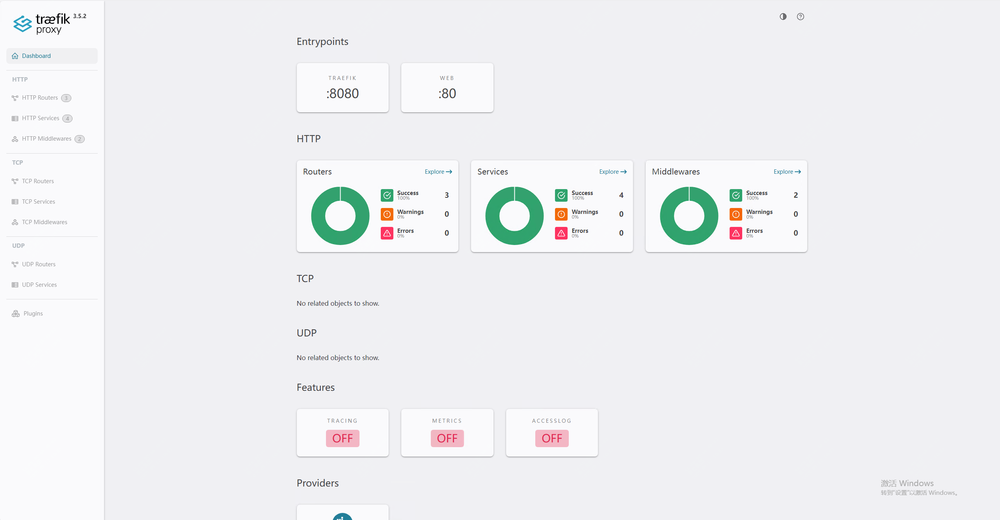
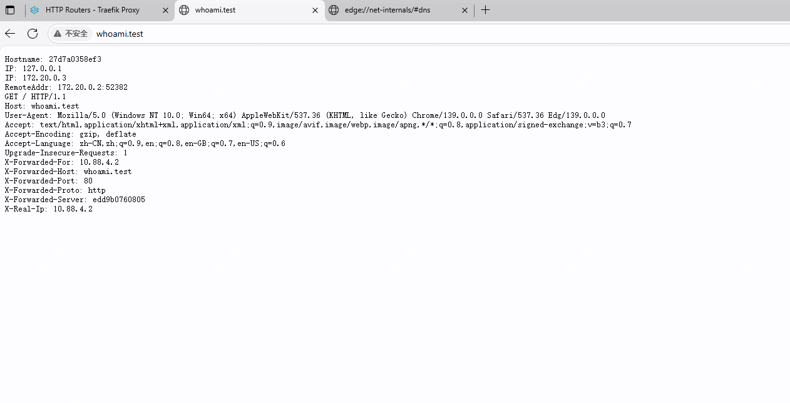
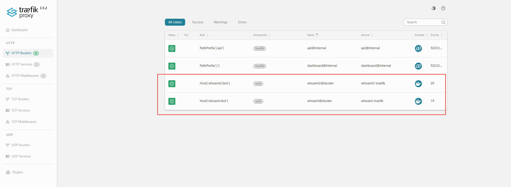
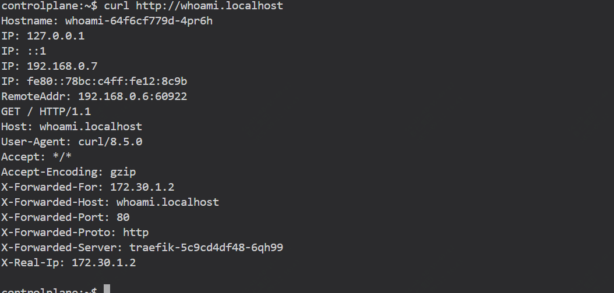

56600星标，介绍一款适合docker、k8s使用的现代化的反向代理工具

说到反向代理工具，你可能想到的是nginx，nginx作为经典的反向代理工具，是经常被用到和提到的，而今天我们介绍的是一款更现代化的工具，它最大的特点在于能够自动发现服务，并且自动生成路由规则。

下面就通过几个例子来介绍下如何使用

## 安装及使用

安装方式可以选择二进制方式安装，也可以选择docker或者直接在k8s中安装。

### docker安装及最简化demo

通过如下yml文件启动traefik及一个whoami容器，可以通过host，whoami.test来访问

```
version: "2.2"

services:
  traefik:
    image: traefik/traefik:v3.5
    command:
      - "--api.insecure=true"                # 开启 dashboard (http://localhost:8080/dashboard/)
      - "--providers.docker=true"            # 启用 Docker provider
      - "--providers.docker.exposedbydefault=false"  # 默认不暴露容器，避免不小心把所有容器暴露
      - "--entrypoints.web.address=:80"      # 定义 web 入口 (80)
    ports:
      - "80:80"       # 入口流量
      - "8080:8080"   # Dashboard
    volumes:
      - /var/run/docker.sock:/var/run/docker.sock
    networks:
      - traefik-net

  whoami:
    image: traefik/whoami
    labels:
      - "traefik.enable=true"
      - "traefik.http.routers.whoami.rule=Host(`whoami.test`)" # 通过 Host 规则访问
      - "traefik.http.routers.whoami.entrypoints=web"               # 入口点是 web(80)
    networks:
      - traefik-net

networks:
  traefik-net:
    driver: bridge
```

执行如下：

```
docker-compoe up -d
```

访问8080端口可以查看dashboard，可以在


需要本地配下host，可通过whoami.test 访问页面。



**如何验证它的自动发现？**

我们可以通过继续部署一个whoami，通过如下配置：

```
version: "2.2"
  whoami2:
    image: traefik/whoami
    labels:
      - "traefik.enable=true"
      - "traefik.http.routers.whoami2.rule=Host(`whoami2.test`)" # 通过 Host 规则访问
      - "traefik.http.routers.whoami2.entrypoints=web"               # 入口点是 web(80)
    networks:
      - traefik-net

networks:
  traefik-net:
    driver: bridge
```

Traefik 通过 docker.sock 自动检测新容器 + 解析其 labels → 动态生成路由，无需修改 Traefik 配置。

dashboard可以看到已经更新了。



可以看到在docker-compose的配置中我们指定了同一个network，因为路由中拿到的地址是容器的地址，需要能访问通，这样就会有一个问题了，如果跨主机怎么办？配置文件直接写死那就失去了自动发现的意义，也可以通过写入consul这种注册中心来实现，但略显麻烦，traefik更适合的场景还是在k8s中使用。

在介绍k8s中使用traefik之前，我们先来介绍下它的TLS怎么实现的。

### treakfik的TLS认证

trakfik支持传统的静态证书，也可以自动从 Let’s Encrypt 获取证书，它里面已经内置了acme客户端，当然前提是你有一个公网可以访问的域名。

这里不做演示了。

### kubernets环境部署treakfit

通过helm方式安装，配置repo
```
helm repo add traefik https://traefik.github.io/charts
helm repo update
```
新建value配置文件,正常通过LoadBalancer来使用80、443端口，这里临时使用hostpost，另外如果你需要快速起一个k8s环境，可以试下k3d。

```
ports:
  traefik:
    port: 8080
    expose:
      default: true
    exposedPort: 8080
    protocol: TCP
  web:
    port: 80
    expose:
      default: true
    exposedPort: 80
    protocol: TCP
    hostPort: 80
  websecure:
    port: 443
    expose:
      default: true
    exposedPort: 443
    protocol: TCP
    hostPort: 443
ingressRoute:
  dashboard:
    enabled: true
    matchRule: Host(`dashboard.localhost`)
    entryPoints:
      - web
providers:
  kubernetesGateway:
    enabled: true
gateway:
  listeners:
    web:
      namespacePolicy:
        from: All
service:
  enabled: true
  type: NodePort
  spec:
    externalTrafficPolicy: Cluster   # 或 Local，看你需不需要保留源 IP
  nodePorts:
    traefik: 38081 
```

然后部署

```
helm install traefik traefik/traefik -f values.yml
```

部署完成后，可以通过如下访问

```
curl http://dashboard.localhost/dashboard/
```

那然后部署一个deployment及service并且通过IngressRoute方式暴露服务，你可以通过Gateway API方式。

```
# whoami.yaml
apiVersion: apps/v1
kind: Deployment
metadata:
  name: whoami
spec:
  replicas: 2
  selector:
    matchLabels:
      app: whoami
  template:
    metadata:
      labels:
        app: whoami
    spec:
      containers:
        - name: whoami
          image: traefik/whoami
          ports:
            - containerPort: 80
```

```
# whoami-service.yaml
apiVersion: v1
kind: Service
metadata:
  name: whoami
spec:
  ports:
    - port: 80
  selector:
    app: whoami
```

部署
```
kubectl apply -f whoami.yaml
kubectl apply -f whoami-service.yaml
```

创建一个IngressRoute

```
# whoami-ingressroute.yaml
apiVersion: traefik.io/v1alpha1
kind: IngressRoute
metadata:
  name: whoami
spec:
  entryPoints:
    - web
  routes:
    - match: Host(`whoami.localhost`)
      kind: Rule
      services:
        - name: whoami
          port: 80
```

```
kubectl apply -f whoami-ingressroute.yaml
```

访问测试：



ok,就先介绍到这里了！
