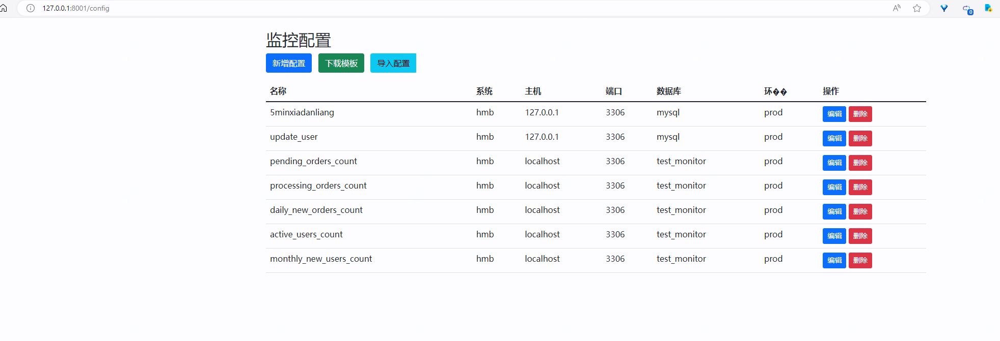
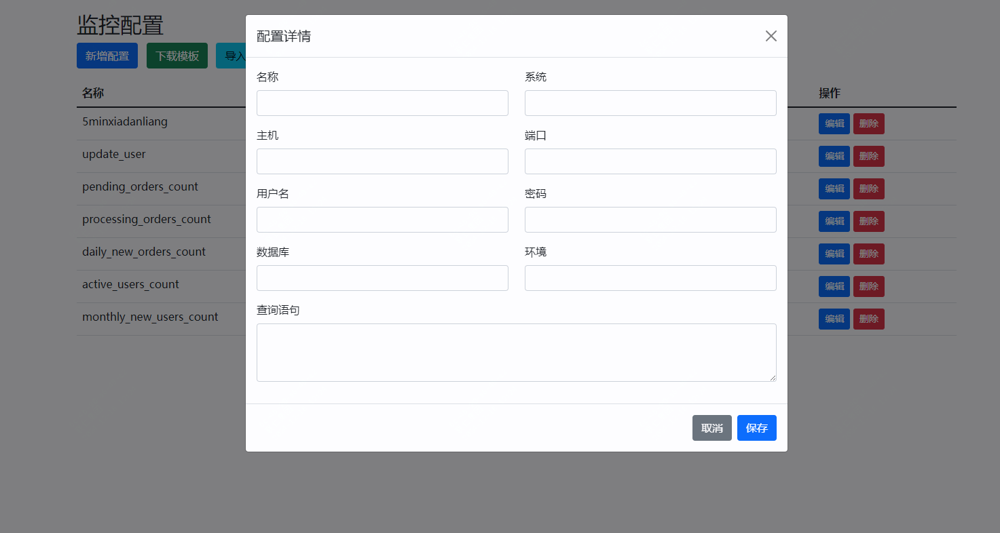
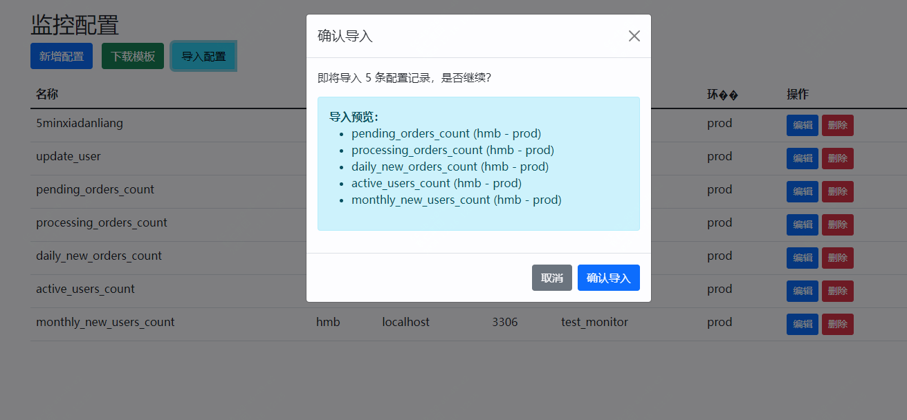
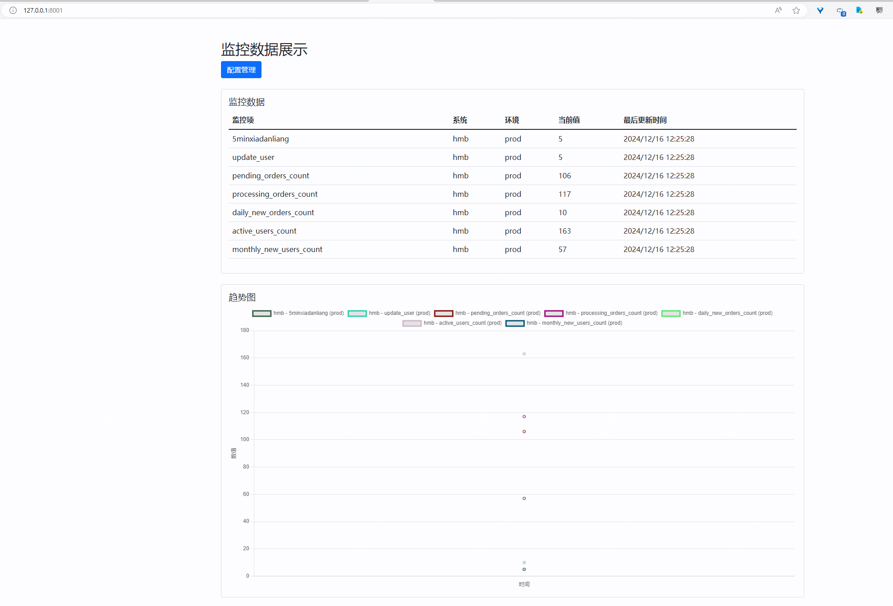
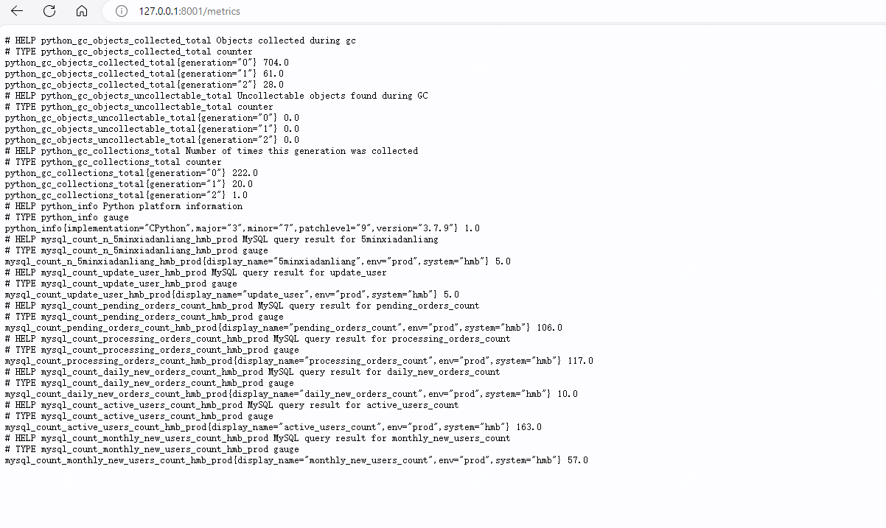
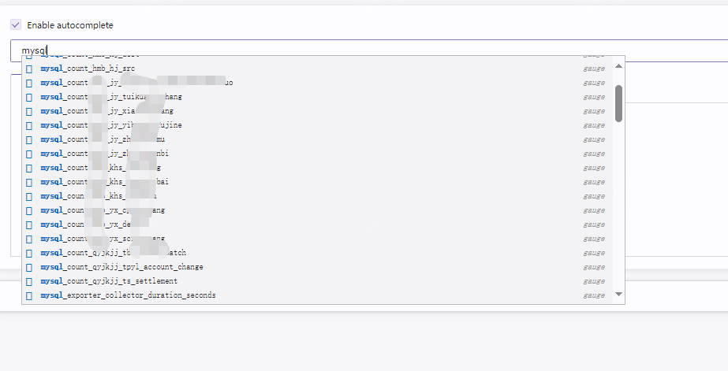

最近上线了一套新的业务系统，业务方扔了几十条业务sql过来说把这些sql监控下，如果出现异常需要在企微中看到。

本来最初这个监控是一直没有做的，业务相关的监控也仅仅做了es日志相关的监控，但前段时间手欠，用python脚本写了个简单的监控，sql及数据库配置都是写在配置文件中，如果真要配置这几十条sql，那还是有点费事的。

而本文就是在这个情况下开始的。

最开始这个脚本，我姑且称之为业务监控1.0。

脚本极其简单，因为要与现有的整体监控配套，所以是通过通过读取sql配置文件，查询数据，然后包装为prometheus可读的/mertics形式。脚本如下：

```
import pymysql
from prometheus_client import start_http_server, Gauge

import time

config_file = "dbconfig"

def load_config():

    with open(config_file, "r", encoding='utf-8') as f:
        config_data = f.read()
        config = eval(config_data)  # 将字符串转换为字典
        return config
def query_mysql(config):
    try:
        conn = pymysql.connect(host=config['host'], port=config['port'], user=config['user'],
                               password=config['password'], db=config['database'], charset='utf8mb4')
        cursor = conn.cursor()
        cursor.execute(config['query'])
        result = cursor.fetchone()
        cursor.close()
        conn.close()
        env=config['env']
        return [result[0],env]
    except Exception as e:
        print('Error querying MySQL:', e)
        return None

if __name__ == '__main__':
    # Start the Prometheus server on port 8000
    start_http_server(8000)

    # Define a Prometheus gauge metric for each query
    metrics = {}
    DB_CONFIGS = load_config()

    for db_name, db_config in DB_CONFIGS.items():
        metric_name = 'mysql_count_' + db_name
        #print (metric_name)
        #print (db_name)
        metrics[db_name] = Gauge(metric_name, 'Count of records in database' + db_name,['env'])
        print(metrics)

    # Loop indefinitely, updating the metrics every 10 seconds
    while True:
        new_config = load_config()
        if DB_CONFIGS != new_config:  # 如果新配置和旧配置不一样，则更新变量值
            print("Config updated:", new_config)

            DB_CONFIGS = new_config

        for db_name, db_config in DB_CONFIGS.items():
            value = query_mysql(db_config)[0]
            print(db_name)
            #print (value)
            env= query_mysql(db_config)[1]
            if value is not None:
                metrics[db_name].labels(env=env).set(value)
        time.sleep(300)
```

配置文件格式如下：

```
{
    'xiadangliang': {
        'host': 'ip',
        'port': 3306,
        'user': 'yw_monitor',
        'password': 'passwd',
        'database': 'test_monitor',
        'env': 'monitor',
        'query': 'select count(*) as order_count from insurance_pts.t_pts_order where create_time >= date_add(current_timestamp, interval -5 minute);'
    }
}    
```
上述配置只给出了一条，实际目前已经配置了几十条，按照现在的需求，那可能要扩到更多。

于是我计划升级，一呢是好久不碰python了，得熟悉下，二呢，也是想更简操作，如通过页面去配置？如批量导入？

说干就干，下面这套业务监控2.0是用了一下午的时间来完成的。

所以问题多多，但已能用，后续再慢慢优化。代码开源，地址如下：

github.com/dxzyw/python_work 


## 配置页面：









## prometheus 指标



## prometheus可查询项




# MySQL Monitor System (MySQL 监控系统)

## 项目简介 (Introduction)
MySQL Monitor System 是一个基于 Flask 和 Prometheus 的 MySQL 数据库监控系统。它允许用户通过配置 SQL 查询来监控数据库中的各种指标，并通过 Prometheus 进行数据收集和展示。

This is a MySQL monitoring system based on Flask and Prometheus. It allows users to monitor various metrics in MySQL databases by configuring SQL queries, and collects and displays data through Prometheus.

## 主要功能 (Core Features)

### 1. 监控配置管理 (Monitor Configuration Management)
- 支持通过 Web 界面添加、编辑、删除监控配置
- 支持通过 Excel 批量导入监控配置
- 支持下载标准配置模板


### 2. 数据采集 (Data Collection)
- 自动执行配置的 SQL 查询
- 支持自定义查询间隔
- 支持多数据库实例监控

### 3. 数据展示 (Data Visualization)
- 实时显示监控指标


## 技术栈 (Tech Stack)
- 后端 (Backend): Python, Flask
- 前端 (Frontend): Bootstrap, JavaScript

## 未来展望 (Future Plans)

### 1. 功能增强 (Feature Enhancements)
- [ ] 添加告警功能
- [ ] 支持更多数据库类型
- [ ] 添加数据可视化图表
- [ ] 支持自定义监控面板


### 2. 性能优化 (Performance Optimization)
- [ ] 优化数据采集性能
- [ ] 添加数据缓存机制
- [ ] 优化大量监控项的处理

### 3. 用户体验 (User Experience)
- [ ] 改进配置导入流程
- [ ] 添加更多数据展示方式
- [ ] 支持监控配置导出

## 安装说明 (Installation)

```bash
# 克隆项目 (Clone the repository)
git clone https://github.com/dxzyw/python_work.git

# 进入monitor目录

cd python_work/monitor

# 安装依赖 (Install dependencies)
pip install -r requirements.txt

# 初始化数据库 (Initialize database)
flask db upgrade

# 启动应用 (Start the application)
python app.py
```

问题真的有点多，慢慢改吧，先能用起来。