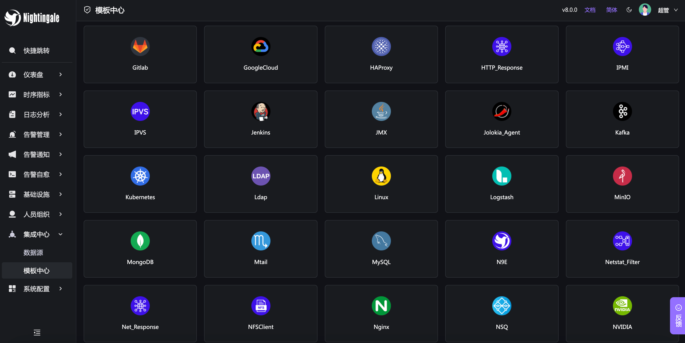
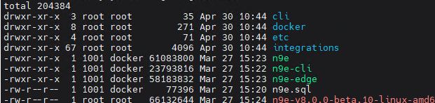
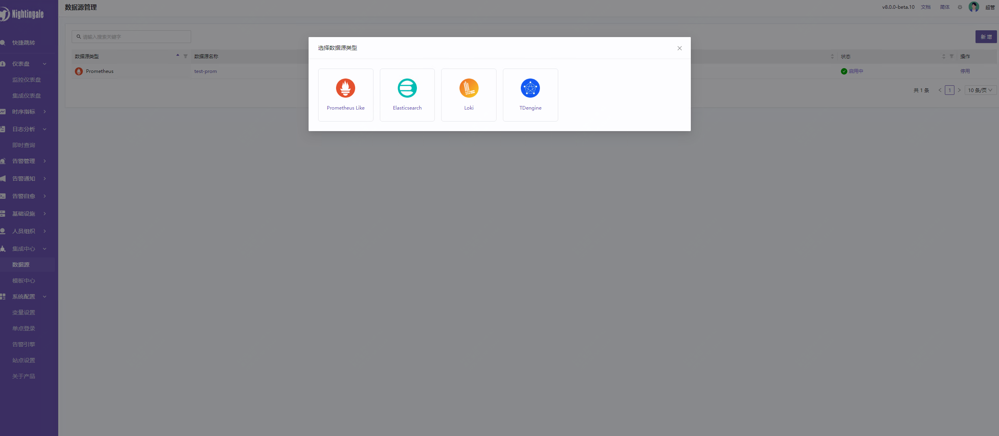
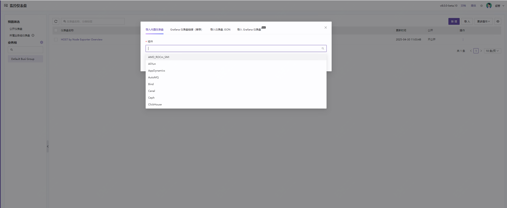
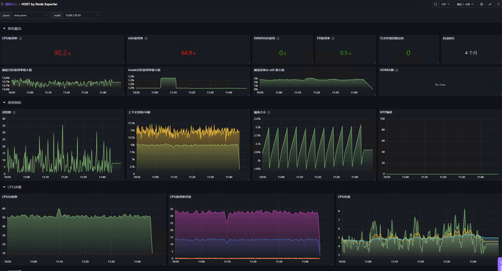
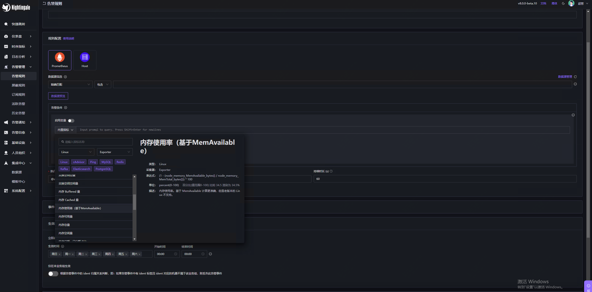
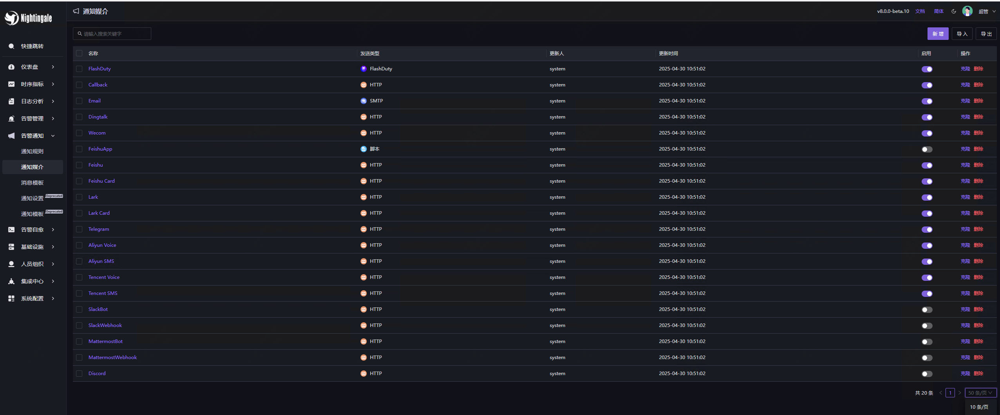

10.8k star，开源5年了，手把手带你实践夜莺监控系统！

不知不觉，夜莺监控已经开源5年了，而我用夜莺监控也4年多了，所以也算是忠实用户吧，而目前公司所用的监控系统，也是我一手搞的。

所以也算是将夜莺带到了这家公司，虽然目前用的版本比较旧，但一直也有关注新版本，今天就带大家实践一把。

顺带去翻了下之前的文章，最早一篇是在2022年初发的，感兴趣的也可以去看下。


这篇文章的话，采用常规二进制方式部署，后面也会出在k8s环境下的部署文章。

## 关于夜莺

如果有了解的朋友，这部分可以忽略。夜莺监控，它还有个英文名字，Nightingale，如果你去搜索，最好带上监控，不然搜出来的大概率是一直鸟。

随着夜莺监控系统的迭代，目前该监控系统大部分监控需求都可以覆盖了，而在最开始使用夜莺的时候，其实我看重的是它的告警能力，在最开始用prometheus的时候，需要配置rules，需要配置alertmanager，还要配置告警渠道，尤其是从头开始做的情况下，所以当时直接选择了夜莺。

不过那会儿还是有用到常规的一些监控组件，但最新版本的夜莺已经很强大了，支持多种数据源，支持类似grafana的展示。使用prometheus需要配置各类exporter，夜莺有自己开源的categraf采集器，支持中间件、主机等。

所以，如果你在找不错的监控系统，那么夜莺可以作为尝试！



## 如何快速部署使用？

首先你需要去下载部署包，有两种方式，第一种为github的release(github.com/ccfos/nightingale/releases),第二种方式是去官网下载。

它会提供两种包，amd64.tar.gz 是 x86_64 架构的，arm64.tar.gz 是 arm64 架构的。根据你的服务器选择对应的包即可。

夜莺监控依赖mysql及redis，需要提前部署，如果是测试，那么可以通过如下方式配置，生产注意修改密码！

### 解压安装包

可以看到目录下会有如下文件



其中核心的就是n9e，也就是启动夜莺的二进制文件，然后就是etc目录，需要进到里面修改配置文件，还有一个是integrations：集成目录。存放内置告警规则、内置仪表盘，如果是新安装，那么你只需要关注这三个即可。

配置文件如下目录，你需要配置你自己的mysql及redis配置。

```
./etc/config.toml
```

然后启动

```
nohup ./n9e &> n9e.log &
```

它的web端口为17000，你可以直接访问。默认的用户为root，密码为root.2020

到目前为止，夜莺部署完成，然后你可以配置数据源，时序类（promtheus、victoriametrics、Thano等），还可以配置es、loki等。


## 配置数据源

我们手头正好有一个promtheus，配置数据源。



数据源接入后，我们可以配置仪表盘，你可以选择自带的，如果你有用grafana，那么可以直接导入现有的json文件。



下面是一张自带的仪表盘



## 告警配置

已经完成了夜莺的部署，并且采集到了数据、配置了数据源，现在我们就快速配置一个告警规则，体验一下夜莺的告警功能。

目前夜莺提供了一些内置的规则你可以直接使用。



然后你可以配置告警通知媒介，目前支持多达20中渠道告警



好的，关于夜莺监控系统就介绍到这里。